# Resiliency Device

## Introduction

An important scenario that Azure Integrated HSM must consider is Live Migration. In Live Migration, a guest VM is moved from node to another. In the AziHSM case, that means that the entire AziHSM guest VM stack (crypto library plugin, client library, driver handle) may suddenly start connecting with a new AziHSM host device.

Session or Key "Resiliency" refers to implementing objects in the AziHSM client library to automatically detect and handle this change in state, in a way that the crypto library plugin or higher layers are agnostic.

Live Migration is the target scenario for session resiliency, but this feature can automatically support similar scenarios, like device crash.

Implementing a new AziHSM client library layer that handles this resiliency has the following goals:
- Automatically detect when live migration, or similar resiliency event, has occured, and handle restoring the device without exposing an error to the caller.
- Support an API layer that is identical, or very similar, to the existing `mcr_api` layer. This way, minimal changes are needed in dependents, like the KSP, or existing `mcr_api` tests.
- Have little to no impact on key operation performance. Allowing key operations within a session to run concurrently is critical to reach expected AziHSM performance benchmarks.

## Design Overview

### Design without Session Resiliency

The existing AziHSM client library architecture, defined in the `mcr_api` crate, can be simplified as follows:

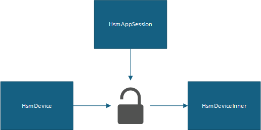

HsmSession and HsmDevice are public logical objects used by the client. They represent a session and device handle, respectively.

HsmSession and HsmDevice share an `Arc<Rwlock>` to the HsmDeviceInner object, which handles operations on the device handle and driver.

This `Arc<Rwlock>` ensures that driver operations are handled in a multithreaded-safe way. Specifically, operations that create or destroy a session (such as `open_session`, `close_session`, `clear_device`) must take a write lock on the `HsmDeviceInner`, so that a key operation cannot be executed at the same time the session is being deleted.

### Design with Session Resiliency

Adding new object ResilientDeviceInner, we can redefine the client library architecture as follows:

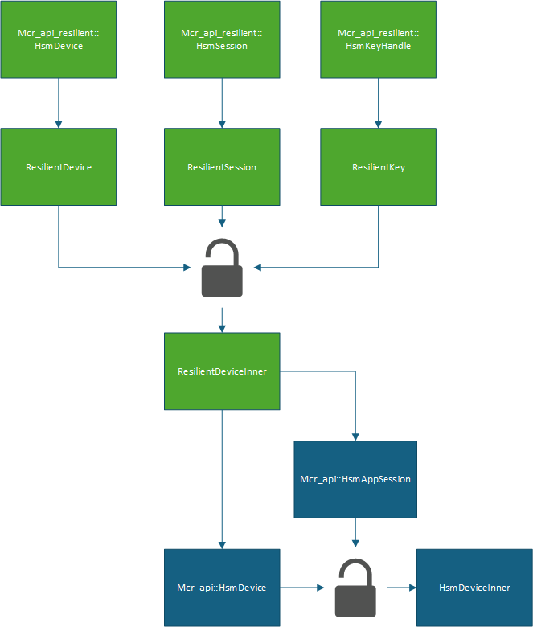

mcr_api_resilient::HsmDevice, mcr_api_resilient::HsmSession, and mcr_api_resilient::HsmKeyHandle represent new top-level objects that implement the same interface as the original HsmDevice, HsmSession, and HsmKeyHandle. By implementing the same interface, we minimize impact to dependents already using the AziHSM client library interface.

These objects map pretty directly to underlying objects ResilientDevice, ResilientSession, ResilientKey. These outer Resilient objects have the following behavior:
- They implement a more abstracted version of the HsmSession, etc. interface. For example, they implement a single key_op function, instead of an individual rsa_encrypt, rsa_sign, etc. functions.
- They manage the read/write lock on the ResilientDeviceInner. When reinitializing the device after a resiliency event, we must take a write lock so that other threads don't try restoring sessions or keys multiple times. However, when running key_op operations, we want to only take a read lock to support multiple concurrent operations.

ResilientDeviceInner contains all of the resiliency logic:
- Storing all information necessary to restore the device after a resiliency event. For example, assigning all session keys a Uuid, and tracking them in a HashMap.
- Detecting when a resiliency event occurs. This is by checking operation error codes.
- Restoring the device after a resiliency event occurs.

In the future, we will need to implement a service to handle storing information that needs to be shared cross-process (like masked named key data). ResilientDeviceInner can also handle communication with that service.

## Testing

`mcr_api` tests in api\lib\tests have been configured to test `mcr_api_resilient` instead of `mcr_api` by enabling a "resilient" feature. Here are example commands you can use to test `mcr_api_resilient` with mock and testhooks configuration:

```
cargo nextest run --features mock,testhooks,use-symcrypt,resilient
cargo test --features mock,testhooks,use-symcrypt,resilient -- --test-threads=1
```

Currently, pipeline does not run these tests with `resilient` automatically. `mcr_api_resilient` is still being developed, and will diverge from the `mcr_api` surface. We can add this in the future once `mcr_api_resilient` is more hardened.

## Sequence Diagrams

What follows are some sequence diagrams to describe scenarios. The plantUml code is at the end of this doc.

Note that colored activation blocks signify write locks. White/clear activation blocks signify read locks.

### Initialization

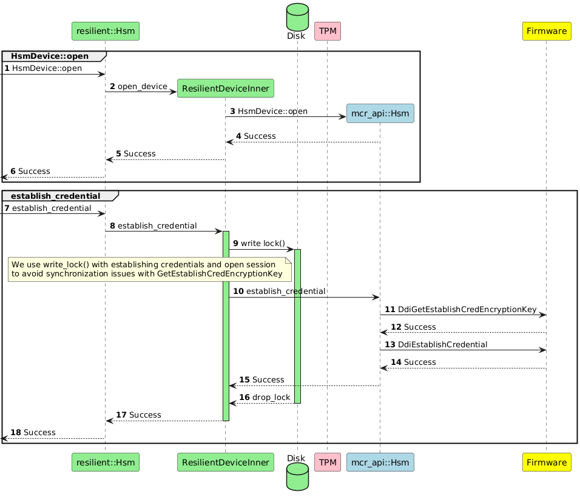

### First Open Session

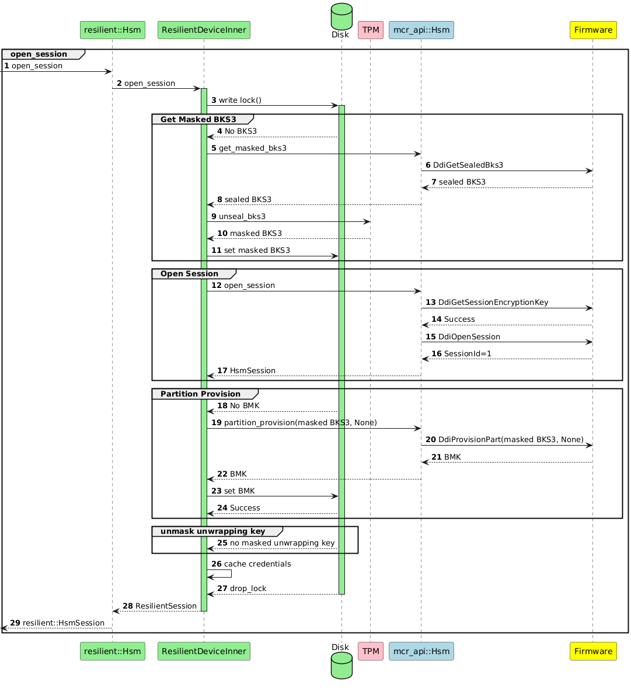

### Subsequent Open Sesssions

Note that the PartitionProvision return value is used to determine whether this is the first, or a subsequent open session operation.

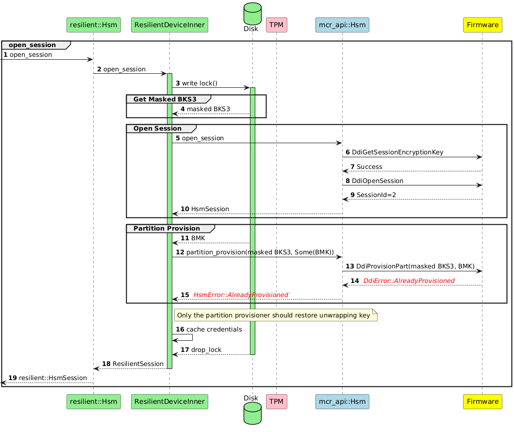

### Example Create Key Op

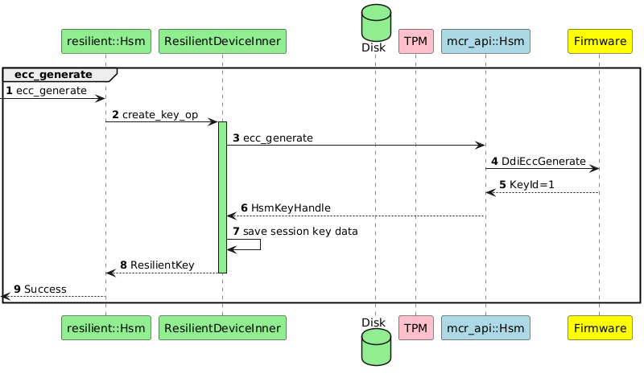

### First Reopen Session after LM

Note that the Error::SessionNeedsRenegotiation is used to determine that Live Migration happened.

For Establish Credential, we use the credentials cached during OpenSession.

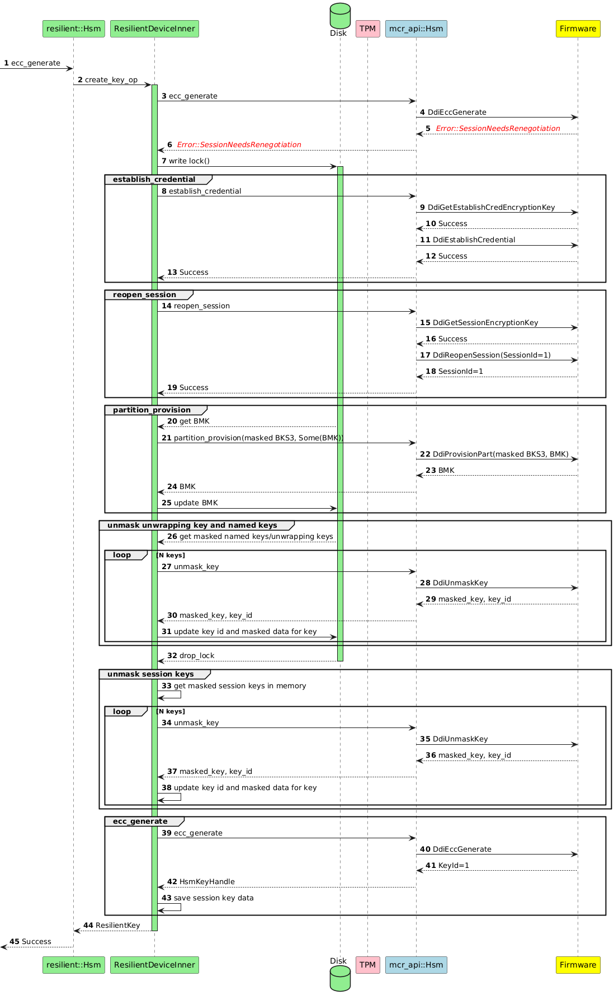

### Subsequent Reopen Sessions after LM

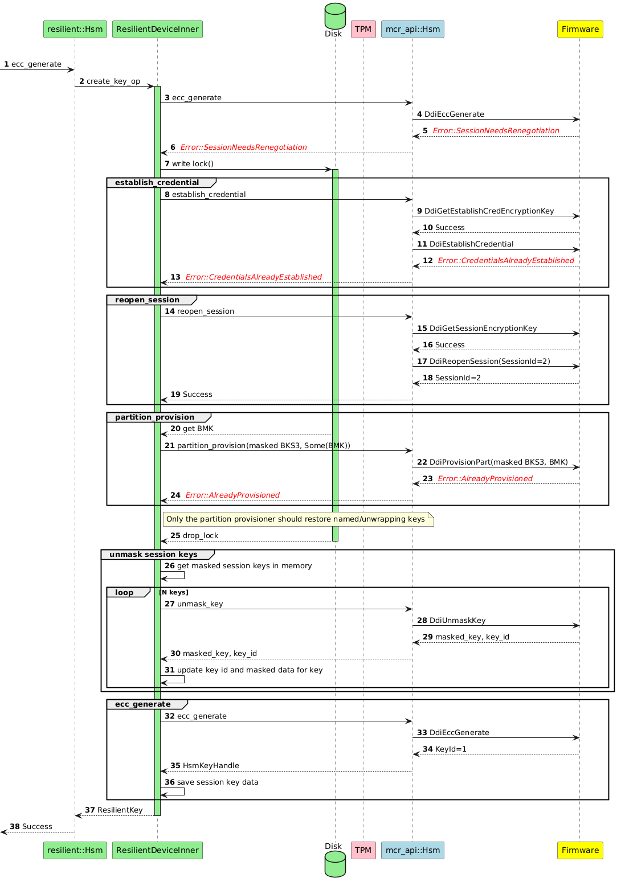

### Example Key Op

Note that this only takes a read lock, to support multiple concurrent crypto operations on a session.

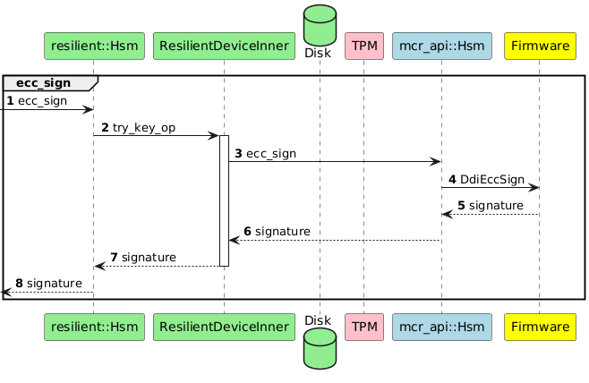

### Reopen Session after LM with Key Op

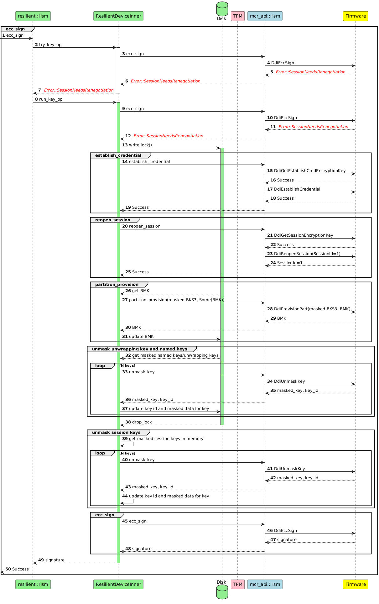

### Two Threads competing to reopen session after LM

Note that, because of the ReadWrite lock on ResilientDeviceInner, all operations initiated before Live Migration will be completed before we begin PartitionProvision and similar operations.

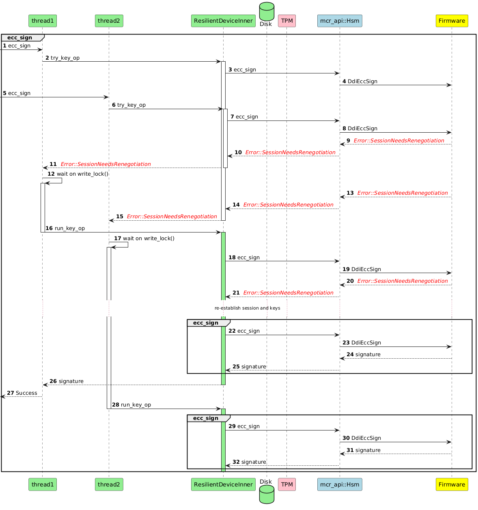

## PlantUml

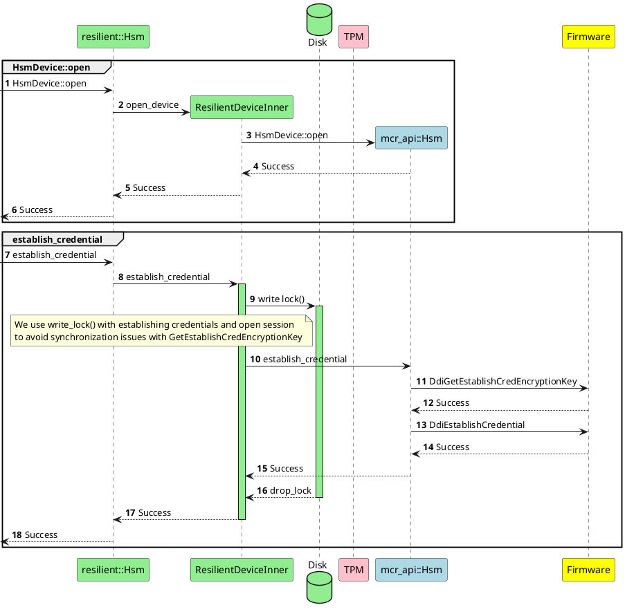
``` plantuml
@startuml
autonumber
'ResilientDeviceInner initialization'

participant "resilient::Hsm" as api #lightgreen
participant "ResilientDeviceInner" as handler #lightgreen
database "Disk" as disk #lightgreen
participant "TPM" as tpm #pink
participant "mcr_api::Hsm" as hsm #lightblue
participant "Firmware" as device #yellow

group HsmDevice::open
 -> api ** : HsmDevice::open
api -> handler ** : open_device
handler -> hsm ** : HsmDevice::open
hsm --> handler : Success
handler --> api : Success
<-- api : Success
end

group establish_credential
-> api: establish_credential
api -> handler : establish_credential
activate handler #lightgreen

handler -> disk : write lock()
activate disk #lightgreen

note left of disk: We use write_lock() with establishing credentials and open session\nto avoid synchronization issues with GetEstablishCredEncryptionKey

handler -> hsm : establish_credential
hsm -> device : DdiGetEstablishCredEncryptionKey
device --> hsm: Success
hsm -> device : DdiEstablishCredential
device --> hsm : Success
hsm --> handler : Success

disk --> handler : drop_lock
deactivate disk

handler --> api : Success
deactivate handler
<-- api : Success
end

@enduml
```

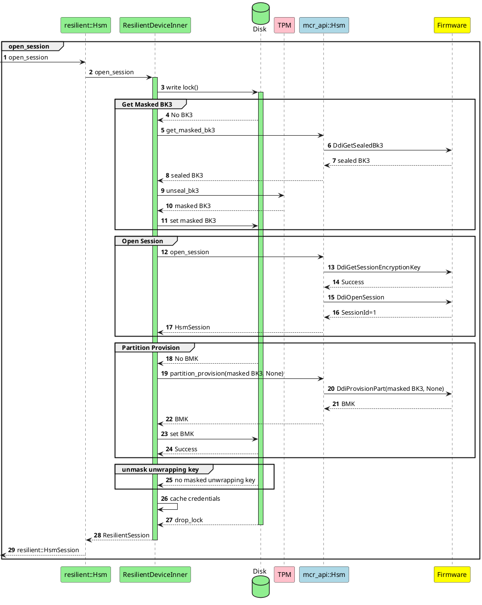
``` plantuml
@startuml
autonumber
'ResilientDeviceInner first opensession'

participant "resilient::Hsm" as api #lightgreen
participant "ResilientDeviceInner" as handler #lightgreen
database "Disk" as disk #lightgreen
participant "TPM" as tpm #pink
participant "mcr_api::Hsm" as hsm #lightblue
participant "Firmware" as device #yellow

group open_session
-> api: open_session
api -> handler : open_session
activate handler #lightgreen

handler -> disk : write lock()
activate disk #lightgreen

group Get Masked BK3

disk --> handler : No BK3
handler -> hsm : get_masked_bk3
hsm -> device : DdiGetSealedBk3
device --> hsm : sealed BK3
hsm --> handler : sealed BK3
handler -> tpm : unseal_bk3
tpm --> handler : masked BK3
handler -> disk : set masked BK3
end

group Open Session

handler -> hsm : open_session
hsm -> device: DdiGetSessionEncryptionKey
device --> hsm : Success
hsm -> device : DdiOpenSession
device --> hsm : SessionId=1
hsm --> handler : HsmSession
end

group Partition Provision
disk --> handler : No BMK
handler -> hsm : partition_provision(masked BK3, None)
hsm -> device : DdiProvisionPart(masked BK3, None)
device --> hsm : BMK
hsm --> handler : BMK
handler -> disk : set BMK
disk --> handler : Success
end

group unmask unwrapping key
disk --> handler : no masked unwrapping key
end

handler -> handler : cache credentials

disk --> handler : drop_lock
deactivate disk

handler --> api : ResilientSession
deactivate handler
<-- api : resilient::HsmSession


end

@enduml
```

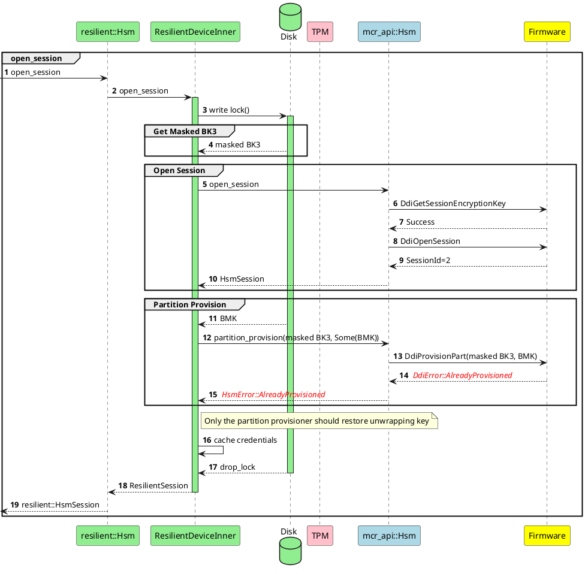
``` plantuml
@startuml
autonumber
'ResilientDeviceInner subsequent opensessions'

'actor Client as client
participant "resilient::Hsm" as api #lightgreen
participant "ResilientDeviceInner" as handler #lightgreen
database "Disk" as disk #lightgreen
participant "TPM" as tpm #pink
participant "mcr_api::Hsm" as hsm #lightblue
participant "Firmware" as device #yellow

group open_session
-> api: open_session
api -> handler : open_session
activate handler #lightgreen
handler -> disk : write lock()
activate disk #lightgreen


group Get Masked BK3
disk --> handler : masked BK3
end

group Open Session
handler -> hsm : open_session
hsm -> device: DdiGetSessionEncryptionKey
device --> hsm : Success
hsm -> device : DdiOpenSession
device --> hsm : SessionId=2
hsm --> handler : HsmSession
end

group Partition Provision
disk --> handler : BMK
handler -> hsm : partition_provision(masked BK3, Some(BMK))
hsm -> device : DdiProvisionPart(masked BK3, BMK)
device --> hsm : <i><color:red> DdiError::AlreadyProvisioned </i>
hsm --> handler : <i><color:red> HsmError::AlreadyProvisioned </i>
end

note right of handler : Only the partition provisioner should restore unwrapping key

handler -> handler : cache credentials

disk --> handler : drop_lock
deactivate disk

handler --> api : ResilientSession
deactivate handler
<-- api : resilient::HsmSession


end

@enduml
```

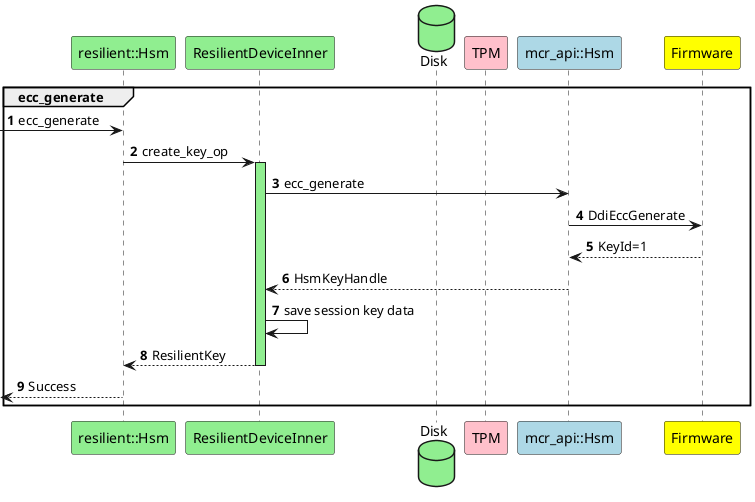
``` plantuml
@startuml
autonumber

'ResilientDeviceInner ecc generate'

participant "resilient::Hsm" as api #lightgreen
participant "ResilientDeviceInner" as handler #lightgreen
database "Disk" as disk #lightgreen
participant "TPM" as tpm #pink
participant "mcr_api::Hsm" as hsm #lightblue
participant "Firmware" as device #yellow

group ecc_generate
 -> api: ecc_generate
api -> handler : create_key_op
activate handler #lightgreen
handler -> hsm : ecc_generate
hsm -> device : DdiEccGenerate
device --> hsm : KeyId=1
hsm --> handler : HsmKeyHandle
handler -> handler : save session key data
handler --> api : ResilientKey
deactivate handler
<-- api : Success
end


@enduml
```

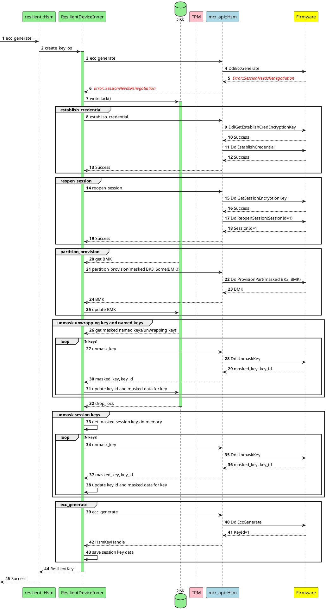
``` plantuml
@startuml
autonumber
'ResilientDeviceInner ReopenSession first session'

'actor Client as client
participant "resilient::Hsm" as api #lightgreen
participant "ResilientDeviceInner" as handler #lightgreen
database "Disk" as disk #lightgreen
participant "TPM" as tpm #pink
participant "mcr_api::Hsm" as hsm #lightblue
participant "Firmware" as device #yellow

group ecc_generate
 -> api: ecc_generate
api -> handler : create_key_op
activate handler #lightgreen

handler -> hsm : ecc_generate
hsm -> device : DdiEccGenerate
device --> hsm : <i><color:red> Error::SessionNeedsRenegotiation </i>
hsm --> handler : <i><color:red> Error::SessionNeedsRenegotiation </i>

handler -> disk : write lock()
activate disk #lightgreen

group establish_credential
handler -> hsm : establish_credential
hsm -> device : DdiGetEstablishCredEncryptionKey
device --> hsm: Success
hsm -> device : DdiEstablishCredential
device --> hsm : Success
hsm --> handler : Success
end


group reopen_session
handler -> hsm : reopen_session
hsm -> device: DdiGetSessionEncryptionKey
device --> hsm : Success
hsm -> device : DdiReopenSession(SessionId=1)
device --> hsm : SessionId=1
hsm --> handler : Success
end

group partition_provision
disk --> handler : get BMK
handler -> hsm : partition_provision(masked BK3, Some(BMK))
hsm -> device : DdiProvisionPart(masked BK3, BMK)
device --> hsm : BMK
hsm --> handler : BMK
handler -> disk : update BMK
end

group unmask unwrapping key and named keys
disk --> handler : get masked named keys/unwrapping keys
loop N keys
handler -> hsm : unmask_key
hsm -> device : DdiUnmaskKey
device --> hsm : masked_key, key_id
hsm --> handler : masked_key, key_id
handler -> disk : update key id and masked data for key
end
end

disk --> handler : drop_lock
deactivate disk

group unmask session keys
handler -> handler : get masked session keys in memory
loop N keys
handler -> hsm : unmask_key
hsm -> device : DdiUnmaskKey
device --> hsm : masked_key, key_id
hsm --> handler : masked_key, key_id
handler -> handler : update key id and masked data for key
end
end

group ecc_generate
handler -> hsm : ecc_generate
hsm -> device : DdiEccGenerate
device --> hsm : KeyId=1
hsm --> handler : HsmKeyHandle
handler -> handler : save session key data
end


handler --> api : ResilientKey
deactivate handler
<-- api : Success


@enduml
```

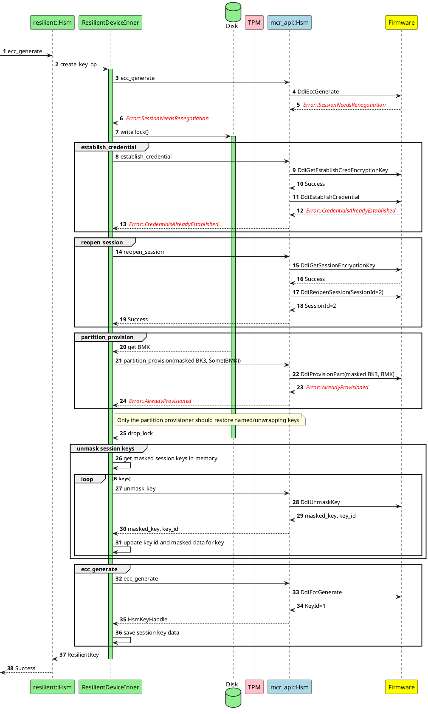
``` plantuml
@startuml
autonumber
'ResilientDeviceInner ReopenSession subsequent session'

'actor Client as client
participant "resilient::Hsm" as api #lightgreen
participant "ResilientDeviceInner" as handler #lightgreen
database "Disk" as disk #lightgreen
participant "TPM" as tpm #pink
participant "mcr_api::Hsm" as hsm #lightblue
participant "Firmware" as device #yellow

group ecc_generate
 -> api: ecc_generate
api -> handler : create_key_op
activate handler #lightgreen

handler -> hsm : ecc_generate
hsm -> device : DdiEccGenerate
device --> hsm : <i><color:red> Error::SessionNeedsRenegotiation </i>
hsm --> handler : <i><color:red> Error::SessionNeedsRenegotiation </i>

handler -> disk : write lock()
activate disk #lightgreen

group establish_credential
handler -> hsm : establish_credential
hsm -> device : DdiGetEstablishCredEncryptionKey
device --> hsm: Success
hsm -> device : DdiEstablishCredential
device --> hsm : <i><color:red> Error::CredentialsAlreadyEstablished </i>
hsm --> handler : <i><color:red> Error::CredentialsAlreadyEstablished </i>
end


group reopen_session
handler -> hsm : reopen_session
hsm -> device: DdiGetSessionEncryptionKey
device --> hsm : Success
hsm -> device : DdiReopenSession(SessionId=2)
device --> hsm : SessionId=2
hsm --> handler : Success
end

group partition_provision
disk --> handler : get BMK
handler -> hsm : partition_provision(masked BK3, Some(BMK))
hsm -> device : DdiProvisionPart(masked BK3, BMK)
device --> hsm : <i><color:red> Error::AlreadyProvisioned </i>
hsm --> handler : <i><color:red> Error::AlreadyProvisioned </i>
end

note right of handler : Only the partition provisioner should restore named/unwrapping keys

disk --> handler : drop_lock
deactivate disk

group unmask session keys
handler -> handler : get masked session keys in memory
loop N keys
handler -> hsm : unmask_key
hsm -> device : DdiUnmaskKey
device --> hsm : masked_key, key_id
hsm --> handler : masked_key, key_id
handler -> handler : update key id and masked data for key
end
end

group ecc_generate
handler -> hsm : ecc_generate
hsm -> device : DdiEccGenerate
device --> hsm : KeyId=1
hsm --> handler : HsmKeyHandle
handler -> handler : save session key data
end


handler --> api : ResilientKey
deactivate handler
<-- api : Success


@enduml
```

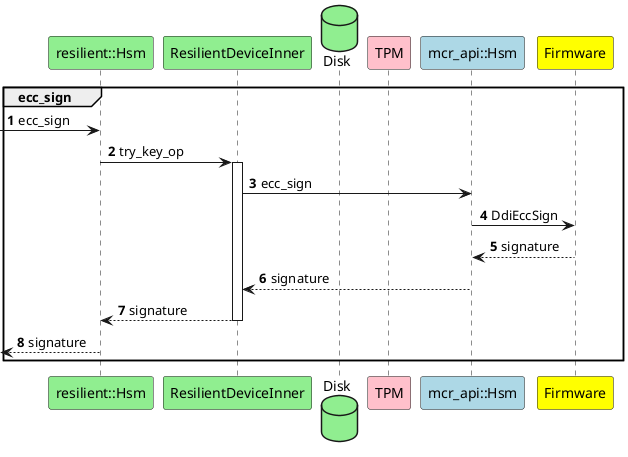
``` plantuml
@startuml
autonumber

'ResilientDeviceInner ecc_sign'

'actor Client as client
participant "resilient::Hsm" as api #lightgreen
participant "ResilientDeviceInner" as handler #lightgreen
database "Disk" as disk #lightgreen
participant "TPM" as tpm #pink
participant "mcr_api::Hsm" as hsm #lightblue
participant "Firmware" as device #yellow


group ecc_sign
 -> api: ecc_sign
api -> handler : try_key_op
activate handler
handler -> hsm : ecc_sign
hsm -> device : DdiEccSign
device --> hsm : signature
hsm --> handler : signature
handler --> api : signature
deactivate handler
<-- api : signature
end


@enduml
```

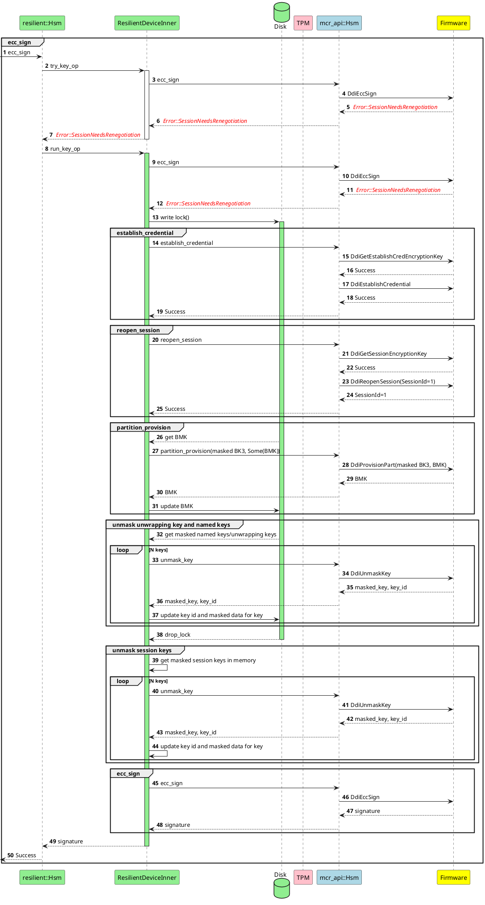
``` plantuml
@startuml
autonumber
'ResilientDeviceInner reopensession w/ key_op'

'actor Client as client
participant "resilient::Hsm" as api #lightgreen
participant "ResilientDeviceInner" as handler #lightgreen
database "Disk" as disk #lightgreen
participant "TPM" as tpm #pink
participant "mcr_api::Hsm" as hsm #lightblue
participant "Firmware" as device #yellow

group ecc_sign
 -> api: ecc_sign
api -> handler : try_key_op
activate handler
handler -> hsm : ecc_sign
hsm -> device : DdiEccSign
device --> hsm : <i><color:red> Error::SessionNeedsRenegotiation </i>
hsm --> handler : <i><color:red> Error::SessionNeedsRenegotiation </i>
handler --> api : <i><color:red> Error::SessionNeedsRenegotiation </i>
deactivate handler

api -> handler : run_key_op
activate handler #lightgreen

handler -> hsm : ecc_sign
hsm -> device : DdiEccSign
device --> hsm : <i><color:red> Error::SessionNeedsRenegotiation </i>
hsm --> handler : <i><color:red> Error::SessionNeedsRenegotiation </i>

handler -> disk : write lock()
activate disk #lightgreen

group establish_credential
handler -> hsm : establish_credential
hsm -> device : DdiGetEstablishCredEncryptionKey
device --> hsm: Success
hsm -> device : DdiEstablishCredential
device --> hsm : Success
hsm --> handler : Success
end


group reopen_session
handler -> hsm : reopen_session
hsm -> device: DdiGetSessionEncryptionKey
device --> hsm : Success
hsm -> device : DdiReopenSession(SessionId=1)
device --> hsm : SessionId=1
hsm --> handler : Success
end

group partition_provision
disk --> handler : get BMK
handler -> hsm : partition_provision(masked BK3, Some(BMK))
hsm -> device : DdiProvisionPart(masked BK3, BMK)
device --> hsm : BMK
hsm --> handler : BMK
handler -> disk : update BMK
end

group unmask unwrapping key and named keys
disk --> handler : get masked named keys/unwrapping keys
loop N keys
handler -> hsm : unmask_key
hsm -> device : DdiUnmaskKey
device --> hsm : masked_key, key_id
hsm --> handler : masked_key, key_id
handler -> disk : update key id and masked data for key
end
end

disk --> handler : drop_lock
deactivate disk

group unmask session keys
handler -> handler : get masked session keys in memory
loop N keys
handler -> hsm : unmask_key
hsm -> device : DdiUnmaskKey
device --> hsm : masked_key, key_id
hsm --> handler : masked_key, key_id
handler -> handler : update key id and masked data for key
end
end

group ecc_sign
handler -> hsm : ecc_sign
hsm -> device : DdiEccSign
device --> hsm : signature
hsm --> handler : signature
end

handler --> api : signature
deactivate handler
<-- api : Success

end


@enduml
```

This is not an image in doc, but used as reference:
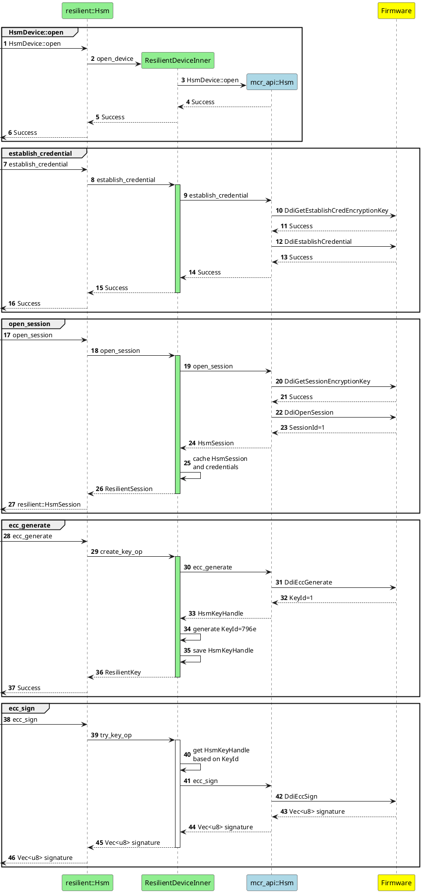
``` plantuml
@startuml
autonumber
'simple Partition Initialization'

'actor Client as client
participant "resilient::Hsm" as api #lightgreen
participant "ResilientDeviceInner" as handler #lightgreen
participant "mcr_api::Hsm" as hsm #lightblue
participant "Firmware" as device #yellow

group HsmDevice::open
 -> api ** : HsmDevice::open
api -> handler ** : open_device
handler -> hsm ** : HsmDevice::open
hsm --> handler : Success
handler --> api : Success
<-- api : Success
end

group establish_credential
-> api: establish_credential
api -> handler : establish_credential
activate handler #lightgreen
handler -> hsm : establish_credential
hsm -> device : DdiGetEstablishCredEncryptionKey
device --> hsm: Success
hsm -> device : DdiEstablishCredential
device --> hsm : Success
hsm --> handler : Success
handler --> api : Success
deactivate handler
<-- api : Success
end

group open_session
-> api: open_session
api -> handler : open_session
activate handler #lightgreen
handler -> hsm : open_session
hsm -> device: DdiGetSessionEncryptionKey
device --> hsm : Success
hsm -> device : DdiOpenSession
device --> hsm : SessionId=1
hsm --> handler : HsmSession
handler -> handler : cache HsmSession \nand credentials
handler --> api : ResilientSession
deactivate handler
<-- api : resilient::HsmSession
end

group ecc_generate
 -> api: ecc_generate
api -> handler : create_key_op
activate handler #lightgreen
handler -> hsm : ecc_generate
hsm -> device : DdiEccGenerate
device --> hsm : KeyId=1
hsm --> handler : HsmKeyHandle
handler -> handler : generate KeyId=796e
handler -> handler : save HsmKeyHandle
handler --> api : ResilientKey
deactivate handler
<-- api : Success
end

group ecc_sign
 -> api: ecc_sign
api -> handler : try_key_op
activate handler
handler -> handler : get HsmKeyHandle\nbased on KeyId
handler -> hsm : ecc_sign
hsm -> device : DdiEccSign
device --> hsm : Vec<u8> signature
hsm --> handler : Vec<u8> signature
handler --> api : Vec<u8> signature
deactivate handler
<-- api : Vec<u8> signature
end

'note left of dev1 : Live migration occurs here!
@enduml
```

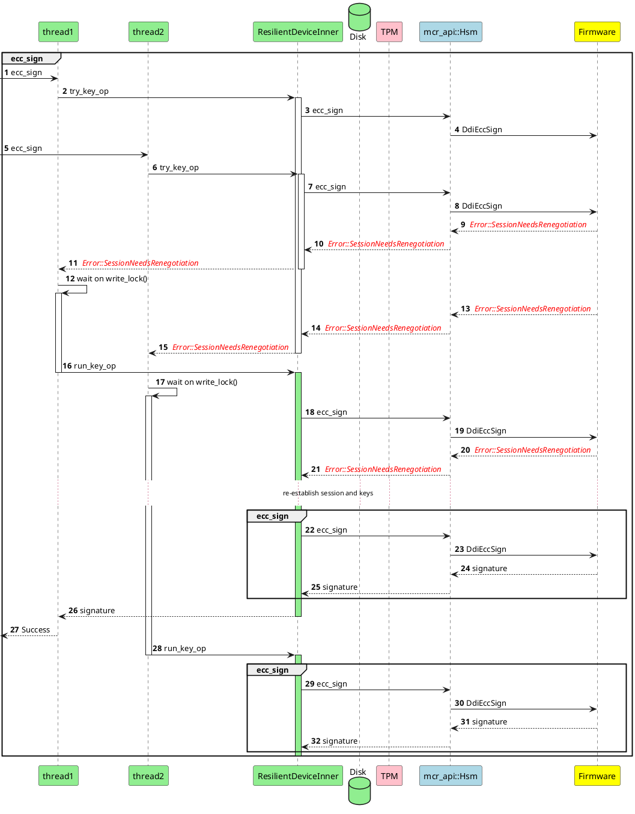
``` plantuml
@startuml
autonumber
'Multi-threaded reopen session'

'actor Client as client
participant "thread1" as api #lightgreen
participant "thread2" as api2 #lightgreen
participant "ResilientDeviceInner" as handler #lightgreen
database "Disk" as disk #lightgreen
participant "TPM" as tpm #pink
participant "mcr_api::Hsm" as hsm #lightblue
participant "Firmware" as device #yellow

group ecc_sign
 -> api: ecc_sign
api -> handler : try_key_op
activate handler
handler -> hsm : ecc_sign
hsm -> device : DdiEccSign

 -> api2: ecc_sign
api2 -> handler : try_key_op
activate handler
handler -> hsm : ecc_sign
hsm -> device : DdiEccSign

device --> hsm : <i><color:red> Error::SessionNeedsRenegotiation </i>
hsm --> handler : <i><color:red> Error::SessionNeedsRenegotiation </i>
handler --> api : <i><color:red> Error::SessionNeedsRenegotiation </i>
deactivate handler

api -> api : wait on write_lock()
activate api

device --> hsm : <i><color:red> Error::SessionNeedsRenegotiation </i>
hsm --> handler : <i><color:red> Error::SessionNeedsRenegotiation </i>
handler --> api2 : <i><color:red> Error::SessionNeedsRenegotiation </i>
deactivate handler

api -> handler: run_key_op
deactivate api


activate handler #lightgreen

api2 -> api2 : wait on write_lock()
activate api2

handler -> hsm : ecc_sign
hsm -> device : DdiEccSign
device --> hsm : <i><color:red> Error::SessionNeedsRenegotiation </i>
hsm --> handler : <i><color:red> Error::SessionNeedsRenegotiation </i>

... re-establish session and keys ...

group ecc_sign
handler -> hsm : ecc_sign
hsm -> device : DdiEccSign
device --> hsm : signature
hsm --> handler : signature
end

handler --> api : signature
deactivate handler
<-- api : Success

api2 -> handler: run_key_op
deactivate api2
activate handler #lightgreen

group ecc_sign
handler -> hsm : ecc_sign
hsm -> device : DdiEccSign
device --> hsm : signature
hsm --> handler : signature

end
deactivate handler


end


@enduml
```