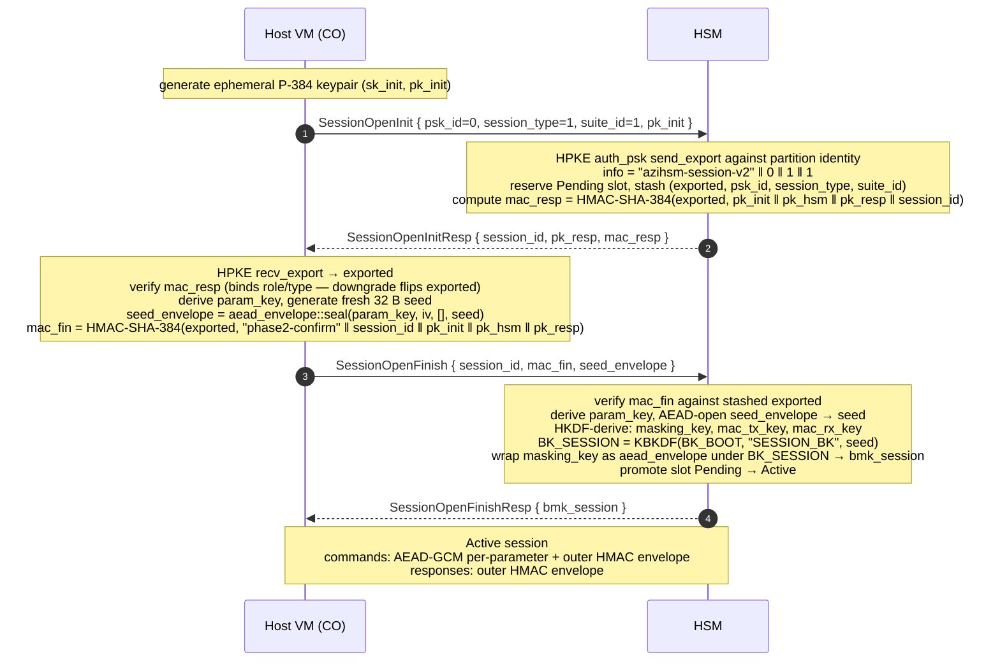
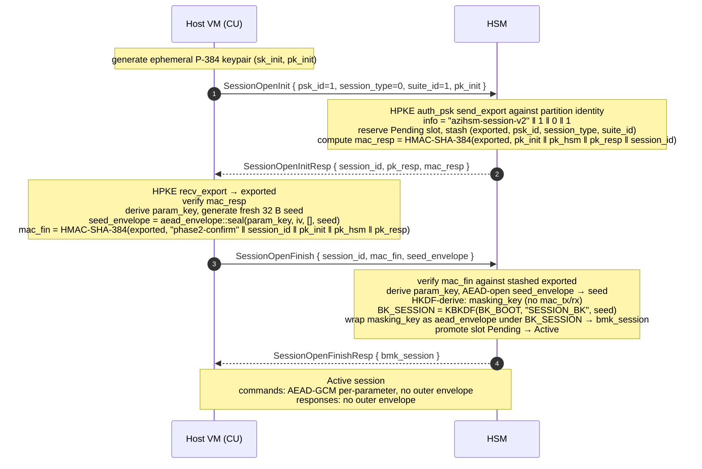

<!--
Copyright (c) Microsoft Corporation.
Licensed under the MIT License.
-->

# TBOR — Unified Specification

Single-file consolidation of the TBOR wire-encoding specification and the
TBOR DDI command specifications.

| Part | Contents | Source of truth |
|---|---|---|
| [Part I](#part-i) | Tabular Binary Object Representation (TBOR) Specification — framing, TOC entries, encodings, schema features | [`fw/core/ddi/tbor/docs/spec.md`](../fw/core/ddi/tbor/docs/spec.md) |
| [Part II](#part-ii) | TBOR DDI Commands — shared headers, opcode table, session flows | [`docs/tbor-ddi/README.md`](./tbor-ddi/README.md) |
| [Part III](#part-iii) | Per-command request/response bodies (31 commands) | [`docs/tbor-ddi/commands/`](./tbor-ddi/commands/) |

> **Note:** this file is an aggregate. The per-part sources listed above
> remain the authoritative copies and are reproduced here verbatim — make
> edits there and re-sync this file, so the two do not drift.

---

<a id="table-of-contents"></a>

## Table of Contents

- [Part I — TBOR Encoding Specification](#part-i)
  - [Version](#enc-version)
  - [Table of Contents](#enc-table-of-contents)
  - [Overview](#enc-overview)
  - [Request Format](#enc-request-format)
  - [Response Format](#enc-response-format)
  - [TOC Entry Format](#enc-toc-entry-format)
  - [Protocol Rules](#enc-protocol-rules)
  - [Schema Features](#enc-schema-features)
  - [Security Considerations](#enc-security-considerations)
  - [Worked Examples](#enc-worked-examples)
  - [Revision History](#enc-revision-history)
- [Part II — TBOR DDI Protocol](#part-ii)
  - [Request header](#ddi-request-header)
  - [Response header](#ddi-response-header)
  - [Commands](#ddi-commands)
  - [Default-PSK gate](#ddi-default-psk-gate)
  - [Session establishment flows](#ddi-session-establishment-flows)
- [Part III — TBOR DDI Command Reference](#part-iii)
  - [ApiRev (Opcode 0x01)](#cmd-api_rev)
  - [PartInfo (Opcode 0x02)](#cmd-part_info)
  - [SessionOpenInit (Opcode 0x03)](#cmd-session_open_init)
  - [SessionOpenFinish (Opcode 0x04)](#cmd-session_open_finish)
  - [SessionClose (Opcode 0x05)](#cmd-session_close)
  - [PskChange (Opcode 0x06)](#cmd-psk_change)
  - [PartInit (Opcode 0x07)](#cmd-part_init)
  - [PartFinal (Opcode 0x08)](#cmd-part_final)
  - [SdSealingKeyGen (Opcode 0x09)](#cmd-sd_sealing_key_gen)
  - [SdCreateRemoteBackup (Opcode 0x0A)](#cmd-sd_create_remote_backup)
  - [SdResealRemoteBackup (Opcode 0x0B)](#cmd-sd_reseal_remote_backup)
  - [SdRestoreRemoteBackup (Opcode 0x0C)](#cmd-sd_restore_remote_backup)
  - [SdRestoreLocalBackup (Opcode 0x0D)](#cmd-sd_restore_local_backup)
  - [SdCreatePeerBackup (Opcode 0x0E)](#cmd-sd_create_peer_backup)
  - [SdRestorePeerBackup (Opcode 0x0F)](#cmd-sd_restore_peer_backup)
  - [KeyReport (Opcode 0x10)](#cmd-key_report)
  - [HmacGenerateKey (Opcode 0x11)](#cmd-hmac_generate_key)
  - [Hmac (Opcode 0x12)](#cmd-hmac)
  - [GetUnwrappingKey (Opcode 0x13)](#cmd-get_unwrapping_key)
  - [UnwrapKey (Opcode 0x14)](#cmd-unwrap_key)
  - [AesGenerateKey (Opcode 0x15)](#cmd-aes_generate_key)
  - [AesEncryptDecrypt (Opcode 0x16)](#cmd-aes_encrypt_decrypt)
  - [EccGenerateKey (Opcode 0x17)](#cmd-ecc_generate_key)
  - [EccSign (Opcode 0x18)](#cmd-ecc_sign)
  - [EcdhDerive (Opcode 0x19)](#cmd-ecdh_derive)
  - [RsaModExp (Opcode 0x1A)](#cmd-rsa_mod_exp)
  - [Hash (Opcode 0x1B)](#cmd-hash)
  - [HkdfDerive (Opcode 0x1C)](#cmd-hkdf_derive)
  - [ConcatKdfDerive (Opcode 0x1D)](#cmd-concat_kdf_derive)
  - [GetCertChainInfo (Opcode 0x1E)](#cmd-get_cert_chain_info)
  - [GetCertificate (Opcode 0x1F)](#cmd-get_cert)

---

<a id="part-i"></a>

## Part I — TBOR Encoding Specification

*Source: [`fw/core/ddi/tbor/docs/spec.md`](../fw/core/ddi/tbor/docs/spec.md) — Tabular Binary Object Representation (TBOR) Specification*


<a id="enc-version"></a>

### Version

0.3

<a id="enc-table-of-contents"></a>

### Part I Contents

- [Overview](#enc-overview)
  - [Purpose](#enc-purpose)
  - [Scope](#enc-scope)
  - [Terminology](#enc-terminology)
  - [Byte Ordering](#enc-byte-ordering)
- [Request Format](#enc-request-format)
  - [Header Fields](#enc-header-fields)
  - [Field Details](#enc-field-details)
- [Response Format](#enc-response-format)
  - [Header Fields](#enc-header-fields-1)
  - [Field Details](#enc-field-details-1)
  - [Well-Known Status Codes](#enc-well-known-status-codes)
- [TOC Entry Format](#enc-toc-entry-format)
  - [Entry Types](#enc-entry-types)
  - [Encoding: Inline None](#enc-encoding-inline-none)
  - [Encoding: Inline 8-bit](#enc-encoding-inline-8-bit)
  - [Encoding: Inline 16-bit](#enc-encoding-inline-16-bit)
  - [Encoding: Offset/Length](#enc-encoding-offsetlength)
  - [Data Alignment](#enc-data-alignment)
- [Protocol Rules](#enc-protocol-rules)
- [Schema Features](#enc-schema-features)
  - [Optional Fields](#enc-optional-fields)
  - [Alignment Padding](#enc-alignment-padding)
  - [Typed Slices](#enc-typed-slices)
  - [Fixed-Size Arrays](#enc-fixed-size-arrays)
  - [Length Constraints](#enc-length-constraints)
  - [Field Groups](#enc-field-groups)
  - [Dispatch Traits](#enc-dispatch-traits)
- [Security Considerations](#enc-security-considerations)
- [Worked Examples](#enc-worked-examples)
  - [Example 1 — Simple Request](#enc-example-1--simple-request)
  - [Example 2 — Simple Response](#enc-example-2--simple-response)
  - [Example 3 — Request with Optional Field](#enc-example-3--request-with-optional-field)
- [Revision History](#enc-revision-history)

---

<a id="enc-overview"></a>

### Overview

<a id="enc-purpose"></a>

#### Purpose

This document defines the binary request/response protocol used for communication between host software and device hardware. The protocol provides a compact, structured wire format that enables the host to issue commands (requests) to the device and receive structured results (responses). It is designed for low-overhead, deterministic communication in environments where bandwidth and latency are constrained.

<a id="enc-scope"></a>

#### Scope

This specification covers:

- The wire format for request and response messages.
- The framing structure, including the fixed header and Table of Contents (TOC) mechanism.
- The encoding rules for TOC entries and the variable-length data section.
- The `none` entry type for representing absent optional fields.
- The `padding` entry type for aligning field data within the variable-length data section.
- Protocol-level rules for versioning, ordering, error handling, and timeouts.

This specification does **not** cover:

- The transport layer (e.g., SPI, I2C, USB, shared memory). The protocol is transport-agnostic and assumes a reliable, ordered byte-stream or message-based transport.
- The application-layer opcode catalog. Opcodes and their semantics are defined by the application layer built on top of this protocol.
- Session management beyond the `session_id` TOC entry type.

<a id="enc-terminology"></a>

#### Terminology

The key words "MUST", "MUST NOT", "REQUIRED", "SHALL", "SHALL NOT", "SHOULD", "SHOULD NOT", "RECOMMENDED", "MAY", and "OPTIONAL" in this document are to be interpreted as described in [RFC 2119](https://www.rfc-editor.org/rfc/rfc2119).

<a id="enc-byte-ordering"></a>

#### Byte Ordering

All multi-byte integer fields in the header and TOC structures are encoded in **little-endian** byte order. All reserved fields MUST be set to zero by senders and MUST be ignored by receivers.

> **Note:** Inline 16-bit values within TOC entries are an exception — see [Encoding: Inline 16-bit](#enc-encoding-inline-16-bit) for details.

---

<a id="enc-request-format"></a>

### Request Format

A request is sent by the host to the device to initiate an operation. It consists of a **fixed 4-byte header** followed by 1–32 [TOC entries](#enc-toc-entry-format) and an optional variable-length data section. The TOC entries describe the parameters of the operation; each entry either inlines a small value directly or provides an offset and length into the variable-length data section that follows the TOC.

**Message size bounds:**

| Component             | Minimum  | Maximum  |
|-----------------------|----------|----------|
| Header                | 4 bytes  | 4 bytes  |
| TOC entries (1–32)    | 4 bytes  | 128 bytes|
| Variable-length data  | 0 bytes  | 8191 bytes |
| **Total**             | **8 bytes** | **8323 bytes** |

```
 0                   1                   2                   3
 0 1 2 3 4 5 6 7 8 9 0 1 2 3 4 5 6 7 8 9 0 1 2 3 4 5 6 7 8 9 0 1
+-+-+-+-+-+-+-+-+-+-+-+-+-+-+-+-+-+-+-+-+-+-+-+-+-+-+-+-+-+-+-+-+
|    Version    |    Reserved   | Rsv |TOC Count|     Opcode    |
+-+-+-+-+-+-+-+-+-+-+-+-+-+-+-+-+-+-+-+-+-+-+-+-+-+-+-+-+-+-+-+-+
|                          TOC Entry 1                          |
+-+-+-+-+-+-+-+-+-+-+-+-+-+-+-+-+-+-+-+-+-+-+-+-+-+-+-+-+-+-+-+-+
|                          TOC Entry 2                          |
+-+-+-+-+-+-+-+-+-+-+-+-+-+-+-+-+-+-+-+-+-+-+-+-+-+-+-+-+-+-+-+-+
|                              ...                              |
+-+-+-+-+-+-+-+-+-+-+-+-+-+-+-+-+-+-+-+-+-+-+-+-+-+-+-+-+-+-+-+-+
|                          TOC Entry 32                         |
+-+-+-+-+-+-+-+-+-+-+-+-+-+-+-+-+-+-+-+-+-+-+-+-+-+-+-+-+-+-+-+-+
|                                                               |
|                    Variable-Length Data ...                    |
|                                                               |
+-+-+-+-+-+-+-+-+-+-+-+-+-+-+-+-+-+-+-+-+-+-+-+-+-+-+-+-+-+-+-+-+
```

<a id="enc-header-fields"></a>

#### Header Fields

| Offset | Size    | Field       | Description                                      |
|--------|---------|-------------|--------------------------------------------------|
| 0      | 1 byte  | Version     | Protocol version. Current version is `0x01`.      |
| 1      | 1 byte  | Reserved    | Reserved for future use. MUST be `0x00`.          |
| 2      | 3 bits  | Reserved    | Reserved for future use. MUST be `0b000`.         |
| 2.3    | 5 bits  | TOC Count   | Number of entries in the Table of Contents (1–32). Encoded as count minus 1 (`0x00` = 1 entry, `0x1F` = 32 entries). |
| 3      | 1 byte  | Opcode      | Operation code identifying the request type.      |

<a id="enc-field-details"></a>

#### Field Details

<a id="enc-version-byte-0"></a>

##### Version (Byte 0)

Identifies the protocol version. A receiver MUST reject requests with an unsupported version by responding with opcode `0xFF` and status code `0x00000001` (Unsupported Version). See [Well-Known Status Codes](#enc-well-known-status-codes).

| Value  | Meaning            |
|--------|--------------------|
| `0x01` | Protocol version 1 |

<a id="enc-reserved-byte-1"></a>

##### Reserved (Byte 1)

Reserved for future protocol extensions. Senders MUST set this byte to `0x00`. Receivers MUST ignore its value.

<a id="enc-reserved--toc-count-byte-2"></a>

##### Reserved / TOC Count (Byte 2)

```
Bit layout of byte 2:

  7   6   5   4   3   2   1   0
+---+---+---+---+---+---+---+---+
|  Rsvd (3) |   TOC Count (5)   |
+---+---+---+---+---+---+---+---+
```

- **Bits 7–5 (Reserved):** MUST be `0`. Reserved for future use.
- **Bits 4–0 (TOC Count):** Encoded as **count minus 1** (unsigned). A value of `0x00` means 1 TOC entry; `0x1F` means 32 TOC entries. Every request MUST contain at least one TOC entry. Each TOC entry describes a parameter or data section of the request payload. See [TOC Entry Format](#enc-toc-entry-format) for the structure of individual entries.

<a id="enc-opcode-byte-3"></a>

##### Opcode (Byte 3)

Identifies the operation to be performed. Opcode values are defined by the application layer. The following opcode is reserved by the protocol:

| Value  | Meaning                    |
|--------|----------------------------|
| `0xFF` | Version Not Supported      |
| Others | Application-defined        |

---

<a id="enc-response-format"></a>

### Response Format

A response is sent by the device back to the host after processing a request. Every request MUST produce exactly one response. The response consists of a **fixed 8-byte header** followed by 1–32 [TOC entries](#enc-toc-entry-format) and an optional variable-length data section. The TOC entries describe the output data returned by the operation.

**Message size bounds:**

| Component             | Minimum   | Maximum   |
|-----------------------|-----------|-----------|
| Header                | 8 bytes   | 8 bytes   |
| TOC entries (1–32)    | 4 bytes   | 128 bytes |
| Variable-length data  | 0 bytes   | 8191 bytes |
| **Total**             | **12 bytes** | **8327 bytes** |

```
 0                   1                   2                   3
 0 1 2 3 4 5 6 7 8 9 0 1 2 3 4 5 6 7 8 9 0 1 2 3 4 5 6 7 8 9 0 1
+-+-+-+-+-+-+-+-+-+-+-+-+-+-+-+-+-+-+-+-+-+-+-+-+-+-+-+-+-+-+-+-+
|    Version    |     Flags     |    Reserved   | Rsv |TOC Count|
+-+-+-+-+-+-+-+-+-+-+-+-+-+-+-+-+-+-+-+-+-+-+-+-+-+-+-+-+-+-+-+-+
|                          Status Code                          |
+-+-+-+-+-+-+-+-+-+-+-+-+-+-+-+-+-+-+-+-+-+-+-+-+-+-+-+-+-+-+-+-+
|                          TOC Entry 1                          |
+-+-+-+-+-+-+-+-+-+-+-+-+-+-+-+-+-+-+-+-+-+-+-+-+-+-+-+-+-+-+-+-+
|                          TOC Entry 2                          |
+-+-+-+-+-+-+-+-+-+-+-+-+-+-+-+-+-+-+-+-+-+-+-+-+-+-+-+-+-+-+-+-+
|                              ...                              |
+-+-+-+-+-+-+-+-+-+-+-+-+-+-+-+-+-+-+-+-+-+-+-+-+-+-+-+-+-+-+-+-+
|                          TOC Entry 32                         |
+-+-+-+-+-+-+-+-+-+-+-+-+-+-+-+-+-+-+-+-+-+-+-+-+-+-+-+-+-+-+-+-+
|                                                               |
|                    Variable-Length Data ...                    |
|                                                               |
+-+-+-+-+-+-+-+-+-+-+-+-+-+-+-+-+-+-+-+-+-+-+-+-+-+-+-+-+-+-+-+-+
```

<a id="enc-header-fields-1"></a>

#### Header Fields

| Offset | Size    | Field       | Description                                      |
|--------|---------|-------------|--------------------------------------------------|
| 0      | 1 byte  | Version     | Protocol version. MUST match the version of the corresponding request. |
| 1      | 1 byte  | Flags       | Bit flags (see [Flags](#enc-flags-byte-1) below).     |
| 2      | 1 byte  | Reserved    | Reserved for future use. MUST be `0x00`.          |
| 3      | 3 bits  | Reserved    | Reserved for future use. MUST be `0b000`.         |
| 3.3    | 5 bits  | TOC Count   | Number of TOC entries (1–32). Encoded as count minus 1 (`0x00` = 1 entry, `0x1F` = 32 entries). |
| 4      | 4 bytes | Status Code | Application-defined status code indicating the result of the request. See [Well-Known Status Codes](#enc-well-known-status-codes). |

<a id="enc-field-details-1"></a>

#### Field Details

<a id="enc-version-byte-0-1"></a>

##### Version (Byte 0)

Identifies the protocol version. The response version MUST match the version field of the corresponding request, even in error responses. This allows the sender to correlate the response with the protocol version it used.

| Value  | Meaning            |
|--------|--------------------|
| `0x01` | Protocol version 1 |

<a id="enc-flags-byte-1"></a>

##### Flags (Byte 1)

```
Bit layout of byte 1:

  7   6   5   4   3   2   1   0
+---+---+---+---+---+---+---+---+
|        Reserved (7)       | F |
+---+---+---+---+---+---+---+---+
```

| Bit | Name          | Description                                                  |
|-----|---------------|--------------------------------------------------------------|
| 0   | FIPS_APPROVED | Set to `1` if the operation was performed using only FIPS 140-2/140-3 approved cryptographic algorithms and modules. Set to `0` otherwise. This flag is informational and MUST NOT be used as the sole mechanism for enforcing compliance policy (see [Security Considerations](#enc-security-considerations)). |
| 1–7 | Reserved      | MUST be `0`. Reserved for future use.                        |

<a id="enc-reserved-byte-2"></a>

##### Reserved (Byte 2)

Reserved for future protocol extensions. Senders MUST set this byte to `0x00`. Receivers MUST ignore its value.

<a id="enc-reserved--toc-count-byte-3"></a>

##### Reserved / TOC Count (Byte 3)

```
Bit layout of byte 3:

  7   6   5   4   3   2   1   0
+---+---+---+---+---+---+---+---+
|  Rsvd (3) |   TOC Count (5)   |
+---+---+---+---+---+---+---+---+
```

- **Bits 7–5 (Reserved):** MUST be `0`. Reserved for future use.
- **Bits 4–0 (TOC Count):** Encoded as **count minus 1** (unsigned). A value of `0x00` means 1 TOC entry; `0x1F` means 32 TOC entries. Every response MUST contain at least one TOC entry.

<a id="enc-status-code-bytes-47"></a>

##### Status Code (Bytes 4–7)

A 4-byte little-endian unsigned integer indicating the result of the requested operation. A value of `0x00000000` indicates success. Non-zero values indicate an error or an informational condition. See [Well-Known Status Codes](#enc-well-known-status-codes) for protocol-level codes; additional codes are defined by the application layer.

<a id="enc-well-known-status-codes"></a>

#### Well-Known Status Codes

The following status codes are defined at the protocol level. Application-layer status codes SHOULD use values `0x00010000` and above to avoid collisions with future protocol-level codes.

| Code           | Name                 | Description                                                                 |
|----------------|----------------------|-----------------------------------------------------------------------------|
| `0x00000000`   | Success              | The operation completed successfully.                                        |
| `0x00000001`   | Unsupported Version  | The receiver does not support the protocol version specified in the request. |
| `0x00000002`   | Invalid Opcode       | The opcode is not recognized by the receiver.                                |
| `0x00000003`   | Malformed Request    | The request could not be parsed (e.g., invalid TOC structure, offset/length out of bounds). |
| `0x00000004`   | Internal Error       | The device encountered an unspecified internal error while processing the request. |
| `0x00000005`   | Session Not Found    | The `session_id` in the request does not correspond to an active session.    |
| `0x00000006`   | Key Not Found        | The `key_id` in the request does not correspond to a known key.              |
| `0x00000007`   | Permission Denied    | The operation is not permitted in the current context.                        |
| `0x0000FFFF`   | *(Reserved)*         | Upper bound of the protocol-level status code range.                         |

---

<a id="enc-toc-entry-format"></a>

### TOC Entry Format

The Table of Contents (TOC) is the central mechanism for passing structured parameters in requests and returning structured results in responses. Each TOC entry is a **4-byte (32-bit)** structure that is self-describing: the first 6 bits identify the entry type, and the remaining 26 bits carry a type-specific encoding.

This design achieves two goals:

1. **Compactness.** Small values (8-bit or 16-bit integers, session IDs, key IDs) are inlined directly in the TOC entry, requiring no additional space in the variable-length data section.
2. **Flexibility.** Larger or variable-length values (buffers, sealed keys, 32/64-bit integers) are stored in the variable-length data section and referenced by offset and length from the TOC entry.

```
 0                   1                   2                   3
 0 1 2 3 4 5 6 7 8 9 0 1 2 3 4 5 6 7 8 9 0 1 2 3 4 5 6 7 8 9 0 1
+-+-+-+-+-+-+-+-+-+-+-+-+-+-+-+-+-+-+-+-+-+-+-+-+-+-+-+-+-+-+-+-+
| Entry Type|               Type-Specific Encoding              |
+-+-+-+-+-+-+-+-+-+-+-+-+-+-+-+-+-+-+-+-+-+-+-+-+-+-+-+-+-+-+-+-+
```

<a id="enc-fields"></a>

#### Fields

| Offset | Size    | Field                  | Description                                                        |
|--------|---------|------------------------|--------------------------------------------------------------------|
| 0      | 6 bits  | Entry Type             | Unsigned integer (0–63) identifying the type of this TOC entry.    |
| 0.6    | 26 bits | Type-Specific Encoding | Interpretation depends on the Entry Type. See type definitions below. |

<a id="enc-entry-types"></a>

#### Entry Types

| Type Value | Name       | Encoding   | Description                        |
|------------|------------|------------|------------------------------------|
| 0          | session_id | [Inline 16](#enc-encoding-inline-16-bit)  | Session identifier (2 bytes).      |
| 1          | key_id     | [Inline 16](#enc-encoding-inline-16-bit)  | Key identifier (2 bytes).          |
| 2          | sealed_key | [Offset/Len](#enc-encoding-offsetlength) | Sealed key blob in variable-length data. |
| 3          | uint8      | [Inline 8](#enc-encoding-inline-8-bit)   | 8-bit unsigned integer.            |
| 4          | uint16     | [Inline 16](#enc-encoding-inline-16-bit)  | 16-bit unsigned integer.           |
| 5          | uint32     | [Offset/Len](#enc-encoding-offsetlength) | 32-bit unsigned integer (length MUST be 4). |
| 6          | uint64     | [Offset/Len](#enc-encoding-offsetlength) | 64-bit unsigned integer (length MUST be 8). |
| 7          | buffer     | [Offset/Len](#enc-encoding-offsetlength) | Variable-length byte buffer.       |
| 8          | none       | [Inline None](#enc-encoding-inline-none) | Absent value. Used as a placeholder for optional fields that are not present in this message. |
| 9          | padding    | [Offset/Len](#enc-encoding-offsetlength) | Alignment padding in the variable-length data section. Length is 0 to N−1 bytes where N is the desired alignment. Data bytes SHOULD be zero. Receivers MUST ignore the content of padding entries. |
| 10–63      | —          | —          | Reserved for future use. Receivers MUST ignore TOC entries with unrecognized Entry Type values (see [Protocol Rules](#enc-protocol-rules), rule 6). |

<a id="enc-encoding-inline-none"></a>

#### Encoding: Inline None

Used by: **none**.

Represents an absent or unset value. The entire 26-bit type-specific encoding region is reserved and MUST be zero. This entry type carries no value and does not reference the variable-length data section. It is used as a placeholder for optional fields that are not present in a message, allowing the TOC count to remain fixed regardless of which optional fields are populated.

```
 0                   1                   2                   3
 0 1 2 3 4 5 6 7 8 9 0 1 2 3 4 5 6 7 8 9 0 1 2 3 4 5 6 7 8 9 0 1
+-+-+-+-+-+-+-+-+-+-+-+-+-+-+-+-+-+-+-+-+-+-+-+-+-+-+-+-+-+-+-+-+
| Entry Type|                  Reserved                         |
+-+-+-+-+-+-+-+-+-+-+-+-+-+-+-+-+-+-+-+-+-+-+-+-+-+-+-+-+-+-+-+-+
```

| Offset | Size    | Field      | Description                                |
|--------|---------|------------|--------------------------------------------|
| 0      | 6 bits  | Entry Type | Type identifier (`0x08` for none).         |
| 0.6    | 26 bits | Reserved   | MUST be `0`.                               |

<a id="enc-encoding-inline-8-bit"></a>

#### Encoding: Inline 8-bit

Used by: **uint8**.

The value is stored directly in the TOC entry. Bits 6–23 are reserved and MUST be zero.

```
 0                   1                   2                   3
 0 1 2 3 4 5 6 7 8 9 0 1 2 3 4 5 6 7 8 9 0 1 2 3 4 5 6 7 8 9 0 1
+-+-+-+-+-+-+-+-+-+-+-+-+-+-+-+-+-+-+-+-+-+-+-+-+-+-+-+-+-+-+-+-+
| Entry Type|              Reserved             |     Value     |
+-+-+-+-+-+-+-+-+-+-+-+-+-+-+-+-+-+-+-+-+-+-+-+-+-+-+-+-+-+-+-+-+
```

| Offset | Size    | Field    | Description                                |
|--------|---------|----------|--------------------------------------------|
| 0      | 6 bits  | Entry Type | Type identifier (`0x03` for uint8).      |
| 0.6    | 18 bits | Reserved | MUST be `0`.                               |
| 3      | 8 bits  | Value    | Unsigned 8-bit value.                      |

<a id="enc-encoding-inline-16-bit"></a>

#### Encoding: Inline 16-bit

Used by: **session_id**, **key_id**, **uint16**.

The value is stored directly in the TOC entry. Bits 6–15 are reserved and MUST be zero. The 16-bit value occupies bytes 2–3 of the TOC entry and is encoded in **big-endian** byte order.

> **Note:** This is the one exception to the protocol's little-endian convention. The inline 16-bit value is stored big-endian to preserve natural reading order when inspecting raw bytes.

```
 0                   1                   2                   3
 0 1 2 3 4 5 6 7 8 9 0 1 2 3 4 5 6 7 8 9 0 1 2 3 4 5 6 7 8 9 0 1
+-+-+-+-+-+-+-+-+-+-+-+-+-+-+-+-+-+-+-+-+-+-+-+-+-+-+-+-+-+-+-+-+
| Entry Type|      Reserved     |             Value             |
+-+-+-+-+-+-+-+-+-+-+-+-+-+-+-+-+-+-+-+-+-+-+-+-+-+-+-+-+-+-+-+-+
```

| Offset | Size    | Field    | Description                                |
|--------|---------|----------|--------------------------------------------|
| 0      | 6 bits  | Entry Type | Type identifier.                         |
| 0.6    | 10 bits | Reserved | MUST be `0`.                               |
| 2      | 16 bits | Value    | Unsigned 16-bit value (big-endian).        |

<a id="enc-encoding-offsetlength"></a>

#### Encoding: Offset/Length

Used by: **sealed_key**, **uint32**, **uint64**, **buffer**.

The data resides in the variable-length data section that follows all TOC entries. The TOC entry stores a 13-bit length and a 13-bit offset, both unsigned.

```
 0                   1                   2                   3
 0 1 2 3 4 5 6 7 8 9 0 1 2 3 4 5 6 7 8 9 0 1 2 3 4 5 6 7 8 9 0 1
+-+-+-+-+-+-+-+-+-+-+-+-+-+-+-+-+-+-+-+-+-+-+-+-+-+-+-+-+-+-+-+-+
| Entry Type|          Length         |          Offset         |
+-+-+-+-+-+-+-+-+-+-+-+-+-+-+-+-+-+-+-+-+-+-+-+-+-+-+-+-+-+-+-+-+
```

| Offset | Size    | Field    | Description                                                          |
|--------|---------|----------|----------------------------------------------------------------------|
| 0      | 6 bits  | Entry Type | Type identifier.                                                   |
| 0.6    | 13 bits | Length   | Length in bytes of the data in the variable-length data section (0–8191). |
| 2.3    | 13 bits | Offset   | Byte offset from the start of the variable-length data section (0–8191). |

For fixed-size types the Length field MUST be set as follows. A receiver MUST reject a message where a fixed-size type has an incorrect length (status code `0x00000003`, Malformed Request):

| Type       | Required Length |
|------------|-----------------|
| uint32     | 4               |
| uint64     | 8               |
| sealed_key | Variable        |
| buffer     | Variable        |

A receiver MUST verify that `Offset + Length` does not exceed the actual size of the variable-length data section. If it does, the message MUST be rejected with status code `0x00000003` (Malformed Request).

<a id="enc-data-alignment"></a>

#### Data Alignment

Data in the variable-length data section is **not** required to be aligned to any particular boundary by default. Implementations that operate on architectures requiring aligned memory access MUST perform appropriate byte-level reads (e.g., `memcpy` into an aligned buffer) rather than assuming natural alignment of referenced data.

To support aligned access, a sender MAY insert a `padding` TOC entry (Entry Type `9`) immediately before a data-bearing TOC entry. The padding entry references zero-filled bytes in the variable-length data section whose purpose is to advance the data offset so that the subsequent entry's data begins at a naturally aligned boundary relative to the start of the data section. The padding length is between 0 and N−1 bytes, where N is the desired alignment. A receiver MUST ignore the content of padding entries.

Multiple TOC entries MAY reference overlapping regions of the variable-length data section, though this is NOT RECOMMENDED and the behavior is application-defined.

---

<a id="enc-protocol-rules"></a>

### Protocol Rules

The following rules govern the behavior of all conforming implementations.

<a id="enc-1-request-response-semantics"></a>

#### 1. Request-Response Semantics

Every request MUST receive exactly one response. A sender that does not receive a response within the configured timeout period (see rule 5) SHOULD treat the request as failed. The recovery strategy (retry, session teardown, or device reset) is application-defined, but implementations SHOULD document their chosen behavior. A receiver MUST NOT send more than one response per request.

<a id="enc-2-ordering-and-pipelining"></a>

#### 2. Ordering and Pipelining

Multiple requests MAY be issued concurrently without waiting for prior responses (pipelining). Responses are **not** guaranteed to arrive in the order the corresponding requests were sent; a receiver MAY process requests in parallel and return responses in any order. Request-response correlation is performed using a command identifier carried by the external transport or framing protocol — this specification does not define a command ID field. Implementations MUST rely on the external protocol's command ID to match each response to its originating request.

<a id="enc-3-version-negotiation"></a>

#### 3. Version Negotiation

A receiver that does not support the protocol version specified in the request MUST respond with:

- **Version:** the version from the request (echoed back, so the sender can correlate the response).
- **Status Code:** `0x00000001` (Unsupported Version).
- **TOC:** a single `uint8` entry (Entry Type `3`) whose value is the highest protocol version the receiver supports.

This allows the sender to retry with a mutually supported version.

<a id="enc-4-maximum-toc-entries"></a>

#### 4. Maximum TOC Entries

A message MUST contain between 1 and 32 TOC entries (inclusive). This constraint is enforced by the 5-bit TOC Count field, which encodes the count as `count minus 1` (range `0x00`–`0x1F`).

<a id="enc-5-timeouts"></a>

#### 5. Timeouts

Implementations SHOULD enforce a configurable idle timeout to detect unresponsive peers. The RECOMMENDED default timeout is **5 seconds**. When a timeout fires, the sender SHOULD consider the outstanding request as failed and MAY initiate error recovery. Implementations MUST document their timeout behavior.

<a id="enc-6-unknown-toc-entry-types"></a>

#### 6. Unknown TOC Entry Types

A receiver MUST silently ignore TOC entries whose Entry Type value is not recognized. This ensures forward compatibility: a sender using a newer version of the application-layer TOC catalog can communicate with an older receiver, provided the older receiver can still process the entries it understands. The ignored entries' data regions (if any) in the variable-length section MAY be skipped without parsing.

<a id="enc-7-maximum-message-size"></a>

#### 7. Maximum Message Size

The maximum total size of a single message (header + TOC entries + variable-length data) is **8323 bytes** for a request and **8327 bytes** for a response. These limits are derived from the 32-entry TOC maximum and the 13-bit offset/length fields (maximum addressable data = 8191 bytes). Implementations MUST reject messages that exceed these limits.

<a id="enc-8-malformed-message-handling"></a>

#### 8. Malformed Message Handling

A receiver that cannot parse a request (e.g., the TOC Count implies more TOC entries than the message contains, an Offset/Length pair references data beyond the message boundary, or a fixed-size type has an incorrect length) MUST respond with status code `0x00000003` (Malformed Request). The receiver MUST NOT partially process a malformed request.

<a id="enc-9-reserved-fields"></a>

#### 9. Reserved Fields

All reserved fields and reserved bits MUST be set to zero by the sender. A receiver MUST ignore the values of reserved fields and MUST NOT reject a message solely because a reserved field is non-zero. This allows future protocol extensions to use these fields without breaking existing receivers.

---

<a id="enc-schema-features"></a>

### Schema Features

The following features describe conventions for structured message schemas built on top of the wire format. These are implemented by the `azihsm_tbor_derive` macro but are not required by the protocol itself.

<a id="enc-optional-fields"></a>

#### Optional Fields

A schema field may be declared optional. When an optional field is absent from a message, its TOC slot contains a `none` entry (Entry Type `8`). The TOC count remains fixed regardless of which optional fields are present, allowing deterministic message layout.

<a id="enc-alignment-padding"></a>

#### Alignment Padding

A schema field may request alignment to a power-of-two boundary within the variable-length data section. When alignment is specified, a `padding` TOC entry (Entry Type `9`) is inserted immediately before the field's TOC entry. The padding entry references zero-filled bytes that advance the data offset to the requested alignment boundary. Padding entries are always present (even with zero length) to maintain a fixed TOC count.

Alignment is requested **explicitly** via a fixed power-of-two boundary annotation on the field. Typed-slice fields (see [Typed Slices](#enc-typed-slices)) are **not** auto-aligned: their element type is required to be `Unaligned` (alignment 1), so the borrow is sound at any offset and no padding entry is inserted.

<a id="enc-typed-slices"></a>

#### Typed Slices

A variable-length `buffer` field may be declared as a typed slice `&[T]` (where `T` is a `#[repr(C)]` POD with no padding) instead of a raw `&[u8]`. The wire encoding is identical — raw little-endian bytes whose length is a multiple of `size_of::<T>()` — but the generated decoder borrows the bytes directly as `&[T]` (zero-copy) and the encoder accepts `&[T]`. `T` MUST be `Unaligned` (alignment 1) — use little-endian wire integer types (e.g. `tbor_int::U16`/`U32`/`U64`) rather than native `u16`/`u32`/`u64` — so the borrow is sound at any data-section offset with no alignment padding; a length that is not a whole number of elements yields an empty slice rather than a panic.

<a id="enc-fixed-size-arrays"></a>

#### Fixed-Size Arrays

A schema field declared as `[u8; N]` is encoded as a `buffer` TOC entry (Entry Type `7`) with a fixed length of exactly N bytes. The encoder and decoder validate that the buffer length matches N.

<a id="enc-length-constraints"></a>

#### Length Constraints

Variable-length buffer and sealed_key fields may specify minimum and maximum length constraints. The encoder validates constraints at write time and the decoder validates at parse time.

<a id="enc-field-groups"></a>

#### Field Groups

Schema fields may be grouped into reusable field group types. A field group contributes its fields to the enclosing message's TOC layout without introducing any additional TOC entries of its own. Groups may be nested. An optional group (where the group type is wrapped in `Option`) emits `none` entries for all group field positions when absent.

<a id="enc-dispatch-traits"></a>

#### Dispatch Traits

Each request schema type exposes its opcode as an associated constant (`OPCODE`), enabling opcode-based dispatch without hardcoding opcode values in match arms.

---

<a id="enc-security-considerations"></a>

### Security Considerations

The following security considerations apply to implementations of this protocol.

<a id="enc-fips_approved-flag"></a>

#### FIPS_APPROVED Flag

The `FIPS_APPROVED` flag in the response header (bit 0 of the Flags byte) indicates whether the device used FIPS 140-2/140-3 approved cryptographic algorithms to process the request. This flag is **informational only**. Host software that requires FIPS compliance MUST independently verify the device's FIPS certification status through out-of-band means (e.g., hardware attestation, certificate chain validation) and MUST NOT rely solely on this flag for compliance decisions.

<a id="enc-sealed-key-handling"></a>

#### Sealed Key Handling

The `sealed_key` TOC entry type carries opaque, device-sealed key material. Intermediaries and host software MUST treat sealed key blobs as opaque byte sequences and MUST NOT attempt to parse, modify, or interpret their contents. Sealed keys SHOULD be stored in secure, access-controlled memory when held by the host.

<a id="enc-input-validation"></a>

#### Input Validation

Implementations MUST perform thorough bounds-checking on all incoming messages:

- Verify that `Offset + Length` for every Offset/Length TOC entry falls within the actual variable-length data section.
- Verify that the total message size is consistent with the TOC Count and the referenced data regions.
- Reject messages that fail validation with status code `0x00000003` (Malformed Request) and do not process them further.

Failure to validate inputs can lead to buffer over-reads or other memory safety vulnerabilities, which are especially critical in device driver contexts.

<a id="enc-transport-security"></a>

#### Transport Security

This protocol does not define encryption or authentication at the wire level. If the transport channel is not physically secured (e.g., communication over a shared bus), implementations SHOULD layer appropriate transport security (encryption, message authentication) beneath this protocol.

---

<a id="enc-worked-examples"></a>

### Worked Examples

The following examples demonstrate how requests and responses are encoded on the wire. All values are shown in hexadecimal. Byte offsets are zero-indexed from the start of the message.

<a id="enc-example-1--simple-request"></a>

#### Example 1 — Simple Request

A request with protocol version 1, opcode `0x0A`, containing two TOC entries:

1. A `session_id` (Entry Type 0, Inline 16-bit) with value `0x002B` (session 43).
2. A `buffer` (Entry Type 7, Offset/Length) containing 5 bytes of payload data: `48 65 6C 6C 6F` (ASCII "Hello").

<a id="enc-field-breakdown"></a>

##### Field Breakdown

| Byte Offset | Hex Value | Field             | Explanation                                                   |
|-------------|-----------|-------------------|---------------------------------------------------------------|
| 0           | `01`      | Version           | Protocol version 1.                                           |
| 1           | `00`      | Reserved          | Must be zero.                                                 |
| 2           | `01`      | Rsv(3) + TOC Count(5) | Reserved bits = `000`, TOC Count = `00001` (count minus 1 = 1, so 2 entries). |
| 3           | `0A`      | Opcode            | Application-defined opcode `0x0A`.                            |
| 4–7         | `00 00 00 2B` | TOC Entry 1    | Entry Type = `000000` (0 = session_id), Reserved = `0000000000`, Value = `0x002B`. |
| 8–11        | `1C 0A 00 00` | TOC Entry 2    | Entry Type = `000111` (7 = buffer), Length = `0000000000101` (5), Offset = `0000000000000` (0). |
| 12–16       | `48 65 6C 6C 6F` | Variable data | The 5-byte buffer payload: "Hello".                          |

**Total message size:** 17 bytes.

<a id="enc-hex-dump"></a>

##### Hex Dump

```
Offset  Bytes
 0000   01 00 01 0A
 0004   00 00 00 2B
 0008   1C 0A 00 00
 000C   48 65 6C 6C 6F
```

<a id="enc-decoding-the-toc-entries"></a>

##### Decoding the TOC Entries

**TOC Entry 1** (`00 00 00 2B` as a 32-bit little-endian value = `0x2B000000`):
- Bits 31–26: `000000` = Entry Type 0 (`session_id`)
- Bits 25–16: `0000000000` = Reserved (all zeros)
- Bits 15–0: `0x002B` = Value 43 (big-endian inline 16-bit)

**TOC Entry 2** (`1C 0A 00 00` as a 32-bit little-endian value = `0x00000A1C`):
- Bits 31–26: `000111` = Entry Type 7 (`buffer`)
- Bits 25–13: `0000000000101` = Length 5
- Bits 12–0: `0000000000000` = Offset 0

<a id="enc-example-2--simple-response"></a>

#### Example 2 — Simple Response

A response to the above request, indicating success with the FIPS_APPROVED flag set, returning a single `buffer` TOC entry containing 3 bytes of output data: `4F 4B 21` (ASCII "OK!").

<a id="enc-field-breakdown-1"></a>

##### Field Breakdown

| Byte Offset | Hex Value      | Field                | Explanation                                                     |
|-------------|----------------|----------------------|-----------------------------------------------------------------|
| 0           | `01`           | Version              | Protocol version 1 (matches the request).                       |
| 1           | `01`           | Flags                | Bit 0 (FIPS_APPROVED) = 1; bits 1–7 = 0.                       |
| 2           | `00`           | Reserved             | Must be zero.                                                   |
| 3           | `00`           | Rsv(3) + TOC Count(5)| Reserved bits = `000`, TOC Count = `00000` (count minus 1 = 0, so 1 entry). |
| 4–7         | `00 00 00 00`  | Status Code          | `0x00000000` = Success.                                         |
| 8–11        | `1C 06 00 00`  | TOC Entry 1          | Entry Type = `000111` (7 = buffer), Length = `0000000000011` (3), Offset = `0000000000000` (0). |
| 12–14       | `4F 4B 21`     | Variable data        | The 3-byte buffer payload: "OK!".                               |

**Total message size:** 15 bytes.

<a id="enc-hex-dump-1"></a>

##### Hex Dump

```
Offset  Bytes
 0000   01 01 00 00
 0004   00 00 00 00
 0008   1C 06 00 00
 000C   4F 4B 21
```

<a id="enc-decoding-the-toc-entry"></a>

##### Decoding the TOC Entry

**TOC Entry 1** (`1C 06 00 00` as a 32-bit little-endian value = `0x0000061C`):
- Bits 31–26: `000111` = Entry Type 7 (`buffer`)
- Bits 25–13: `0000000000011` = Length 3
- Bits 12–0: `0000000000000` = Offset 0

<a id="enc-example-3--request-with-optional-field"></a>

#### Example 3 — Request with Optional Field

A request with opcode `0x20`, a required `uint8` field (value 5), an absent optional `uint16` field, and a present optional `uint8` field (value 42).

**TOC layout:** 3 entries (required uint8, none, optional uint8).

| Offset | Bytes | Description |
|--------|-------|-------------|
| 0–3    | `01 00 02 20` | Header: v1, reserved, 3 entries, opcode 0x20 |
| 4–7    | `0C 00 00 05` | TOC[0]: uint8, value = 5 |
| 8–11   | `20 00 00 00` | TOC[1]: none (absent optional field) |
| 12–15  | `0C 00 00 2A` | TOC[2]: uint8, value = 42 |

Total message: 16 bytes, no variable-length data section.

---

<a id="enc-revision-history"></a>

### Revision History

| Version | Date       | Summary                                                                                       |
|---------|------------|-----------------------------------------------------------------------------------------------|
| 0.1     | —          | Initial draft. Defined core request/response framing, TOC structure, and basic entry types.    |
| 0.2     | —          | Added well-known status codes, security considerations, data alignment rules, and worked examples. Expanded protocol rules (pipelining, unknown TOC types, malformed message handling, maximum message size). Clarified endianness convention and FIPS_APPROVED flag semantics. |
| 0.3     | —          | Added Entry Type 8 (`none`) for optional fields. Added Entry Type 9 (`padding`) for data alignment. Added Schema Features section describing optional fields, alignment, fixed arrays, length constraints, field groups, and dispatch traits. |


---

<a id="part-ii"></a>

## Part II — TBOR DDI Protocol

*Source: [`docs/tbor-ddi/README.md`](./tbor-ddi/README.md)*


Per-command specifications for the TBOR DDI protocol.

Per-command documents in [`commands/`](#part-iii) describe only the
request and response **bodies** (the TOC entries that follow the
shared headers below).  Wire framing, TOC entry layout, alignment, and
schema features are defined in the
[TBOR encoding specification](#part-i).

Every command with a defined wire schema is listed.  Commands whose
firmware handler has not yet landed are marked **schema-only** in the
table below (and in their per-command document); they are not yet
dispatchable.

<a id="ddi-request-header"></a>

### Request header

Every TBOR DDI request begins with a 4-byte header followed by the
request body's TOC entries and optional variable-length data section.

| Offset | Size | Field | Description |
|---|---|---|---|
| 0 | 1 B | `version` | Protocol version.  Current version is `0x01`. |
| 1 | 1 B | `reserved` | Reserved, MUST be `0x00`. |
| 2 | 1 B | `toc_count` | Bits 4-0: number of TOC entries minus 1 (`0` = 1 entry, `0x1F` = 32 entries).  Bits 7-5 reserved, MUST be `0`. |
| 3 | 1 B | `opcode` | Command identifier; see the [command table](#ddi-commands) below. |

<a id="ddi-response-header"></a>

### Response header

Every TBOR DDI response begins with an 8-byte header.  `status` carries
the `HsmError` value for the request — `0x00000000` on success, a
non-zero `HsmError` variant on failure.  Error responses contain a
single `none` TOC placeholder and no typed body fields.

| Offset | Size | Field | Description |
|---|---|---|---|
| 0 | 1 B | `version` | Protocol version.  MUST match the request's `version`. |
| 1 | 1 B | `flags` | Bit 0: `FIPS_APPROVED` — set if the operation used only FIPS-approved algorithms.  Bits 1-7 reserved, MUST be `0`. |
| 2 | 1 B | `reserved` | Reserved, MUST be `0x00`. |
| 3 | 1 B | `toc_count` | Bits 4-0: number of TOC entries minus 1.  Bits 7-5 reserved, MUST be `0`. |
| 4 | 4 B | `status` | Little-endian `HsmError` value.  `0x00000000` = success. |

<a id="ddi-commands"></a>

### Commands

| Opcode | Command | Session | Doc |
|---|---|---|---|
| `0x01` | `ApiRev` | NoSession | [`commands/api_rev.md`](#cmd-api_rev) |
| `0x02` | `PartInfo` | NoSession | [`commands/part_info.md`](#cmd-part_info) |
| `0x03` | `SessionOpenInit` | NoSession | [`commands/session_open_init.md`](#cmd-session_open_init) |
| `0x04` | `SessionOpenFinish` | NoSession | [`commands/session_open_finish.md`](#cmd-session_open_finish) |
| `0x05` | `SessionClose` | InSession | [`commands/session_close.md`](#cmd-session_close) |
| `0x06` | `PskChange` | InSession | [`commands/psk_change.md`](#cmd-psk_change) |
| `0x07` | `PartInit` | InSession | [`commands/part_init.md`](#cmd-part_init) |
| `0x08` | `PartFinal` | InSession | [`commands/part_final.md`](#cmd-part_final) |
| `0x09` | `SdSealingKeyGen` | InSession | [`commands/sd_sealing_key_gen.md`](#cmd-sd_sealing_key_gen) |
| `0x0A` | `SdCreateRemoteBackup` | InSession | [`commands/sd_create_remote_backup.md`](#cmd-sd_create_remote_backup) |
| `0x0B` | `SdResealRemoteBackup` | InSession | [`commands/sd_reseal_remote_backup.md`](#cmd-sd_reseal_remote_backup) |
| `0x0C` | `SdRestoreRemoteBackup` | InSession | [`commands/sd_restore_remote_backup.md`](#cmd-sd_restore_remote_backup) |
| `0x0D` | `SdRestoreLocalBackup` | InSession | [`commands/sd_restore_local_backup.md`](#cmd-sd_restore_local_backup) |
| `0x0E` | `SdCreatePeerBackup` | InSession | [`commands/sd_create_peer_backup.md`](#cmd-sd_create_peer_backup) |
| `0x0F` | `SdRestorePeerBackup` | InSession | [`commands/sd_restore_peer_backup.md`](#cmd-sd_restore_peer_backup) |
| `0x10` | `KeyReport` | InSession | [`commands/key_report.md`](#cmd-key_report) |
| `0x11` | `HmacGenerateKey` | InSession | [`commands/hmac_generate_key.md`](#cmd-hmac_generate_key) |
| `0x12` | `Hmac` | InSession | [`commands/hmac.md`](#cmd-hmac) |
| `0x13` | `GetUnwrappingKey` | InSession | [`commands/get_unwrapping_key.md`](#cmd-get_unwrapping_key) |
| `0x14` | `UnwrapKey` | InSession | [`commands/unwrap_key.md`](#cmd-unwrap_key) |
| `0x15` | `AesGenerateKey` | InSession | [`commands/aes_generate_key.md`](#cmd-aes_generate_key) |
| `0x16` | `AesEncryptDecrypt` | InSession | [`commands/aes_encrypt_decrypt.md`](#cmd-aes_encrypt_decrypt) |
| `0x17` | `EccGenerateKey` | InSession | [`commands/ecc_generate_key.md`](#cmd-ecc_generate_key) |
| `0x18` | `EccSign` | InSession | [`commands/ecc_sign.md`](#cmd-ecc_sign) |
| `0x19` | `EcdhDerive` | InSession | [`commands/ecdh_derive.md`](#cmd-ecdh_derive) |
| `0x1A` | `RsaModExp` | InSession | [`commands/rsa_mod_exp.md`](#cmd-rsa_mod_exp) |
| `0x1B` | `Hash` | InSession | [`commands/hash.md`](#cmd-hash) |
| `0x1C` | `HkdfDerive` | InSession | [`commands/hkdf_derive.md`](#cmd-hkdf_derive) |
| `0x1D` | `ConcatKdfDerive` | InSession | [`commands/concat_kdf_derive.md`](#cmd-concat_kdf_derive) |
| `0x1E` | `GetCertChainInfo` | NoSession | [`commands/get_cert_chain_info.md`](#cmd-get_cert_chain_info) |
| `0x1F` | `GetCertificate` | NoSession | [`commands/get_cert.md`](#cmd-get_cert) |

<a id="ddi-default-psk-gate"></a>

### Default-PSK gate

Partitions ship with publicly-known compiled-in default PSKs
(`AZIHSM-DEFAULT-CO-PSK-v1--------` /
`AZIHSM-DEFAULT-CU-PSK-v1--------`) so they are usable at bring-up.
A session opened against an un-rotated default PSK has no
authentication value and the dispatcher refuses to run any
production work on it.

While the calling session's role still has its **default PSK**, the
only in-session commands permitted are:

| Opcode | Command | Why it's allowed |
|---|---|---|
| `0x05` | `SessionClose` | Tear-down has no security impact |
| `0x06` | `PskChange` | The rotation itself |

Any other in-session opcode returns `DefaultPskMustRotate`
(`0x087000E6`).  The gate is **per role**: rotating the CO PSK
unlocks CO sessions but does not affect CU; rotating the CU PSK is a
separate operation.  Out-of-session opcodes (`ApiRev`,
`SessionOpenInit`, `SessionOpenFinish`, `PartInfo`, `GetCertChainInfo`,
`GetCertificate`) are never gated so a client can always open the
bootstrap session.

**Bootstrap sequence (mandatory on first provisioning):**

1. Open a session for the role under the default PSK.
2. Issue `PskChange` as the first in-session command.
3. (Optional) `SessionClose`; subsequent sessions are unrestricted.

The gate is **safe-by-default** in code: future opcodes added to the
dispatcher are gated unless explicitly placed on the
`allowed_with_default_psk` allow-list in
`fw/core/lib/src/ddi/tbor/mod.rs`.

<a id="ddi-session-establishment-flows"></a>

### Session establishment flows

Session establishment is a two-message handshake driven by
[`SessionOpenInit`](#cmd-session_open_init) and
[`SessionOpenFinish`](#cmd-session_open_finish).  The flow is
the same shape for both roles, but the negotiated `session_type` pins
which keys the schedule derives and therefore which envelope
subsequent in-session commands carry.

Resume is **not** a TBOR concern.  A host that wants to restore a
prior session's `masking_key` blob across resets uses the MBOR
`ReopenSession` command instead; every `SessionOpenInit` here opens
a fresh session.

<a id="ddi-crypto-officer-authenticated-psk_id--0-session_type--1"></a>

#### Crypto Officer (Authenticated, `psk_id = 0`, `session_type = 1`)

The CO channel binds every in-session command and response with an
outer per-direction HMAC envelope so that even though parameter
ciphertexts are individually authenticated by AEAD-GCM, command
framing, opcode, and TOC layout are also covered.



<a id="ddi-crypto-user-plaintext-psk_id--1-session_type--0"></a>

#### Crypto User (PlainText, `psk_id = 1`, `session_type = 0`)

The CU channel keeps the same HPKE handshake (so role and
`session_type` are still bound by the Phase-1 confirmation MAC and
neither side can be downgraded mid-handshake) but the derived schedule
omits the per-direction HMAC keys.  In-session commands and responses
travel without an outer envelope; parameter confidentiality and
integrity is provided per-parameter by AEAD-GCM alone.



<a id="ddi-teardown"></a>

#### Teardown

Either party can end an active session: the host issues
[`SessionClose`](#cmd-session_close) (which the HSM
acknowledges and zeroizes the slot), and the HSM unilaterally
zeroizes any session whose slot it needs to reclaim (`bmk_session`
may still be re-presented later via the resume path on a fresh
`SessionOpenInit`).


---

<a id="part-iii"></a>

## Part III — TBOR DDI Command Reference

*Source: [`docs/tbor-ddi/commands/`](./tbor-ddi/commands/). Commands are
ordered by opcode. Each section documents only the request and response
**bodies**; the shared headers are defined in [Part II](#part-ii) and the
wire framing in [Part I](#part-i).*

| Opcode | Command | Section |
|---|---|---|
| `0x01` | `ApiRev` | [ApiRev (Opcode 0x01)](#cmd-api_rev) |
| `0x02` | `PartInfo` | [PartInfo (Opcode 0x02)](#cmd-part_info) |
| `0x03` | `SessionOpenInit` | [SessionOpenInit (Opcode 0x03)](#cmd-session_open_init) |
| `0x04` | `SessionOpenFinish` | [SessionOpenFinish (Opcode 0x04)](#cmd-session_open_finish) |
| `0x05` | `SessionClose` | [SessionClose (Opcode 0x05)](#cmd-session_close) |
| `0x06` | `PskChange` | [PskChange (Opcode 0x06)](#cmd-psk_change) |
| `0x07` | `PartInit` | [PartInit (Opcode 0x07)](#cmd-part_init) |
| `0x08` | `PartFinal` | [PartFinal (Opcode 0x08)](#cmd-part_final) |
| `0x09` | `SdSealingKeyGen` | [SdSealingKeyGen (Opcode 0x09)](#cmd-sd_sealing_key_gen) |
| `0x0A` | `SdCreateRemoteBackup` | [SdCreateRemoteBackup (Opcode 0x0A)](#cmd-sd_create_remote_backup) |
| `0x0B` | `SdResealRemoteBackup` | [SdResealRemoteBackup (Opcode 0x0B)](#cmd-sd_reseal_remote_backup) |
| `0x0C` | `SdRestoreRemoteBackup` | [SdRestoreRemoteBackup (Opcode 0x0C)](#cmd-sd_restore_remote_backup) |
| `0x0D` | `SdRestoreLocalBackup` | [SdRestoreLocalBackup (Opcode 0x0D)](#cmd-sd_restore_local_backup) |
| `0x0E` | `SdCreatePeerBackup` | [SdCreatePeerBackup (Opcode 0x0E)](#cmd-sd_create_peer_backup) |
| `0x0F` | `SdRestorePeerBackup` | [SdRestorePeerBackup (Opcode 0x0F)](#cmd-sd_restore_peer_backup) |
| `0x10` | `KeyReport` | [KeyReport (Opcode 0x10)](#cmd-key_report) |
| `0x11` | `HmacGenerateKey` | [HmacGenerateKey (Opcode 0x11)](#cmd-hmac_generate_key) |
| `0x12` | `Hmac` | [Hmac (Opcode 0x12)](#cmd-hmac) |
| `0x13` | `GetUnwrappingKey` | [GetUnwrappingKey (Opcode 0x13)](#cmd-get_unwrapping_key) |
| `0x14` | `UnwrapKey` | [UnwrapKey (Opcode 0x14)](#cmd-unwrap_key) |
| `0x15` | `AesGenerateKey` | [AesGenerateKey (Opcode 0x15)](#cmd-aes_generate_key) |
| `0x16` | `AesEncryptDecrypt` | [AesEncryptDecrypt (Opcode 0x16)](#cmd-aes_encrypt_decrypt) |
| `0x17` | `EccGenerateKey` | [EccGenerateKey (Opcode 0x17)](#cmd-ecc_generate_key) |
| `0x18` | `EccSign` | [EccSign (Opcode 0x18)](#cmd-ecc_sign) |
| `0x19` | `EcdhDerive` | [EcdhDerive (Opcode 0x19)](#cmd-ecdh_derive) |
| `0x1A` | `RsaModExp` | [RsaModExp (Opcode 0x1A)](#cmd-rsa_mod_exp) |
| `0x1B` | `Hash` | [Hash (Opcode 0x1B)](#cmd-hash) |
| `0x1C` | `HkdfDerive` | [HkdfDerive (Opcode 0x1C)](#cmd-hkdf_derive) |
| `0x1D` | `ConcatKdfDerive` | [ConcatKdfDerive (Opcode 0x1D)](#cmd-concat_kdf_derive) |
| `0x1E` | `GetCertChainInfo` | [GetCertChainInfo (Opcode 0x1E)](#cmd-get_cert_chain_info) |
| `0x1F` | `GetCertificate` | [GetCertificate (Opcode 0x1F)](#cmd-get_cert) |

<a id="cmd-api_rev"></a>
<a id="cmd-api_rev-apirev-opcode-0x01"></a>

### ApiRev (Opcode 0x01)

*Source: [`docs/tbor-ddi/commands/api_rev.md`](./tbor-ddi/commands/api_rev.md)*


**Handler:** `fw/core/lib/src/ddi/tbor/api_rev.rs`
**Session:** NoSession

<a id="cmd-api_rev-description"></a>

#### Description

Returns the inclusive range of TBOR wire-protocol versions the firmware
supports.  Used by the host to pick a compatible version for subsequent
requests on this connection.

<a id="cmd-api_rev-request"></a>

#### Request

(empty body)

<a id="cmd-api_rev-response"></a>

#### Response

Wire layout: 8-byte header, followed by the TOC entries, then the
(empty) data section.

<a id="cmd-api_rev-toc-entries"></a>

##### TOC entries

| Offset | Field | Type | Description |
|---|---|---|---|
| 8 | `min_protocol_version` | `uint8` (inline) | Lowest TBOR wire-protocol version the firmware speaks. |
| 12 | `max_protocol_version` | `uint8` (inline) | Highest TBOR wire-protocol version the firmware speaks. |

<a id="cmd-api_rev-data-section"></a>

##### Data section

_Empty — both fields are carried inline within their TOC entries._

The shipping firmware currently returns `min = max = 1`.

<a id="cmd-api_rev-errors"></a>

#### Errors

| Error | Cause |
|---|---|
| `DdiDecodeFailed` | Malformed request body |

<a id="cmd-api_rev-see-also"></a>

#### See also

- Wire encoding: [TBOR specification](#part-i)
- Wire schema: `fw/core/ddi/tbor/types/src/api_rev.rs`


<a id="cmd-part_info"></a>
<a id="cmd-part_info-partinfo-opcode-0x02"></a>

### PartInfo (Opcode 0x02)

*Source: [`docs/tbor-ddi/commands/part_info.md`](./tbor-ddi/commands/part_info.md)*


**Handler:** `fw/core/lib/src/ddi/tbor/part_info.rs`
**Session:** NoSession

<a id="cmd-part_info-description"></a>

#### Description

Out-of-session info command.  Combines the device-level fields of the
MBOR `GetDeviceInfo` command with the partition's identity and
lifecycle posture, so a host can learn — in a single round-trip and
without first opening a session — what device it is talking to and the
identity/state of the partition it is bound to.

The module-wide FIPS approval status is carried in the standard
response-header `FIPS_APPROVED` flag, not as a body field.

<a id="cmd-part_info-request"></a>

#### Request

(empty body)

<a id="cmd-part_info-response"></a>

#### Response

Wire layout: 8-byte header, followed by the TOC entries, then the
variable-length data section.

<a id="cmd-part_info-toc-entries"></a>

##### TOC entries

| Offset | Field | Type | Description |
|---|---|---|---|
| 8  | `device_kind` | `uint8` (inline) | Device kind: `1` = Virtual, `2` = Physical. Unknown values round-trip as `DeviceKind(x)`. |
| 12 | `part_state` | `uint8` (inline) | Partition lifecycle state: `0` = Unallocated, `1` = Allocated, `2` = Enabled, `3` = Disabled, `4` = Initializing. |
| 16 | `generation` | `uint32` (offset/len) | Monotonic partition generation counter. |
| 20 | `owner_svn` | `uint64` (offset/len) | Owner-seed (BKS2) selector currently in effect. |
| 24 | `mfgr_svn` | `uint64` (offset/len) | Manufacturer-seed (BKS1) selector — the current firmware SVN. |
| 28 | `pid` | `buffer` (offset/len) | Opaque 16-byte partition identity (PID). |
| 32 | `pid_pub_key` | `buffer` (offset/len) | Raw ECC-P384 identity public key (`x ‖ y`, 96 B, each 48-byte coordinate little-endian; SEC1 `0x04` prefix stripped). |

<a id="cmd-part_info-data-section"></a>

##### Data section

Carries the `generation`/`owner_svn`/`mfgr_svn` values and the `pid`
(16 B) and `pid_pub_key` (96 B) buffers.  The `device_kind` and
`part_state` fields are carried inline within their TOC entries.

<a id="cmd-part_info-errors"></a>

#### Errors

| Error | Cause |
|---|---|
| `DdiDecodeFailed` | Malformed request body |

<a id="cmd-part_info-see-also"></a>

#### See also

- Wire encoding: [TBOR specification](#part-i)
- Wire schema: `fw/core/ddi/tbor/types/src/part_info.rs`


<a id="cmd-session_open_init"></a>
<a id="cmd-session_open_init-sessionopeninit-opcode-0x03"></a>

### SessionOpenInit (Opcode 0x03)

*Source: [`docs/tbor-ddi/commands/session_open_init.md`](./tbor-ddi/commands/session_open_init.md)*


**Handler:** `fw/core/lib/src/ddi/tbor/session_open_init.rs`
**Session:** NoSession

<a id="cmd-session_open_init-description"></a>

#### Description

Phase 1 of the session-establishment handshake.  The host VM supplies
its per-handshake ephemeral public key, a PSK identifier asserting
its role (`0` = Crypto Officer, `1` = Crypto User), the
**`session_type`** it wants to establish (`0` = PlainText,
`1` = Authenticated), and the **`suite_id`** selecting the
cryptographic suite (today only `0x01` —
`P384HkdfSha384AesGcm256` — is implemented).  The HSM runs HPKE
`mode_auth_psk` `send_export` against the partition identity key,
reserves a `Pending` session slot, and returns the HSM's HPKE
response ephemeral together with a Phase-1 confirmation MAC.

**Role ↔ session-type pairing.**  The two are pinned per role; any
other pairing is rejected with `InvalidSessionType`:

| `psk_id` (role) | Required `session_type` |
|---|---|
| `0` (Crypto Officer) | `1` (Authenticated) |
| `1` (Crypto User)    | `0` (PlainText) |

A `PlainText` session derives only `param_key` (per-parameter
AEAD-GCM encryption under [`aead_envelope`](
../../../fw/core/crypto/aead-envelope/src/lib.rs)) and `masking_key`.
An `Authenticated` session also derives `mac_tx_key` / `mac_rx_key`
so subsequent command and response bodies carry an outer per-message
HMAC envelope (see [`session_open_finish.md`](#cmd-session_open_finish)
for the full key schedule).

The HPKE suite is `DHKEM(P-384, HKDF-SHA-384) + AES-256-GCM`, with
`info = "azihsm-session-v2" ‖ psk_id ‖ session_type ‖ suite_id` and
`exporter_context = "session-exporter"`.  Mixing `psk_id`,
`session_type` and `suite_id` into the HPKE `info` field domain-
separates each role/type/suite combination and makes any attempt to
downgrade `session_type` or `suite_id` produce a different `exported`
on the HSM side — the Phase-1 confirm MAC then fails to verify on
the host.

<a id="cmd-session_open_init-suite-registry"></a>

##### Suite registry

The `suite_id` byte selects every other cryptographic primitive used
by the handshake (KEM, KDF, AEAD, MAC).  It is also persisted in the
HSM's Pending slot so `SessionOpenFinish` can recover the negotiated
suite without trusting any client-side state.

| `suite_id` | Suite | KEM | KDF | AEAD | MAC |
|---|---|---|---|---|---|
| `0x01` | `P384HkdfSha384AesGcm256` | HPKE DHKEM(P-384) | HKDF-SHA-384 | AES-256-GCM | HMAC-SHA-384 (48 B) |

`0x01` is the only currently registered suite; any other value is
rejected with `UnsupportedSessionSuite`.  The `suite_id` byte exists
so future suites can be added without a wire-format break — when one
is added it will receive its own row above, and its `pk_init` /
`pk_resp` / `mac_resp` lengths may differ from the values shown for
`0x01`.

Resume is **not** a TBOR concern: a host that wants to reuse a prior
session's masking-key blob does so via the MBOR `ReopenSession`
command.  Every `SessionOpenInit` here is therefore a fresh open.

<a id="cmd-session_open_init-request"></a>

#### Request

Wire layout: 4-byte header, followed by the TOC entries, then the
data section.  Buffer payloads pack contiguously in TOC order.

<a id="cmd-session_open_init-toc-entries"></a>

##### TOC entries

| Offset | Field | Type | Description |
|---|---|---|---|
| 4  | `psk_id` | `uint8` (inline) | PSK identifier asserting the caller role.  `0` = Crypto Officer, `1` = Crypto User.  Any other value → `InvalidPskId`. |
| 8  | `session_type` | `uint8` (inline) | Channel-level integrity profile.  `0` = PlainText, `1` = Authenticated.  Any other value → `InvalidSessionType`.  Pairing with `psk_id` is enforced (see table above). |
| 12 | `suite_id` | `uint8` (inline) | Cryptographic suite identifier (see [Suite registry](#cmd-session_open_init-suite-registry)).  Today only `0x01` is accepted; any other value → `UnsupportedSessionSuite`. |
| 16 | `pk_init` | `buffer` (ref) | References the `pk_init` payload below.  TOC word carries `(data_offset = 20, length = Npk)`.  For `suite_id = 0x01` `Npk = 97`. |

<a id="cmd-session_open_init-data-section"></a>

##### Data section

| Offset | Length | Field | Description |
|---|---|---|---|
| 20  | `Npk` (97 B for `0x01`) | `pk_init` | VM's per-handshake ephemeral key.  For `suite_id = 0x01` this is a P-384 SEC1 uncompressed public key (`0x04 ‖ x(48) ‖ y(48)`).  Used as the HPKE recipient key in `auth_psk` send/receive export. |

<a id="cmd-session_open_init-response"></a>

#### Response

Wire layout: 8-byte header, followed by the TOC entries, then the
data section.

<a id="cmd-session_open_init-toc-entries-1"></a>

##### TOC entries

| Offset | Field | Type | Description |
|---|---|---|---|
| 8  | `session_id` | `session_id` (inline) | Reserved Pending slot index (`0` for CO, `1..=7` for CU). |
| 12 | `pk_resp` | `buffer` (ref) | References the `pk_resp` payload below.  TOC word carries `(data_offset = 20, length = Npk)`. |
| 16 | `mac_resp` | `buffer` (ref) | References the `mac_resp` payload below.  TOC word carries `(data_offset = 20 + Npk, length = Nh)`. |

<a id="cmd-session_open_init-data-section-1"></a>

##### Data section

| Offset | Length | Field | Description |
|---|---|---|---|
| 20 | `Npk` (97 B for `0x01`) | `pk_resp` | HSM's HPKE response ephemeral public key.  For `suite_id = 0x01` this is a P-384 SEC1 uncompressed point (distinct from the long-term `pk_hsm` — this is the per-handshake `enc` value from `auth_encap`). |
| 20 + `Npk` | `Nh` (48 B for `0x01`) | `mac_resp` | Phase-1 confirmation MAC, HMAC over the suite's KDF hash keyed on the HPKE `exported` value.  See [Phase-1 confirmation MAC](#cmd-session_open_init-phase-1-confirmation-mac-mac_resp) below. |

<a id="cmd-session_open_init-phase-1-confirmation-mac-mac_resp"></a>

#### Phase-1 confirmation MAC (`mac_resp`)

```
mac_resp = HMAC-SHA-384(
    key = exported,
    msg = "phase1-confirm" ‖ session_id_be ‖ pk_init ‖ pk_hsm ‖ pk_resp,
)
```

- `exported` is the 48-byte HPKE export produced by `send_export` /
  `receive_export`.
- `session_id_be` is the 2-byte big-endian wire encoding of `session_id`.
- `pk_hsm` is the partition identity public key (SEC1 uncompressed,
  97 bytes).

A successful verify by the VM proves the responder holds `sk_hsm` and
the correct PSK.

<a id="cmd-session_open_init-errors"></a>

#### Errors

| Error | Cause |
|---|---|
| `InvalidPskId` | `psk_id` is neither `0` nor `1` |
| `InvalidSessionType` | `session_type` is not `0`/`1`, or pairing with `psk_id` is not the required one (CO must be `Authenticated`, CU must be `PlainText`) |
| `UnsupportedSessionSuite` | `suite_id` is not a value implemented by this firmware build (see [Suite registry](#cmd-session_open_init-suite-registry)) |
| `InvalidArg` | `pk_init` malformed (wrong length for the negotiated suite, not SEC1 uncompressed) |
| `EccPointValidationFailed` | `pk_init` off-curve or identity |
| `PartitionNotEnabled` | Partition is not in `Enabled` state |
| `PartitionNotProvisioned` | Identity key not present |
| `VaultSessionLimitReached` | No eligible Pending slot available for the asserted role |

<a id="cmd-session_open_init-see-also"></a>

#### See also

- Wire encoding: [TBOR specification](#part-i)
- Wire schema: `fw/core/ddi/tbor/types/src/session_open_init.rs`
- Phase 2: [`session_open_finish.md`](#cmd-session_open_finish)


<a id="cmd-session_open_finish"></a>
<a id="cmd-session_open_finish-sessionopenfinish-opcode-0x04"></a>

### SessionOpenFinish (Opcode 0x04)

*Source: [`docs/tbor-ddi/commands/session_open_finish.md`](./tbor-ddi/commands/session_open_finish.md)*


**Handler:** `fw/core/lib/src/ddi/tbor/session_open_finish.rs`
**Session:** NoSession

<a id="cmd-session_open_finish-description"></a>

#### Description

Phase 2 of the session-establishment handshake.  The host VM submits
its Phase-2 confirmation MAC for the slot reserved by
[`SessionOpenInit`](#cmd-session_open_init) together with a
fresh 32-byte `seed` sealed as an AEAD-GCM envelope under the
HPKE-derived `param_key`.  The HSM verifies the MAC, AEAD-opens the
seed envelope, derives the per-session key schedule selected by the
`session_type` chosen in Phase 1, and promotes the slot from
`Pending` to `Active`.

All suite-derived sizes in this command (the `mac_fin` MAC length,
the `seed_envelope` AEAD parameters, the `bmk_session` AEAD key
length) follow the `suite_id` selected during Phase 1; the HSM
recovers `suite_id` from the Pending slot itself so the host cannot
re-negotiate it here.  For the only currently registered suite
(`0x01` — `P384HkdfSha384AesGcm256`), the wire sizes shown below
apply verbatim.

`param_key` is HKDF-derived from the HPKE `exported` value on both
sides — the host computes it locally during Phase 2 to seal the
`seed_envelope`, and the HSM computes the same key from its own
`exported` to open the envelope.

The derived schedule always includes `param_key` (per-parameter
AEAD-GCM encryption via [`aead_envelope`](
../../../fw/core/crypto/aead-envelope/src/lib.rs)) and `masking_key`
(host-visible masked-key blobs).  `Authenticated` sessions
additionally derive a per-direction MAC key pair
(`mac_tx_key`, `mac_rx_key`) used to authenticate subsequent command
and response bodies.  See [Derived keys](#cmd-session_open_finish-derived-keys) below for
the full HKDF schedule.

<a id="cmd-session_open_finish-request"></a>

#### Request

Wire layout: 4-byte header, followed by the TOC entries, then the
data section.

<a id="cmd-session_open_finish-toc-entries"></a>

##### TOC entries

| Offset | Field | Type | Description |
|---|---|---|---|
| 4  | `session_id` | `session_id` (inline) | Pending session identifier the handshake reserved in Phase 1. |
| 8  | `mac_fin` | `buffer` (ref) | References the `mac_fin` payload below.  TOC word carries `(data_offset = 16, length = 48)`. |
| 12 | `seed_envelope` | `buffer` (ref) | References the `seed_envelope` payload below.  TOC word carries `(data_offset = 64, length = 68)`. |

<a id="cmd-session_open_finish-data-section"></a>

##### Data section

| Offset | Length | Field | Description |
|---|---|---|---|
| 16 | 48 B | `mac_fin` | Phase-2 confirmation MAC, HMAC-SHA-384 keyed on the HPKE `exported` value.  See [Phase-2 confirmation MAC](#cmd-session_open_finish-phase-2-confirmation-mac-mac_fin) below. |
| 64 | 68 B | `seed_envelope` | AEAD-GCM envelope of a fresh 32-byte `seed` sealed under `param_key` with no AAD.  See [`seed_envelope` format](#cmd-session_open_finish-seed_envelope-format) below. |

<a id="cmd-session_open_finish-response"></a>

#### Response

Wire layout: 8-byte header, followed by the TOC entries, then the
data section.

<a id="cmd-session_open_finish-toc-entries-1"></a>

##### TOC entries

| Offset | Field | Type | Description |
|---|---|---|---|
| 8 | `bmk_session` | `buffer` (ref) | References the `bmk_session` payload below.  TOC word carries `(data_offset = 12, length = N)` where `N` is the actual envelope length (≤ 512). |

<a id="cmd-session_open_finish-data-section-1"></a>

##### Data section

| Offset | Length | Field | Description |
|---|---|---|---|
| 12 | _N_ B | `bmk_session` | Wrapped session-key blob (≤ 512 B, typically 148 B).  See [`bmk_session` envelope](#cmd-session_open_finish-bmk_session-envelope) below. |

<a id="cmd-session_open_finish-seed_envelope-format"></a>

#### `seed_envelope` format

`seed_envelope` is a fixed-size 68-byte [`aead_envelope`](
../../../fw/core/crypto/aead-envelope/src/lib.rs) blob sealed by the
host with the AEAD-GCM `AesGcm256` algorithm under `param_key` with
**empty AAD**:

```
"AEAD"(4) | alg=0x03(1) | rsv=0(1) | aad_len_be=0(2)
        | IV(12)        | seed(32)                 | TAG(16)
```

The HSM AEAD-opens this envelope (the AEAD tag itself authenticates
the IV, the empty AAD, and the ciphertext); any failure destroys the
Pending slot and returns `SessionAuthFailure`.  The recovered 32-byte
`seed` is the input to `BK_SESSION` derivation for the response's
`bmk_session` envelope below.

<a id="cmd-session_open_finish-bmk_session-envelope"></a>

#### `bmk_session` envelope

`bmk_session` is an [`aead_envelope`](
../../../fw/core/crypto/aead-envelope/src/lib.rs) blob (AES-256-GCM)
wrapping the freshly-derived `masking_key` under `BK_SESSION`:

```
BK_SESSION  = SP800-108-KBKDF-HMAC-SHA-384(
    key     = BK_BOOT,           // 80-byte partition boot key
    label   = "SESSION_BK",
    context = seed,              // 32-byte seed from seed_envelope
    L       = 32 bytes,          // AES-256 key
)
bmk_session = aead_envelope::seal(
    alg = AesGcm256,
    key = BK_SESSION,
    iv  = random 12 B,
    aad = svn(8 BE) | bks2_index(2 BE) | "SMK\0"(4) | key_length(2 BE) | rsv(16),
    pt  = masking_key,           // 80 B (CO and CU, all session_types)
)
```

Wire layout (148 B total):

```
"AEAD"(4) | alg=0x03(1) | rsv=0(1) | aad_len_be=32(2)
        | IV(12) | AAD(32) | masking_key_ct(80) | TAG(16)
```

Only the `masking_key` is wrapped — transport keys (`param_key`,
`mac_tx_key`, `mac_rx_key`) are never persisted in `bmk_session`.

TBOR sessions do not provide a resume path; a host that wants to
restore a masking-key blob across resets uses the MBOR
`ReopenSession` command instead.

A subsequent `BK_BOOT` rotation (SVN bump) invalidates all previously
issued `bmk_session` blobs.

<a id="cmd-session_open_finish-phase-2-confirmation-mac-mac_fin"></a>

#### Phase-2 confirmation MAC (`mac_fin`)

```
mac_fin = HMAC-SHA-384(
    key = exported,
    msg = "phase2-confirm" ‖ session_id_be ‖ pk_init ‖ pk_hsm ‖ pk_resp,
)
```

Identical input layout to
[`mac_resp`](#cmd-session_open_init-phase-1-confirmation-mac-mac_resp);
only the 14-byte domain-separation label differs.

<a id="cmd-session_open_finish-derived-keys"></a>

#### Derived keys

After MAC verify, the HSM expands `exported` (48 B) into per-session
key material via HKDF-SHA-384-Expand.  The set of keys derived
depends on the `session_type` chosen in
[`SessionOpenInit`](#cmd-session_open_init):

| Key | HKDF label | Length | Derived for |
|---|---|---|---|
| `param_key`   | `"azihsm-session-param-v1"` | 32 B  | All sessions (AES-256 for `aead_envelope`) |
| `masking_key` | `"azihsm-masking-v1"`       | 80 B  | All sessions |
| `mac_tx_key`  | `"azihsm-session-mac-tx-v1"`| 48 B  | `Authenticated` sessions only (HSM → host) |
| `mac_rx_key`  | `"azihsm-session-mac-rx-v1"`| 48 B  | `Authenticated` sessions only (host → HSM) |

`param_key` is a raw 32-byte AES-256 key.  `masking_key` keeps the
80-byte AES-CBC-256 (32 B) + HMAC-SHA-384 (48 B) layout consumed by
the MBOR masked-key subsystem.  MAC keys are raw 48-byte
HMAC-SHA-384 keys.

The derived keys are committed to the slot's session vault blob in
a length-discriminated layout:

| `session_type` | Blob layout | Size |
|---|---|---|
| `PlainText` (CU)        | `api_rev(8) ‖ param_key(32) ‖ masking_key(80)` | 120 B |
| `Authenticated` (CO)    | `api_rev(8) ‖ param_key(32) ‖ masking_key(80) ‖ mac_tx_key(48) ‖ mac_rx_key(48)` | 216 B |

Per-direction MAC keys (`mac_tx`/`mac_rx` rather than a single
shared key) eliminate any risk of a reflected-message attack and
provide built-in domain separation between the two traffic
directions without needing to encode the direction in the MAC
input.

<a id="cmd-session_open_finish-errors"></a>

#### Errors

| Error | Cause |
|---|---|
| `InvalidArg` | `mac_fin` not 48 bytes, `seed_envelope` not 68 bytes, or `session_id` out of range |
| `SessionNotPending` | Slot is not in `Pending` state |
| `SessionAuthFailure` | MAC verify failed, or `seed_envelope` AEAD-open failed; the Pending slot is destroyed in either case |
| `PartitionNotProvisioned` | Identity key not present |

A late `SessionOpenFinish` arriving against an evicted-and-reused slot
fails MAC verification because the slot now carries a different
`exported` value.  This is the replay/late-arrival defence; no wire
sequence number is needed.

<a id="cmd-session_open_finish-see-also"></a>

#### See also

- Wire encoding: [TBOR specification](#part-i)
- Wire schema: `fw/core/ddi/tbor/types/src/session_open_finish.rs`
- AEAD envelope crate: `fw/core/crypto/aead-envelope/src/lib.rs`
- Phase 1: [`session_open_init.md`](#cmd-session_open_init)
- Cleanup: [`session_close.md`](#cmd-session_close)


<a id="cmd-session_close"></a>
<a id="cmd-session_close-sessionclose-opcode-0x05"></a>

### SessionClose (Opcode 0x05)

*Source: [`docs/tbor-ddi/commands/session_close.md`](./tbor-ddi/commands/session_close.md)*


**Handler:** `fw/core/lib/src/ddi/tbor/session_close.rs`
**Session:** InSession

<a id="cmd-session_close-description"></a>

#### Description

Tears down an Active or Pending session slot, releasing the slot's
session vault blob and any session-scoped keys.  Slot 0 (the Crypto
Officer slot) may be closed and later reopened via a fresh
`SessionOpenInit` with `psk_id = 0`.

<a id="cmd-session_close-request"></a>

#### Request

Wire layout: 4-byte header, followed by the TOC entry, then the
(empty) data section.

<a id="cmd-session_close-toc-entries"></a>

##### TOC entries

| Offset | Field | Type | Description |
|---|---|---|---|
| 4 | `session_id` | `session_id` (inline) | Slot to destroy. |

<a id="cmd-session_close-data-section"></a>

##### Data section

_Empty — `session_id` is carried inline within its TOC entry._

<a id="cmd-session_close-response"></a>

#### Response

(empty body)

<a id="cmd-session_close-errors"></a>

#### Errors

| Error | Cause |
|---|---|
| `SessionNotFound` | `session_id` does not refer to an allocated slot |

<a id="cmd-session_close-see-also"></a>

#### See also

- Wire encoding: [TBOR specification](#part-i)
- Wire schema: `fw/core/ddi/tbor/types/src/session_close.rs`
- Session lifecycle: [`session_open_init.md`](#cmd-session_open_init),
  [`session_open_finish.md`](#cmd-session_open_finish)


<a id="cmd-psk_change"></a>
<a id="cmd-psk_change-pskchange-opcode-0x06"></a>

### PskChange (Opcode 0x06)

*Source: [`docs/tbor-ddi/commands/psk_change.md`](./tbor-ddi/commands/psk_change.md)*


**Handler:** `fw/core/lib/src/ddi/tbor/psk_change.rs`
**Session:** InSession

<a id="cmd-psk_change-description"></a>

#### Description

Replaces the calling session's own partition PSK (Pre-Shared Key) with
a new value supplied encrypted under the session's `param_key`.
"Self-rotate only": the target slot is derived from the session role
(no cross-role rotation surface):

| Active session role | Target PSK slot |
|---|---|
| Crypto Officer (slot 0) | `psk_id = 0` (CO) |
| Crypto User (slot 1..=7) | `psk_id = 1` (CU) |

If the CU PSK is lost or compromised, recovery is **out of scope** for
this command — operators must use an admin-side reset path (factory
reset, partition re-create) rather than a cross-role override from a
CO session.

<a id="cmd-psk_change-request"></a>

#### Request

Wire layout: 4-byte header, followed by two TOC entries, then the
variable-length data section carrying the AEAD-GCM envelope.

<a id="cmd-psk_change-toc-entries"></a>

##### TOC entries

TOC entries are 4 bytes each (`type ‖ offset` packed); see the [TBOR
spec](#part-i).

| Offset | Field | Type | Description |
|---|---|---|---|
| 4 | `session_id` | `session_id` (inline) | Session whose `param_key` wraps `psk_envelope`. |
| 8 | `psk_envelope` | `buffer` (fixed 100 B) | AEAD-GCM envelope (see below); points into the data section. Length is pinned to exactly 100 B (`PSK_CHANGE_ENVELOPE_LEN`); a wrong length is rejected at decode. |

<a id="cmd-psk_change-data-section"></a>

##### Data section

| Offset | Field | Description |
|---|---|---|
| 12 | `psk_envelope` bytes | Raw AEAD-GCM envelope; length stored in the TOC entry above. |

<a id="cmd-psk_change-psk_envelope-contents"></a>

##### `psk_envelope` contents

Built by the host with [`aead_envelope::seal`](
../../../crates/crypto/src/aead_envelope/) under the active session's
`param_key` (32-byte AES-256 key, AEAD-GCM):

* **Plaintext:** exactly **32 bytes** = the new PSK value (`PSK_LEN`).
* **AAD** (wire-embedded, **32 bytes**, authenticated by the AEAD tag):

  | Offset | Size | Field | Description |
  |---|---|---|---|
  | 0  | 13 B | `label` | ASCII `"psk-change-v1"` |
  | 13 | 2 B  | `session_id` | Little-endian; same value as the TOC `session_id` field |
  | 15 | 17 B | `rsv0` | Zero padding so AAD length is a multiple of 32 (the `aead_envelope` granularity invariant) |

  The shared helper [`build_psk_change_aad`](
    ../../../fw/core/ddi/tbor/types/src/psk_change.rs) — re-exported
  from the host wrapper — produces these bytes; the FW handler
  reconstructs the identical buffer via the same helper and rejects
  any contents mismatch with `AeadEnvelopeAuthFailed`.

  No `target_psk_id` is bound in the AAD: the target slot is implicit
  in the session role, so there is no slot-selection byte the AAD
  needs to pin.

* **Envelope wire layout** (exact 100 bytes for a 32-byte PSK):

  ```
  "AEAD"(4) | alg=0x03(1) | rsv=0(1) | aad_len_be=32(2)
          | IV(12) | AAD(32) | psk_ct(32) | TAG(16)
  ```

<a id="cmd-psk_change-response"></a>

#### Response

(empty body)

<a id="cmd-psk_change-errors"></a>

#### Errors

| Error | Cause |
|---|---|
| `SessionNotFound` | `session_id` does not refer to an Active slot in the calling partition (slot free, destroyed, or still Pending) |
| `TborInvalidFixedLength` | `psk_envelope` is not exactly 100 B (rejected at decode before the handler runs) |
| `InvalidArg` | Decrypted plaintext length ≠ 32; AAD length on the envelope ≠ 32 |
| `AeadEnvelopeAuthFailed` | Envelope AEAD-GCM tag verification failed (wrong `param_key`, tampering, or AAD **contents** do not match the expected layout) |
| `InvalidPermissions` | A `PskChange` has already succeeded on this session (one-rotation-per-session bound) |
| `InternalError` | Session vault blob shorter than expected; indicates internal corruption |

<a id="cmd-psk_change-replay-model"></a>

#### Replay model

* **Cross-session replay** is structurally impossible: `param_key` is
  HPKE-derived per session, so an envelope captured from session *A*
  cannot decrypt under session *B*'s key (the AEAD tag fails before
  any plaintext is produced).
* **Intra-session replay** is bounded to **one successful change per
  session**: the handler atomically marks the session as "change
  used" on success.  A second `PskChange` on the same session is
  rejected with `InvalidPermissions`.  The flag resets whenever the
  slot is rebound to fresh key material — closing and re-opening the
  session, letting it expire, or a successful renegotiation
  (`session_recreate` / `session_promote`).

<a id="cmd-psk_change-default-psks"></a>

#### Default PSKs

Partitions ship with well-known default PSKs returned by
[`HsmPartManager::part_psk`](
  ../../../fw/pal/traits/src/part.rs) when no rotated value has been
persisted:

| Slot | Default value (32 bytes, ASCII + `-` padding) |
|---|---|
| `0` (CO) | `AZIHSM-DEFAULT-CO-PSK-v1--------` |
| `1` (CU) | `AZIHSM-DEFAULT-CU-PSK-v1--------` |

Deployments **must** rotate both via `PskChange` on first
provisioning; the defaults are public by design.

Until rotation completes, the TBOR dispatcher refuses to run any
other in-session command on a session authenticated against the
default PSK — only `PskChange` and `SessionClose` are permitted.
See the [Default-PSK gate](#ddi-default-psk-gate) section in
the TBOR DDI README for the full bootstrap sequence.

<a id="cmd-psk_change-see-also"></a>

#### See also

- Wire encoding: [TBOR specification](#part-i)
- FW schema: `fw/core/ddi/tbor/types/src/psk_change.rs`
- Host wrapper + AAD helper: `ddi/tbor/types/src/psk_change.rs`
- AEAD envelope crate: `fw/core/crypto/aead-envelope/src/lib.rs`
- Session lifecycle: [`session_open_init.md`](#cmd-session_open_init),
  [`session_open_finish.md`](#cmd-session_open_finish),
  [`session_close.md`](#cmd-session_close)


<a id="cmd-part_init"></a>
<a id="cmd-part_init-partinit-opcode-0x07"></a>

### PartInit (Opcode 0x07)

*Source: [`docs/tbor-ddi/commands/part_init.md`](./tbor-ddi/commands/part_init.md)*


**Handler:** `fw/core/lib/src/ddi/tbor/part_init.rs`
**Session:** InSession (Crypto Officer only)

<a id="cmd-part_init-description"></a>

#### Description

Phase 1 of partition provisioning.  Binds the partition to a
deterministic per-partition keypair (the **PTA** — Partition Trust
Anchor) derived from caller-supplied entropy, a caller-asserted
[`PartPolicy`], and the SHA-384 thumbprint of the partition's
**POTA** (Partition Owner Trust Anchor) certificate.

`PartInit` is **write-once** on a partition: a second invocation on
an already-initialized or in-flight partition is refused (the
write-once partition setters reject the duplicate values).  It
transitions the partition from `Enabled → Initializing`; the
follow-up `FinalizePart` handler (TBD) drives `Initializing →
Initialized` after POTA validates the returned PTACSR / PTAReport.

Only **Crypto Officer** sessions may issue `PartInit`; CU callers
receive `InvalidPermissions`.  The default-PSK gate ([README →
Default-PSK gate](#ddi-default-psk-gate)) applies in the
usual way: the caller's CO PSK must already have been rotated by
[`PskChange`](#cmd-psk_change).

<a id="cmd-part_init-cryptographic-pipeline"></a>

#### Cryptographic pipeline

1. **Decode + validate** the caller's `PartPolicy` blob (167 bytes,
   schema-checked by `policy::from_bytes`).
2. **AEAD-open** `mach_seed_envelope` under the session's
   `param_key`; recover the 32-byte `mach_seed` plaintext.
3. **KDF cascade:**
   * `UMS = derive_ums(UDS, mach_seed, policy, pota_thumb)` — the
     Unique Material Secret (per-partition, NIST SP 800-108 / RFC
     5869 cascade).
   * `(PTA_priv, PTA_pub) = derive_pta_keypair(UMS)` — deterministic
     P-384 keypair from the UMS.
4. **Build PTACSR:** PKCS#10 CertificationRequest for `PTA_pub`,
   subject `CN = "Azure Integrated HSM PTA"` and `serialNumber = `
   hex-encoded **PTAID** (`SHA-384("AZIHSM-PTAID-v1" ‖ sec1_pub)[..16]`,
   32 hex chars).  Signed by `PTA_priv` (`ECDSA-P384`).
5. **Build PTAReport:** COSE_Sign1 key-attestation report signed by
   the per-partition identity key (**PID**, owned by `alloc_part`).
   Claims bind `PTA_pub`, the partition policy, and the POTA
   thumbprint via the `report_data` field:

   ```
   report_data = SHA-384( "AZIHSM-PTAReport-v1"
                        ‖ u16_be(|policy|) ‖ policy
                        ‖ u16_be(|thumb|)  ‖ thumb )
               ‖ zeros[..80]
   ```
6. **Commit:** vault-allocate the UMS (`PartitionUniqueMachineSecret`)
   and the PTA private key (`PartitionTrustAnchor`), then write the
   write-once partition fields `(pta_pub, pta_key_id, ums_key_id,
   policy, pota_thumb, sata_thumb, sapota_thumb)` and mark the partition
   `Initializing`.  All
   commits are atomic — a failure before the final
   `part_mark_initializing` rolls back both vault entries.

<a id="cmd-part_init-request"></a>

#### Request

Wire layout: 4-byte header, six TOC entries, then the variable-length
data section.

<a id="cmd-part_init-toc-entries"></a>

##### TOC entries

TOC entries are 4 bytes each (`type ‖ offset` packed); see the [TBOR
spec](#part-i).

| Offset | Field | Type | Description |
|---|---|---|---|
| 4  | `session_id` | `session_id` (inline) | CO session whose `param_key` wraps `mach_seed_envelope`; cross-checked against the SQE-carried session id. |
| 8  | `mach_seed_envelope` | `buffer` (fixed 100 B) | AEAD-GCM envelope (see below) carrying the 32-byte `mach_seed`. Length is pinned to exactly 100 B (`MACH_SEED_ENVELOPE_LEN`); a wrong length is rejected at decode. |
| 12 | `part_policy` | `buffer` (fixed 484 B) | Unified `PartPolicy` blob bound into the partition's attested state. Length pinned to `PART_POLICY_LEN` (484 B); a wrong length is rejected at decode. |
| 16 | `pota_thumbprint` | `buffer` (fixed 48 B) | SHA-384 thumbprint of the POTA certificate the partition is being provisioned under. |
| 20 | `sata_thumbprint` | `buffer` (fixed 48 B) | SHA-384 thumbprint of the SATA certificate bound to the security domain. |
| 24 | `sapota_thumbprint` | `buffer` (offset/len) | Optional SHA-384 thumbprint of the SAPOTA certificate. An **empty** field means absent; when present it is exactly 48 B. |

<a id="cmd-part_init-mach_seed_envelope-contents"></a>

##### `mach_seed_envelope` contents

Built by the host with [`aead_envelope::seal`](
../../../crates/crypto/src/aead_envelope/) under the active session's
`param_key` (32-byte AES-256 key, AEAD-GCM):

* **Plaintext:** exactly **32 bytes** = the raw `mach_seed`
  (`MACH_SEED_LEN`).
* **AAD** (wire-embedded, **32 bytes**, authenticated by the AEAD tag):

  | Offset | Size | Field | Description |
  |---|---|---|---|
  | 0  | 17 B | `label` | ASCII `"part-init-seed-v1"` |
  | 17 | 2 B  | `session_id` | Little-endian; same value as the TOC `session_id` field |
  | 19 | 13 B | `rsv0` | Zero padding so AAD length is a multiple of 32 (the `aead_envelope` granularity invariant) |

  The shared helper [`build_part_init_mach_seed_aad`](
    ../../../fw/core/ddi/tbor/types/src/part_init.rs) — re-exported
  from the host wrapper — produces these bytes; the FW handler
  reconstructs the identical buffer via the same helper and rejects
  any contents mismatch with `AeadEnvelopeAuthFailed`.

* **Envelope wire layout** (exact 100 bytes for a 32-byte plaintext):

  ```
  "AEAD"(4) | alg=0x03(1) | rsv=0(1) | aad_len_be=32(2)
          | IV(12) | AAD(32) | mach_seed_ct(32) | TAG(16)
  ```

<a id="cmd-part_init-response"></a>

#### Response

<a id="cmd-part_init-toc-entries-1"></a>

##### TOC entries

| Offset | Field | Type | Description |
|---|---|---|---|
| 8  | `pta_csr` | `varlen` (≤ 512 B) | DER-encoded PKCS#10 CertificationRequest for the PTA public key, signed by `PTA_priv`. |
| 12 | `pta_report` | `varlen` (≤ 1024 B) | COSE_Sign1 PTA key-attestation report signed by the partition identity key (PID). |

<a id="cmd-part_init-data-section"></a>

##### Data section

| Offset | Field | Description |
|---|---|---|
| 16 | `pta_csr` bytes | DER PKCS#10; length stored in the TOC entry above. |
| 16 + `len(pta_csr)` | `pta_report` bytes | COSE_Sign1; length stored in the TOC entry above. |

The host is expected to forward both blobs to the partition owner
for POTA validation; the resulting PTA certificate is then handed
back to the partition in the upcoming `FinalizePart` opcode.

<a id="cmd-part_init-errors"></a>

#### Errors

| Error | Cause |
|---|---|
| `InvalidPermissions` | Calling session is not Crypto Officer. |
| `SessionNotFound` | `session_id` does not refer to an Active CO slot in the calling partition. |
| `TborInvalidFixedLength` | `mach_seed_envelope` is not exactly 100 B, or `part_policy` is not 484 B (rejected at decode before the handler runs). |
| `InvalidArg` | Decrypted plaintext length ≠ 32; AAD length on the envelope ≠ 32; `part_policy` fails schema validation. |
| `AeadEnvelopeAuthFailed` | Envelope AEAD-GCM tag verification failed (wrong `param_key`, tampering, or AAD **contents** do not match the expected layout / `session_id`). |
| `PartStateInvalid` | Partition is not in `Enabled`; e.g. already `Initializing` or `Initialized` (write-once gate via `part_mark_initializing`). |
| `PtaKeyAlreadySet` / `UmsKeyAlreadySet` | A prior `PartInit` already committed PTA or UMS material; write-once setters reject the duplicate. |
| `InternalError` | KDF / signing / encoding internal failure; should not occur on a healthy device. |

<a id="cmd-part_init-determinism"></a>

#### Determinism

For a fixed `(UDS, mach_seed, policy, pota_thumb)` tuple the entire
pipeline is deterministic: the same call inputs always produce
byte-identical `pta_csr` (modulo the ECDSA signature, which is
deterministic via RFC 6979 in the PAL) and byte-identical
`report_data` claims.  This is exercised by
`part_init_determinism_emu` in the integration suite.

<a id="cmd-part_init-replay-model"></a>

#### Replay model

* **Cross-session replay** of `mach_seed_envelope` is structurally
  impossible: `param_key` is HPKE-derived per session, so an
  envelope captured from session *A* cannot decrypt under session
  *B*'s key (the AEAD tag fails before any plaintext is produced).
* **Cross-partition replay** is impossible: vault key creation, the
  policy commit, and `part_mark_initializing` all run against the
  CO session's bound partition; an envelope minted for partition *X*
  cannot be replayed into partition *Y* because the SQE routes to a
  different partition's IO scope.
* **Re-initialization replay** is rejected by the write-once
  partition setters (`PtaKeyAlreadySet` / `UmsKeyAlreadySet`) before
  any state mutation.

<a id="cmd-part_init-see-also"></a>

#### See also

- Wire encoding: [TBOR specification](#part-i)
- FW schema: `fw/core/ddi/tbor/types/src/part_init.rs`
- FW handler: `fw/core/lib/src/ddi/tbor/part_init.rs`
- Host wrapper + AAD re-export: `ddi/tbor/types/src/part_init.rs`
- PartPolicy schema: `fw/core/ddi/tbor/types/src/policy.rs`
- AEAD envelope crate: `fw/core/crypto/aead-envelope/src/lib.rs`
- Key-report (PTAReport) crate: `fw/core/crypto/key-report/src/lib.rs`
- X.509 CSR builder (PTACSR): `fw/core/crypto/x509-builder/src/csr_builder.rs`
- Session lifecycle: [`session_open_init.md`](#cmd-session_open_init),
  [`session_open_finish.md`](#cmd-session_open_finish),
  [`psk_change.md`](#cmd-psk_change)


<a id="cmd-part_final"></a>
<a id="cmd-part_final-partfinal-opcode-0x08"></a>

### PartFinal (Opcode 0x08)

*Source: [`docs/tbor-ddi/commands/part_final.md`](./tbor-ddi/commands/part_final.md)*


**Handler:** Implemented (`fw/core/lib/src/ddi/tbor/part_final.rs`) —
manticore `FinalizePart`. The PTA certificate chain is walked and
validated; only the SD-local key material of `ConfigPartSD` is **not yet
implemented**.
**Session:** InSession (Crypto Officer)

<a id="cmd-part_final-description"></a>

#### Description

Finalizes a partition after [`PartInit`](#cmd-part_init): derives the
partition-local masking keys and returns the current `local_mk` backup.
The caller re-supplies the unified `PartPolicy`, the PTA cert-chain
descriptor list (referencing the certificates carried **out of band** as
SGL Data Blocks), and an optional prior `local_mk` backup to restore.  It
returns the current `local_mk` backup envelope, which the host persists
and replays as `prev_local_mk_backup` on subsequent launches.

<a id="cmd-part_final-handler-steps"></a>

#### Handler steps

1. **Gate:** CO-only; partition must be in `Initializing`; reject otherwise.
2. **Integrity:** verify `SHA-384(part_policy)` == the stored
   `policy_hash` (bound at `PartInit`); validate the typed policy.
3. **UPS:** read the partition root (UMS) from the `ups_key_id` slot and
   derive `UPS = KBKDF(UMS, "AZIHSM-PartFinal-UPS-v1")` (cert-chain hash
   deferred → empty context).
4. **PartLocalMK:** derive `PartLocalBMK` (svn/owner-bound); generate a
   fresh 32 B `PartLocalMK` (no prior backup) or restore it by unmasking
   `prev_local_mk_backup` and re-mask under the current SVN.
5. **EphemeralMK:** sample a fresh 32 B random masking key.
6. **Commit:** vault `PartLocalMK` (Local scope) + `EphemeralMK`
   (Ephemeral scope) recording their ids; replace UMS → UPS in the root
   slot (free the old UMS key); transition `Initializing → Initialized`.
7. **Respond:** return the 164 B `local_mk_backup`.

<a id="cmd-part_final-request"></a>

#### Request

Wire layout: 4-byte header, followed by the TOC entries, then the
variable-length data section.

<a id="cmd-part_final-toc-entries"></a>

##### TOC entries

| Offset | Field | Type | Description |
|---|---|---|---|
| 4  | `session_id` | `session_id` (inline) | CO session this request is bound to; cross-checked against the SQE-carried session id. |
| 8  | `part_policy` | `buffer` (offset/len) | Caller-asserted unified `PartPolicy` re-supplied from `PartInit`. Length pinned to 484 B. The handler verifies `SHA-384(part_policy)` against the stored policy hash. |
| 12 | `cert_descriptors` | `buffer` (offset/len) | Packed list of `CertDescriptor` entries `(index: u8, length: u16)`, each 3 B little-endian, referencing the DER certificates of the PTA chain carried **out of band** as SGL Data Blocks (selected by descriptor `index`). 1–2 entries (a non-zero multiple of 3 B, up to 6 B). |
| 16 | `prev_local_mk_backup` | `buffer` (offset/len) | Optional previously-generated `local_mk` backup envelope to restore. An **empty** field means absent; when present it is exactly 164 B. |

<a id="cmd-part_final-data-section"></a>

##### Data section

Carries the `part_policy` (484 B), the packed `cert_descriptors`, and
the optional `prev_local_mk_backup` envelope.  The PTA certificate
bytes themselves are **not** in the TBOR message — each `cert_descriptors`
entry's `index` selects an SGL Data Block carried out of band.

`CertDescriptor` elements are `Unaligned` (a `u8` `index` and a
little-endian `U16` `length`), so the typed slice is borrowed zero-copy
with no alignment padding.

<a id="cmd-part_final-response"></a>

#### Response

Wire layout: 8-byte header, followed by the TOC entry, then the data
section.

<a id="cmd-part_final-toc-entries-1"></a>

##### TOC entries

| Offset | Field | Type | Description |
|---|---|---|---|
| 8 | `local_mk_backup` | `buffer` (offset/len) | Current `local_mk` backup envelope (`CurrPartLocalMKBackup`). Always exactly 164 B. |

<a id="cmd-part_final-data-section-1"></a>

##### Data section

Carries the 164-byte `local_mk_backup` envelope.

<a id="cmd-part_final-errors"></a>

#### Errors

| Error | Cause |
|---|---|
| `TborInvalidFixedLength` | Decode-time length-bound violation: `part_policy` ≠ 484 B, `cert_descriptors` byte length outside `3..=6` B, or `prev_local_mk_backup` > 164 B |
| `InvalidArg` | Handler-time validation: `cert_descriptors` within range but not a whole number of 3-byte descriptors (e.g. 4 or 5 B), or a present `prev_local_mk_backup` not exactly 164 B |
| `DdiDecodeFailed` | Malformed request body |

<a id="cmd-part_final-see-also"></a>

#### See also

- Wire encoding: [TBOR specification](#part-i)
- Wire schema: `fw/core/ddi/tbor/types/src/part_final.rs`
- Partition setup: [`part_init.md`](#cmd-part_init)


<a id="cmd-sd_sealing_key_gen"></a>
<a id="cmd-sd_sealing_key_gen-sdsealingkeygen-opcode-0x09"></a>

### SdSealingKeyGen (Opcode 0x09)

*Source: [`docs/tbor-ddi/commands/sd_sealing_key_gen.md`](./tbor-ddi/commands/sd_sealing_key_gen.md)*


**Handler:** `fw/core/lib/src/ddi/tbor/sd_sealing_key_gen.rs`
**Session:** InSession

<a id="cmd-sd_sealing_key_gen-description"></a>

#### Description

Generates a new security-domain sealing key and returns the **masked**
private key together with the public key.  The sealing key is a **P-384
ECC keypair for ECDH key agreement** (ECIES-style seal / unseal).

The private key is **not** stored on the device.  It is masked
(AEAD-GCM-256) under the masking key associated with the requested
`scope` and the masked blob is returned to the caller, which re-imports
it (unmask-on-use) when the key is later needed.  Because nothing is
persisted, the command records no rollback on the undo log.

The request carries the requested key `scope` (lifecycle / visibility
domain) as its 1-byte `KeyScope` discriminant — a wire mirror of the
firmware `HsmKeyScope`.  Scope → masking key:

- `Ephemeral` → the partition `PartitionEphemeralMaskingKey`.
- `Local` → the partition `PartitionLocalMaskingKey`.

Both masking keys are provisioned by `PartFinal`, so the partition must
be in the `Initialized` lifecycle state.  The `Session` and
`SecurityDomain` scopes (and any other) are rejected with
`UnsupportedKeyScope` until their masking keys exist (session-key
masking / `CreateSD`'s `SDKMK`).  The masked key's metadata records the
sealing key as `derive`-only, `local`, `private`, and never-extractable,
plus the requested scope.

This command is **Crypto-Officer-only**: a Crypto-User session is
rejected with `InvalidPermissions`.

<a id="cmd-sd_sealing_key_gen-request"></a>

#### Request

Wire layout: 4-byte header, followed by the TOC entries, then the
(empty) data section.

<a id="cmd-sd_sealing_key_gen-toc-entries"></a>

##### TOC entries

| Offset | Field | Type | Description |
|---|---|---|---|
| 4 | `session_id` | `session_id` (inline) | CO session this request is bound to; cross-checked against the SQE-carried session id. |
| 8 | `scope` | `uint8` (inline) | Requested key scope (`KeyScope` discriminant): `0` = Unspecified, `1` = Session, `2` = Ephemeral, `3` = Local, `4` = SecurityDomain, `5` = Internal. Only `Ephemeral` and `Local` are supported; others return `UnsupportedKeyScope`. |

<a id="cmd-sd_sealing_key_gen-data-section"></a>

##### Data section

_Empty — both fields are carried inline within their TOC entries._

<a id="cmd-sd_sealing_key_gen-response"></a>

#### Response

Wire layout: 8-byte header, followed by the TOC entries, then the data
section carrying the masked key and public key.

<a id="cmd-sd_sealing_key_gen-toc-entries-1"></a>

##### TOC entries

| Offset | Field | Type | Description |
|---|---|---|---|
| 8 | `masked_key` | `buffer` (180 B) | The sealing key's ECC-P384 private half, masked (AEAD-GCM-256) under the scope's masking key: `header(8) ‖ iv(12) ‖ aad(96) ‖ pt(48) ‖ tag(16)`. Not stored on-device. |
| 12 | `pub_key` | `buffer` (96 B) | Raw P-384 public key: `x ‖ y` affine coordinates (48 + 48 bytes, little-endian per coordinate) of the new sealing key. Not a SEC1 point encoding (no `0x04` prefix). |

<a id="cmd-sd_sealing_key_gen-data-section-1"></a>

##### Data section

Carries the 180-byte `masked_key` followed by the 96-byte `pub_key`.

<a id="cmd-sd_sealing_key_gen-errors"></a>

#### Errors

| Error | Cause |
|---|---|
| `InvalidPermissions` | The calling session is a Crypto User (this command is Crypto-Officer-only) |
| `SessionNotFound` | `session_id` does not refer to an allocated slot, or the slot is not `Active` |
| `InvalidArg` | The partition is not `Initialized` (run `PartFinal` first) |
| `UnsupportedKeyScope` | The requested scope (`Session`, `SecurityDomain`, or other) has no masking key yet |
| `DdiDecodeFailed` | Malformed request body |

<a id="cmd-sd_sealing_key_gen-see-also"></a>

#### See also

- Wire encoding: [TBOR specification](#part-i)
- Wire schema: `fw/core/ddi/tbor/types/src/sd_sealing_key_gen.rs`


<a id="cmd-sd_create_remote_backup"></a>
<a id="cmd-sd_create_remote_backup-sdcreateremotebackup-opcode-0x0a"></a>

### SdCreateRemoteBackup (Opcode 0x0A)

*Source: [`docs/tbor-ddi/commands/sd_create_remote_backup.md`](./tbor-ddi/commands/sd_create_remote_backup.md)*


**Handler:** `fw/core/lib/src/ddi/tbor/sd_create_remote_backup.rs`
**Session:** InSession (Crypto Officer)

<a id="cmd-sd_create_remote_backup-description"></a>

#### Description

Creates a security domain on the partition (manticore `CreateSD`). It
mints a fresh 48-byte BKS3 and a random 32-byte security-domain masking
key (`SDMK`), provisions `SDMK` in the vault as the partition's
`SecurityDomain`-scope masking key, and returns three backups:

- **`pok_remote_backup`** — the fresh BKS3 HPKE-Auth-sealed to the
  *receiver's* SD sealing public key (`RcvrPub`, recovered from the
  receiver's `KeyReport` carried out of band), authenticated by the
  *sender's* SD sealing private key (`SndrPriv`, recovered by unmasking
  `masked_sealing_key`).
- **`pok_local_backup`** — the same BKS3 masked under the partition-local
  masking key (`PartLocalMK`), for on-device (local) recovery of the
  security domain.
- **`sd_mk_backup`** — `SDMK` masked under `SDBMK` (a backup masking key
  derived from BKS3, the platform seeds, and the policy hash), the
  SVN-monotonic backup of the masking key.

The command is **stateful**: it vaults `SDMK` and marks the partition
security-domain-initialized. Every persistent mutation is recorded on the
per-command undo log, so a handler failure — or a failed completion —
rolls the whole command back. It is **one-shot** per partition
incarnation: a second create returns `SdAlreadyInitialized` (the atomic
claim is the race-winner gate). It requires an `Initialized` partition
whose bound policy names this partition as the backing partition.

The receiver attestation **evidence** is validated on-device
([`verify_evidence`](../fw/core/evidence/src/lib.rs)): the three
certificate chains (manufacturer / owner / partition-owner) are verified,
the partition-owner chain is anchored to the policy SATA key, and the
attested COSE_Key is recovered as `RcvrPub`.

<a id="cmd-sd_create_remote_backup-request"></a>

#### Request

Wire layout: 4-byte header, followed by the TOC entries, then the
variable-length data section.

<a id="cmd-sd_create_remote_backup-toc-entries"></a>

##### TOC entries

| Offset | Field | Type | Description |
|---|---|---|---|
| 4  | `session_id` | `session_id` (inline) | CO session this request is bound to; cross-checked against the SQE-carried session id. |
| 8  | `masked_sealing_key` | `buffer` (fixed 180 B) | Sender's masked SD-sealing key (the `masked_key` from `SdSealingKeyGen`), unmasked on-device to recover `SndrPriv`. `MASKED_SEALING_KEY_LEN` (180 B). |
| 12 | `mfgr_cert_chain` | `buffer` (typed `&[CertDescriptor]`) | Manufacturer certificate-chain descriptors (from the `Evidence` field group). |
| 16 | `owner_cert_chain` | `buffer` (typed `&[CertDescriptor]`) | Owner certificate-chain descriptors. |
| 20 | `part_owner_cert_chain` | `buffer` (typed `&[CertDescriptor]`) | Partition-owner certificate-chain descriptors. |
| 24 | `evidence` | `buffer` (single `&ReportDescriptor`, 3 B) | Receiver attestation-report (COSE_Sign1) descriptor. |
| 28 | `policy` | `buffer` (fixed 484 B) | Caller-asserted unified `PartPolicy`. Must match the policy bound at `PartInit` (`SHA-384` re-check) and name this partition as the backing partition (`backup_part_id` = PID, `backup_part_pub_key` = PID public key). Length pinned to `PART_POLICY_LEN` (484 B). |

The four `mfgr_cert_chain` … `evidence` entries are spliced in by the
shared [`Evidence`](../fw/core/ddi/tbor/types/src/evidence.rs)
field group.  Each descriptor is `{ index: u8, length: U16 }`: `index`
selects a 16-byte NVMe SGL Data Block descriptor in the **out-of-band**
SGL page (SQE `oob_prp`/`oob_len`), and `length` is the byte count of the
referenced payload.  All three certificate chains **and** the `evidence`
(receiver `KeyReport`) descriptor are consumed: the chains are validated
and the report's COSE_Key is recovered as `RcvrPub`.

<a id="cmd-sd_create_remote_backup-data-section"></a>

##### Data section

Carries the 180-byte `masked_sealing_key`, the packed cert-chain / report
descriptors, and the 484-byte `policy` image.  The referenced evidence
payloads (the receiver `KeyReport`) travel out of band.

<a id="cmd-sd_create_remote_backup-response"></a>

#### Response

Wire layout: 8-byte header, followed by the TOC entry, then the data
section.

<a id="cmd-sd_create_remote_backup-toc-entries-1"></a>

##### TOC entries

| Offset | Field | Type | Description |
|---|---|---|---|
| 8 | `pok_remote_backup` | `buffer` (fixed 161 B) | Remote partition-owner-key backup: an HPKE-Auth seal of BKS3 under `DHKemP384Sha384AesGcm256`, `enc(97) ‖ ct(64)` = `POK_REMOTE_BACKUP_LEN` (161 B). |
| 12 | `pok_local_backup` | `buffer` (fixed 180 B) | Local partition-owner-key backup: BKS3 masked under `PartLocalMK`. `MASKED_SD_LEN` (180 B). |
| 16 | `sd_mk_backup` | `buffer` (fixed 164 B) | Security-domain masking-key backup: `SDMK` masked under the derived `SDBMK`. `LOCAL_MK_BACKUP_LEN` (164 B). |

<a id="cmd-sd_create_remote_backup-data-section-1"></a>

##### Data section

Carries the 161-byte `pok_remote_backup` seal, the 180-byte
`pok_local_backup`, and the 164-byte `sd_mk_backup` envelope.

<a id="cmd-sd_create_remote_backup-errors"></a>

#### Errors

| Error | Cause |
|---|---|
| `TborInvalidFixedLength` | `masked_sealing_key` (180 B) or `policy` (484 B) is the wrong length (rejected at decode before the handler runs) |
| `InvalidArg` | Not `Initialized`; missing out-of-band evidence; policy hash mismatch; or the policy does not name this partition as the backing partition |
| `SdAlreadyInitialized` | A security domain is already initialized on this partition incarnation (one-shot gate) |
| `InvalidPermissions` | Not a Crypto-Officer session |
| `UnsupportedKeyScope` | The masked sealing key's scope has no provisioned masking key |
| `UnsupportedKeyType` | The unmasked key is not an `SdSealing` key |
| `SessionNotFound` | `session_id` does not refer to an `Active` slot |

<a id="cmd-sd_create_remote_backup-see-also"></a>

#### See also

- Wire encoding: [TBOR specification](#part-i)
- Wire schema: `fw/core/ddi/tbor/types/src/sd_create_remote_backup.rs`
- Sender flow: [`SdSealingKeyGen`](#cmd-sd_sealing_key_gen) → [`KeyReport`](#cmd-key_report) → `SdCreateRemoteBackup`


<a id="cmd-sd_reseal_remote_backup"></a>
<a id="cmd-sd_reseal_remote_backup-sdresealremotebackup-opcode-0x0b"></a>

### SdResealRemoteBackup (Opcode 0x0B)

*Source: [`docs/tbor-ddi/commands/sd_reseal_remote_backup.md`](./tbor-ddi/commands/sd_reseal_remote_backup.md)*


**Handler:** `fw/core/lib/src/ddi/tbor/sd_reseal_remote_backup.rs`
**Session:** InSession (Crypto Officer)

<a id="cmd-sd_reseal_remote_backup-description"></a>

#### Description

Reseals a security-domain **remote backup** from a source recipient to a
destination recipient (manticore §3.3.7 Reseal), run by a Sealing
Authority.  The caller supplies the source backup (`src_remote_backup`,
an HPKE-Auth seal of a 48-byte BKS3) together with the *receiver's*
masked SD-sealing key (`masked_sealing_key`, unmasked on-device to
recover the receiver private key `RcvrPriv`).

The handler HPKE-Auth-**opens** `src_remote_backup` with `RcvrPriv`
(recovering the BKS3), authenticated by the source *sender's* public key
(`SndrPub`, from `src_evidence`); then HPKE-Auth-**reseals** that same
BKS3 to the destination *receiver's* public key (`DstRcvrPub`, from
`dest_evidence`), using the same `RcvrPriv` as the sender-authentication
key ("for simplicity, the same HPKE private key" — manticore).  The
result is returned as `dst_remote_backup`.

The command is **stateless** — nothing is persisted (no vault writes, no
undo log).  It requires an `Initialized` partition (the SD masking keys
are provisioned by `PartFinal`).

Both attestation **evidences** are validated on-device
([`verify_evidence`](../fw/core/evidence/src/lib.rs)): each one's
three certificate chains (manufacturer / owner / partition-owner) are
verified and anchored to the **request** policy's SATA key, and each
report's v2 `policy_hash` must equal `SHA-384(policy)`.  This binds the
source and destination to the same policy (whose digest covers the POTA
key).  The attested COSE_Keys are recovered as `SndrPub` (source sender)
and `DstRcvrPub` (destination receiver).  `BKS3` and `RcvrPriv` are
zeroized before returning on every path.

<a id="cmd-sd_reseal_remote_backup-request"></a>

#### Request

Wire layout: 4-byte header, followed by the TOC entries, then the
variable-length data section.

<a id="cmd-sd_reseal_remote_backup-toc-entries"></a>

##### TOC entries

| Offset | Field | Type | Description |
|---|---|---|---|
| 4  | `session_id` | `session_id` (inline) | CO session this request is bound to; cross-checked against the SQE-carried session id. |
| 8  | `masked_sealing_key` | `buffer` (fixed 180 B) | Receiver's masked SD-sealing key (the `masked_key` from `SdSealingKeyGen`), unmasked on-device to recover `RcvrPriv`. The same key both opens the source and authenticates the reseal; never a vault handle. `MASKED_SEALING_KEY_LEN` (180 B). |
| 12 | `policy` | `buffer` (fixed 484 B) | Caller-asserted unified `PartPolicy` the source and destination must share. Its `SHA-384` digest is checked against each report's v2 `policy_hash`, and its SATA key anchors both evidence chains. Length pinned to `PART_POLICY_LEN` (484 B). |
| 16 | `src_mfgr_cert_chain` | `buffer` (typed `&[CertDescriptor]`) | Source **sender** manufacturer certificate-chain descriptors (from the `src_evidence` field group). |
| 20 | `src_owner_cert_chain` | `buffer` (typed `&[CertDescriptor]`) | Source sender owner certificate-chain descriptors. |
| 24 | `src_part_owner_cert_chain` | `buffer` (typed `&[CertDescriptor]`) | Source sender partition-owner certificate-chain descriptors. |
| 28 | `src_report` | `buffer` (single `&ReportDescriptor`, 3 B) | Source sender attestation-report (COSE_Sign1) descriptor; its attested key is `SndrPub`. |
| 32 | `dest_mfgr_cert_chain` | `buffer` (typed `&[CertDescriptor]`) | Destination **receiver** manufacturer certificate-chain descriptors (from the `dest_evidence` field group). |
| 36 | `dest_owner_cert_chain` | `buffer` (typed `&[CertDescriptor]`) | Destination receiver owner certificate-chain descriptors. |
| 40 | `dest_part_owner_cert_chain` | `buffer` (typed `&[CertDescriptor]`) | Destination receiver partition-owner certificate-chain descriptors. |
| 44 | `dest_report` | `buffer` (single `&ReportDescriptor`, 3 B) | Destination receiver attestation-report (COSE_Sign1) descriptor; its attested key is `DstRcvrPub`. |
| 48 | `src_remote_backup` | `buffer` (fixed 161 B) | Source remote backup to reseal: an HPKE-Auth seal of BKS3 under `DHKemP384Sha384AesGcm256`, `enc(97) ‖ ct(64)` = `POK_REMOTE_BACKUP_LEN` (161 B). |

The two four-entry descriptor blocks are spliced in by the shared
[`Evidence`](../fw/core/ddi/tbor/types/src/evidence.rs) field group
(`src_evidence` then `dest_evidence`).  Each descriptor is
`{ index: u8, length: U16 }`: `index` selects a 16-byte NVMe SGL Data
Block descriptor in the **out-of-band** SGL page (SQE `oob_prp`/`oob_len`),
and `length` is the byte count of the referenced payload.  Both evidences'
certificate-chain DER bytes **and** their COSE_Sign1 reports travel out of
band, referenced by these `(offset, length)` descriptors.

<a id="cmd-sd_reseal_remote_backup-data-section"></a>

##### Data section

Carries the 180-byte `masked_sealing_key`, the 484-byte `policy` image,
the packed source / destination cert-chain and report descriptors, and the
161-byte `src_remote_backup` seal.  The referenced evidence payloads (the
two `KeyReport`s and their certificate chains) travel out of band.

<a id="cmd-sd_reseal_remote_backup-response"></a>

#### Response

Wire layout: 8-byte header, followed by the TOC entry, then the data
section.

<a id="cmd-sd_reseal_remote_backup-toc-entries-1"></a>

##### TOC entries

| Offset | Field | Type | Description |
|---|---|---|---|
| 8 | `dst_remote_backup` | `buffer` (fixed 161 B) | Resealed remote backup: an HPKE-Auth seal of the same BKS3 to `DstRcvrPub` under `DHKemP384Sha384AesGcm256`, `enc(97) ‖ ct(64)` = `POK_REMOTE_BACKUP_LEN` (161 B). Each reseal re-randomizes the HPKE ephemeral, so the ciphertext differs from `src_remote_backup` and between calls. |

<a id="cmd-sd_reseal_remote_backup-data-section-1"></a>

##### Data section

Carries the 161-byte `dst_remote_backup` seal.

<a id="cmd-sd_reseal_remote_backup-errors"></a>

#### Errors

| Error | Cause |
|---|---|
| `TborInvalidFixedLength` | `masked_sealing_key` (180 B), `policy` (484 B), or `src_remote_backup` (161 B) is the wrong length (rejected at decode before the handler runs) |
| `InvalidArg` | Not `Initialized`; missing out-of-band evidence; a report is not v2 (no `policy_hash`); a report's `policy_hash` does not match `SHA-384(policy)`; or evidence chain verification fails |
| `InvalidPermissions` | Not a Crypto-Officer session |
| `UnsupportedKeyScope` | The masked sealing key's scope has no provisioned masking key |
| `UnsupportedKeyType` | The unmasked key is not an `SdSealing` key |
| `AesGcmDecryptTagDoesNotMatch` | `src_remote_backup` fails to HPKE-Auth-open under the recovered receiver key and attested sender key (tampered backup, or mismatched receiver/sender) |
| `SessionNotFound` | `session_id` does not refer to an `Active` slot |

<a id="cmd-sd_reseal_remote_backup-see-also"></a>

#### See also

- Wire encoding: [TBOR specification](#part-i)
- Wire schema: `fw/core/ddi/tbor/types/src/sd_reseal_remote_backup.rs`
- Source backup: [`SdCreateRemoteBackup`](#cmd-sd_create_remote_backup) produces the `src_remote_backup` this command reseals
- Key provenance: [`SdSealingKeyGen`](#cmd-sd_sealing_key_gen) → [`KeyReport`](#cmd-key_report) mints and attests each party's SD sealing key


<a id="cmd-sd_restore_remote_backup"></a>
<a id="cmd-sd_restore_remote_backup-sdrestoreremotebackup-opcode-0x0c"></a>

### SdRestoreRemoteBackup (Opcode 0x0C)

*Source: [`docs/tbor-ddi/commands/sd_restore_remote_backup.md`](./tbor-ddi/commands/sd_restore_remote_backup.md)*


**Handler:** `fw/core/lib/src/ddi/tbor/sd_restore_remote_backup.rs`
**Session:** InSession (Crypto Officer)

<a id="cmd-sd_restore_remote_backup-description"></a>

#### Description

Restores a security domain from a **remote** backup (manticore §3.3.8) —
the peer/migration recovery path.  It is **[`SdResealRemoteBackup`]'s
HPKE-open front-end + [`SdRestoreLocalBackup`]'s provisioning back-end**:
it HPKE-Auth-opens the caller-supplied `src_remote_backup` (an HPKE seal
of BKS3) with the receiver's masked SD-sealing key — authenticated by the
sender's attested key — recovers `SDMK` from `prev_sd_mk_backup`, and
returns the device-local backups so the security domain can afterwards be
restored locally without the sender.

The provisioning half is shared with the local restore
(`fw/core/lib/src/ddi/tbor/sd_backup.rs::reprovision_sd_from_bks3`).

Algorithm:

1. Gate to a Crypto-Officer, `Active` session on an `Initialized`
   partition; fail-fast if the SD is already initialized
   (`SdAlreadyInitialized`).
2. Bind the caller-supplied `policy` to the partition's fixed
   `policy_hash` (from `PartFinal`), then verify the **sender** evidence
   against it: the manufacturer / owner / partition-owner certificate
   chains are validated and anchored to the policy `SATA` key, the
   report's v2 `policy_hash` must equal `SHA-384(policy)`, and its
   attested COSE_Key is recovered as **`SndrPub`**.
3. Unmask `masked_sealing_key` under its scope's masking key → the
   receiver's private HPKE key **`RcvrPriv`** (must be an `SdSealing`
   key), and derive `RcvrPub` on-device.
4. HPKE-Auth-open `src_remote_backup` (`sk_r = RcvrPriv`, sender-auth
   `SndrPub`) → **BKS3**.
5. Recover `SDMK` from `prev_sd_mk_backup` (SDMK masked under the SDBMK
   derived from BKS3 + the partition `policy_hash`), re-mask both backups
   at the current `{svn, owner}`, vault `SDMK` (SecurityDomain scope),
   record `SD_MK_KEY_ID`, and mark the partition SD-initialized —
   undo-guarded.  `RcvrPriv`, BKS3, SDMK, and SDBMK are zeroized before
   returning.

The command is **stateful** (vaults `SDMK`, marks the partition
SD-initialized) and **one-shot** per partition incarnation: a second
create/restore returns `SdAlreadyInitialized`.  Because `masked_sealing_key`
is bound to the device masking key, the realistic recovery sequence after
a reboot is `PartInit` → `PartFinal(prev_local_mk_backup)` (which restores
`PartLocalMK`) → `SdRestoreRemoteBackup`.

<a id="cmd-sd_restore_remote_backup-request"></a>

#### Request

Wire layout: 4-byte header, followed by the TOC entries, then the
variable-length data section.

<a id="cmd-sd_restore_remote_backup-toc-entries"></a>

##### TOC entries

| Offset | Field | Type | Description |
|---|---|---|---|
| 4  | `session_id` | `session_id` (inline) | Session this request is bound to; cross-checked against the SQE-carried session id. |
| 8  | `masked_sealing_key` | `buffer` (fixed 180 B) | The **receiver's** masked SD-sealing key (from [`SdSealingKeyGen`](#cmd-sd_sealing_key_gen)); unmasked on-device to recover the receiver's private HPKE key (`RcvrPriv`). Length pinned to `MASKED_SEALING_KEY_LEN` (180 B). Never a vault handle. |
| 12 | `policy` | `buffer` (fixed 484 B) | Caller-asserted unified `PartPolicy` describing the security domain being restored. Length pinned to `PART_POLICY_LEN` (484 B); its SHA-384 digest must equal the partition's bound `policy_hash` and each report's v2 `policy_hash`. |
| 16 | `mfgr_cert_chain` | `buffer` (typed `&[CertDescriptor]`) | Sender manufacturer certificate-chain descriptors (from the `sender_evidence` field group). |
| 20 | `owner_cert_chain` | `buffer` (typed `&[CertDescriptor]`) | Sender owner certificate-chain descriptors. |
| 24 | `part_owner_cert_chain` | `buffer` (typed `&[CertDescriptor]`) | Sender partition-owner certificate-chain descriptors. |
| 28 | `evidence` | `buffer` (single `&ReportDescriptor`, 4 B) | Sender attestation-report (COSE_Sign1) descriptor. |
| 32 | `src_remote_backup` | `buffer` (fixed 161 B) | Remote backup to restore: an HPKE-Auth seal of BKS3 = `POK_REMOTE_BACKUP_LEN` (161 B). |
| 36 | `prev_sd_mk_backup` | `buffer` (fixed 164 B) | Previous security-domain masking-key backup (SDMK masked under the derived SDBMK) = `SD_MK_BACKUP_LEN` (164 B); `SDMK` is recovered from it. |

The four `mfgr_cert_chain` … `evidence` entries are spliced in by the
shared [`Evidence`](../fw/core/ddi/tbor/types/src/evidence.rs)
field group (`sender_evidence`); the certificate-chain DER bytes and the
COSE_Sign1 report travel **out of band**, referenced by these
`(offset, length)` descriptors.

<a id="cmd-sd_restore_remote_backup-data-section"></a>

##### Data section

Carries the 180-byte `masked_sealing_key`, the packed sender cert-chain
and report descriptors, the 484-byte `policy` image, the 161-byte
`src_remote_backup` seal, and the 164-byte `prev_sd_mk_backup` envelope.

<a id="cmd-sd_restore_remote_backup-response"></a>

#### Response

Wire layout: 8-byte header, followed by the TOC entries, then the data
section.

<a id="cmd-sd_restore_remote_backup-toc-entries-1"></a>

##### TOC entries

| Offset | Field | Type | Description |
|---|---|---|---|
| 8  | `pok_local_backup` | `buffer` (fixed 180 B) | Local partition-owner-key backup (BKS3 re-masked under `PartLocalMK`), sized as a masked BKS3 = `MASKED_SD_LEN` (180 B). |
| 12 | `sd_mk_backup` | `buffer` (fixed 164 B) | Refreshed security-domain masking-key backup envelope (SDMK re-masked under SDBMK) = `SD_MK_BACKUP_LEN` (164 B). |

<a id="cmd-sd_restore_remote_backup-data-section-1"></a>

##### Data section

Carries the 180-byte `pok_local_backup` blob and the 164-byte
`sd_mk_backup` envelope.

<a id="cmd-sd_restore_remote_backup-errors"></a>

#### Errors

| Error | Cause |
|---|---|
| `TborInvalidFixedLength` | `masked_sealing_key` ≠ 180 B, `policy` ≠ 484 B, `src_remote_backup` ≠ 161 B, or `prev_sd_mk_backup` ≠ 164 B (rejected at decode before the handler runs) |
| `InvalidArg` | Partition is not `Initialized` (not finalized); or the policy `SATA` key is not P-384; or the sender report's `policy_hash` ≠ `SHA-384(policy)`; or the opened backup is not a 48-byte BKS3 |
| `SdAlreadyInitialized` | A security domain is already initialized on this partition incarnation (one-shot gate) |
| `SdBackupSvnRollback` | A backup's bound SVN is newer than the current firmware SVN (anti-rollback) |
| `UnsupportedKeyType` | `masked_sealing_key` is not an `SdSealing` key, or `prev_sd_mk_backup` is not an `SdMasking` envelope |
| `AesGcmDecryptTagDoesNotMatch` | A backup blob is tampered or was masked/sealed under a different key (unmask / HPKE-open tag mismatch) |
| Evidence errors | The sender certificate chains fail validation or do not anchor to the policy `SATA` key, or the report signature is invalid |
| `InvalidPermissions` | Not a Crypto-Officer session |
| `SessionNotFound` | `session_id` does not refer to an `Active` slot |

<a id="cmd-sd_restore_remote_backup-see-also"></a>

#### See also

- Wire encoding: [TBOR specification](#part-i)
- Wire schema: `fw/core/ddi/tbor/types/src/sd_restore_remote_backup.rs`
- Shared SD-backup mechanics: `fw/core/lib/src/ddi/tbor/sd_backup.rs`
- HPKE-open front-end: [`SdResealRemoteBackup`](#cmd-sd_reseal_remote_backup)
- Local recovery path: [`SdRestoreLocalBackup`](#cmd-sd_restore_local_backup)
- Producer of the remote backup: [`SdCreateRemoteBackup`](#cmd-sd_create_remote_backup)

[`SdResealRemoteBackup`]: sd_reseal_remote_backup.md
[`SdRestoreLocalBackup`]: sd_restore_local_backup.md


<a id="cmd-sd_restore_local_backup"></a>
<a id="cmd-sd_restore_local_backup-sdrestorelocalbackup-opcode-0x0d"></a>

### SdRestoreLocalBackup (Opcode 0x0D)

*Source: [`docs/tbor-ddi/commands/sd_restore_local_backup.md`](./tbor-ddi/commands/sd_restore_local_backup.md)*


**Handler:** `fw/core/lib/src/ddi/tbor/sd_restore_local_backup.rs`
**Session:** InSession (Crypto Officer)

<a id="cmd-sd_restore_local_backup-description"></a>

#### Description

Restores a security domain from its **device-local** backups (manticore
§3.3.9) — the local-reboot recovery path.  Unlike the remote/peer
restores it needs no sender, HPKE, attestation evidence, or out-of-band
data: it unmasks the two host-replayed backups with keys the device
already holds, re-masks them at the current platform identity, and
re-provisions the security domain.  It is **CreateSD in reverse** and
shares that command's provisioning primitives
(`fw/core/lib/src/ddi/tbor/sd_backup.rs`).

Algorithm:

1. Gate to a Crypto-Officer, `Active` session on an `Initialized`
   partition; fail-fast if the SD is already initialized
   (`SdAlreadyInitialized`).
2. Unmask `pok_local_backup` under the partition-local masking key
   (`PartLocalMK`, from `PartFinal`) → **BKS3**.  The blob must be an
   `SdPartitionOwnerSeed` envelope, and its bound SVN must not be newer
   than the current firmware SVN (`SdBackupSvnRollback`).
3. Derive `SDBMK` from BKS3 + the partition `policy_hash`, then unmask
   `sd_mk_backup` under `SDBMK` → **SDMK** (must be an `SdMasking`
   envelope; same anti-rollback check).
4. Re-mask both at the current `{svn, owner}`: `pok_local_backup =
   mask(BKS3, PartLocalMK)` and `sd_mk_backup = mask(SDMK, SDBMK)`.
5. Vault `SDMK` (SecurityDomain scope), record `SD_MK_KEY_ID`, and mark
   the partition SD-initialized — undo-guarded.  BKS3, SDMK, and SDBMK are
   zeroized before returning.

The command is **stateful** (vaults `SDMK`, marks the partition
SD-initialized) and **one-shot** per partition incarnation: a second
create/restore returns `SdAlreadyInitialized`.  Because `pok_local_backup`
is bound to `PartLocalMK`, the realistic recovery sequence after a reboot
is `PartInit` → `PartFinal(prev_local_mk_backup)` (which restores
`PartLocalMK`) → `SdRestoreLocalBackup`.

<a id="cmd-sd_restore_local_backup-request"></a>

#### Request

Wire layout: 4-byte header, followed by the TOC entries, then the
variable-length data section.

<a id="cmd-sd_restore_local_backup-toc-entries"></a>

##### TOC entries

| Offset | Field | Type | Description |
|---|---|---|---|
| 4  | `session_id` | `session_id` (inline) | Session this request is bound to; cross-checked against the SQE-carried session id. |
| 8  | `pok_local_backup` | `buffer` (fixed 180 B) | Local partition-owner-key backup to restore (a masked BKS3 wrapped under the device-local key) = `MASKED_SD_LEN` (180 B). |
| 12 | `sd_mk_backup` | `buffer` (fixed 164 B) | Security-domain masking-key backup envelope = `LOCAL_MK_BACKUP_LEN` (164 B). |

<a id="cmd-sd_restore_local_backup-data-section"></a>

##### Data section

Carries the 180-byte `pok_local_backup` blob and the 164-byte
`sd_mk_backup` envelope.

<a id="cmd-sd_restore_local_backup-response"></a>

#### Response

Wire layout: 8-byte header, followed by the TOC entries, then the data
section.

<a id="cmd-sd_restore_local_backup-toc-entries-1"></a>

##### TOC entries

| Offset | Field | Type | Description |
|---|---|---|---|
| 8  | `pok_local_backup` | `buffer` (fixed 180 B) | Refreshed local partition-owner-key backup, sized as a masked BKS3 = `MASKED_SD_LEN` (180 B). |
| 12 | `sd_mk_backup` | `buffer` (fixed 164 B) | Refreshed security-domain masking-key backup envelope = `LOCAL_MK_BACKUP_LEN` (164 B). |

<a id="cmd-sd_restore_local_backup-data-section-1"></a>

##### Data section

Carries the 180-byte `pok_local_backup` blob and the 164-byte
`sd_mk_backup` envelope.

<a id="cmd-sd_restore_local_backup-errors"></a>

#### Errors

| Error | Cause |
|---|---|
| `TborInvalidFixedLength` | `pok_local_backup` is not exactly 180 B, or `sd_mk_backup` is not exactly 164 B (rejected at decode before the handler runs) |
| `InvalidArg` | Partition is not `Initialized` (not finalized) |
| `SdAlreadyInitialized` | A security domain is already initialized on this partition incarnation (one-shot gate) |
| `SdBackupSvnRollback` | A backup's bound SVN is newer than the current firmware SVN (anti-rollback) |
| `UnsupportedKeyType` | A backup envelope is not the expected kind (`SdPartitionOwnerSeed` / `SdMasking`) |
| `AesGcmDecryptTagDoesNotMatch` | A backup blob is tampered or was masked under a different key (unmask tag mismatch) |
| `InvalidPermissions` | Not a Crypto-Officer session |
| `SessionNotFound` | `session_id` does not refer to an `Active` slot |

<a id="cmd-sd_restore_local_backup-see-also"></a>

#### See also

- Wire encoding: [TBOR specification](#part-i)
- Wire schema: `fw/core/ddi/tbor/types/src/sd_restore_local_backup.rs`
- Shared SD-backup mechanics: `fw/core/lib/src/ddi/tbor/sd_backup.rs`
- Producer of the local backups: [`SdCreateRemoteBackup`](#cmd-sd_create_remote_backup)


<a id="cmd-sd_create_peer_backup"></a>
<a id="cmd-sd_create_peer_backup-sdcreatepeerbackup-opcode-0x0e"></a>

### SdCreatePeerBackup (Opcode 0x0E)

*Source: [`docs/tbor-ddi/commands/sd_create_peer_backup.md`](./tbor-ddi/commands/sd_create_peer_backup.md)*


**Handler:** `fw/core/lib/src/ddi/tbor/sd_create_peer_backup.rs`
**Session:** InSession (Crypto Officer)

<a id="cmd-sd_create_peer_backup-description"></a>

#### Description

Creates a **peer-transferable** backup of a security domain (manticore
§3.3.10): it recovers BKS3 from the caller's device-local backup
(`pok_local_backup`) and HPKE-Auth-seals it to a destination peer — named
by `dst_evidence` and authenticated by the sender's own masked SD-sealing
key — returning the peer backup (`pok_peer_backup`).

It is **[`SdCreateRemoteBackup`](#cmd-sd_create_remote_backup)'s
HPKE-Auth-seal front-end over a recovered (not freshly minted) BKS3**,
sharing the BKS3-recovery primitive with
[`SdRestoreLocalBackup`](#cmd-sd_restore_local_backup)
(`fw/core/lib/src/ddi/tbor/sd_backup.rs`).

Algorithm:

1. Gate to a Crypto-Officer, `Active` session on an `Initialized`
   partition (`PartLocalMK` and the policy hash are bound by `PartFinal`).
   Unlike the restores this is **not** one-shot and does not touch `SDMK`,
   so it neither requires nor sets the SD-initialized flag — a rebooted
   partition can clone to a peer after `PartFinal` without first restoring
   the SD locally.
2. Bind the caller-supplied `policy` to the partition's fixed `policy_hash`,
   then require its `allow_peer_cloning` flag (`SdPeerCloningNotAllowed`).
3. Verify the **destination** peer evidence against that policy: the
   manufacturer / owner / partition-owner certificate chains are validated
   and anchored to the policy `SATA` key, the report's v2 `policy_hash`
   must equal `SHA-384(policy)`, and its attested COSE_Key is recovered as
   **`RcvrPub`**.
4. Unmask `masked_sealing_key` under its scope's masking key → the sender's
   private HPKE key **`SndrPriv`** (must be an `SdSealing` key), and derive
   `SndrPub` on-device.
5. Recover **BKS3** from `pok_local_backup` (unmask under `PartLocalMK`;
   must be an `SdPartitionOwnerSeed` envelope whose bound SVN is not newer
   than the current firmware SVN).
6. HPKE-Auth-seal BKS3 to `RcvrPub` with `SndrPriv` as the
   sender-authentication key, returning `pok_peer_backup` (161 B).
   `SndrPriv` and BKS3 are zeroized before returning.

The command is **stateless**: no vault writes, no partition-state
mutation, no undo log.

<a id="cmd-sd_create_peer_backup-request"></a>

#### Request

Wire layout: 4-byte header, followed by the TOC entries, then the
variable-length data section.

<a id="cmd-sd_create_peer_backup-toc-entries"></a>

##### TOC entries

| Offset | Field | Type | Description |
|---|---|---|---|
| 4  | `session_id` | `session_id` (inline) | Session this request is bound to; cross-checked against the SQE-carried session id. |
| 8  | `masked_sealing_key` | `buffer` (fixed 180 B) | The **sender's** masked SD-sealing key (from [`SdSealingKeyGen`](#cmd-sd_sealing_key_gen)); unmasked on-device to recover `SndrPriv`. Length pinned to `MASKED_SEALING_KEY_LEN` (180 B). Never a vault handle. |
| 12 | `policy` | `buffer` (fixed 484 B) | Caller-asserted unified `PartPolicy` describing the security domain being backed up. Length pinned to `PART_POLICY_LEN` (484 B); its SHA-384 digest must equal the partition's bound `policy_hash` and the receiver report's v2 `policy_hash`. |
| 16 | `mfgr_cert_chain` | `buffer` (typed `&[CertDescriptor]`) | Destination manufacturer certificate-chain descriptors (from the `dst_evidence` field group). |
| 20 | `owner_cert_chain` | `buffer` (typed `&[CertDescriptor]`) | Destination owner certificate-chain descriptors. |
| 24 | `part_owner_cert_chain` | `buffer` (typed `&[CertDescriptor]`) | Destination partition-owner certificate-chain descriptors. |
| 28 | `evidence` | `buffer` (single `&ReportDescriptor`, 4 B) | Destination attestation-report (COSE_Sign1) descriptor. |
| 32 | `pok_local_backup` | `buffer` (fixed 180 B) | Device-local partition-owner-key backup (a masked BKS3 wrapped under `PartLocalMK`) from which BKS3 is recovered = `MASKED_SD_LEN` (180 B). |

The four `mfgr_cert_chain` … `evidence` entries are spliced in by the
shared [`Evidence`](../fw/core/ddi/tbor/types/src/evidence.rs)
field group (`dst_evidence`); the certificate-chain DER bytes and the
COSE_Sign1 report travel **out of band**, referenced by these
`(offset, length)` descriptors.

<a id="cmd-sd_create_peer_backup-data-section"></a>

##### Data section

Carries the 180-byte `masked_sealing_key`, the 484-byte `policy` image,
the packed destination cert-chain and report descriptors, and the 180-byte
`pok_local_backup` blob.

<a id="cmd-sd_create_peer_backup-response"></a>

#### Response

Wire layout: 8-byte header, followed by the TOC entries, then the data
section.

<a id="cmd-sd_create_peer_backup-toc-entries-1"></a>

##### TOC entries

| Offset | Field | Type | Description |
|---|---|---|---|
| 8  | `pok_peer_backup` | `buffer` (fixed 161 B) | Peer backup: an HPKE-Auth seal of BKS3 to the destination peer = `POK_REMOTE_BACKUP_LEN` (161 B). |

<a id="cmd-sd_create_peer_backup-data-section-1"></a>

##### Data section

Carries the 161-byte `pok_peer_backup` seal.

<a id="cmd-sd_create_peer_backup-errors"></a>

#### Errors

| Error | Cause |
|---|---|
| `TborInvalidFixedLength` | `masked_sealing_key` ≠ 180 B, `policy` ≠ 484 B, or `pok_local_backup` ≠ 180 B (rejected at decode before the handler runs) |
| `InvalidArg` | Partition is not `Initialized` (not finalized); the policy `SATA` key is not P-384; the destination report's `policy_hash` ≠ `SHA-384(policy)`; or the missing OOB evidence page |
| `SdPeerCloningNotAllowed` | The partition's policy does not set `allow_peer_cloning` |
| `SdBackupSvnRollback` | `pok_local_backup`'s bound SVN is newer than the current firmware SVN (anti-rollback) |
| `UnsupportedKeyType` | `masked_sealing_key` is not an `SdSealing` key, or `pok_local_backup` is not an `SdPartitionOwnerSeed` envelope |
| `AesGcmDecryptTagDoesNotMatch` | `pok_local_backup` is tampered or was masked under a different `PartLocalMK` (unmask tag mismatch) |
| Evidence errors | The destination certificate chains fail validation or do not anchor to the policy `SATA` key, or the report signature is invalid |
| `InvalidPermissions` | Not a Crypto-Officer session |
| `SessionNotFound` | `session_id` does not refer to an `Active` slot |

<a id="cmd-sd_create_peer_backup-see-also"></a>

#### See also

- Wire encoding: [TBOR specification](#part-i)
- Wire schema: `fw/core/ddi/tbor/types/src/sd_create_peer_backup.rs`
- Shared SD-backup mechanics: `fw/core/lib/src/ddi/tbor/sd_backup.rs`
- Consumer of the peer backup: [`SdRestorePeerBackup`](#cmd-sd_restore_peer_backup)
- Producer of the local backup: [`SdCreateRemoteBackup`](#cmd-sd_create_remote_backup)


<a id="cmd-sd_restore_peer_backup"></a>
<a id="cmd-sd_restore_peer_backup-sdrestorepeerbackup-opcode-0x0f"></a>

### SdRestorePeerBackup (Opcode 0x0F)

*Source: [`docs/tbor-ddi/commands/sd_restore_peer_backup.md`](./tbor-ddi/commands/sd_restore_peer_backup.md)*


**Handler:** `fw/core/lib/src/ddi/tbor/sd_restore_peer_backup.rs`
**Session:** InSession (Crypto Officer)

<a id="cmd-sd_restore_peer_backup-description"></a>

#### Description

Restores a security domain from a **peer** backup (manticore §3.3.11) —
the peer-cloning recovery path.  It is
**[`SdRestoreRemoteBackup`](#cmd-sd_restore_remote_backup) plus a
peer-cloning policy gate**: it HPKE-Auth-opens the caller-supplied
`pok_peer_backup` (an HPKE seal of BKS3) with the receiver's masked
SD-sealing key — authenticated by the sender peer's attested key —
recovers `SDMK` from `prev_sd_mk_backup`, and returns the device-local
backups so the security domain can afterwards be restored locally without
the peer.

The provisioning half is shared with the local and remote restores
(`fw/core/lib/src/ddi/tbor/sd_backup.rs::reprovision_sd_from_bks3`).

Algorithm:

1. Gate to a Crypto-Officer, `Active` session on an `Initialized`
   partition; fail-fast if the SD is already initialized
   (`SdAlreadyInitialized`).
2. Bind the caller-supplied `policy` to the partition's fixed `policy_hash`,
   then require its `allow_peer_cloning` flag (`SdPeerCloningNotAllowed`).
3. Verify the **sender** peer evidence against that policy: the cert chains
   are validated and anchored to the policy `SATA` key, the report's v2
   `policy_hash` must equal `SHA-384(policy)`, and its attested COSE_Key is
   recovered as **`SndrPub`**.
4. Unmask `masked_sealing_key` under its scope's masking key → the
   receiver's private HPKE key **`RcvrPriv`** (must be an `SdSealing`
   key), and derive `RcvrPub` on-device.
5. HPKE-Auth-open `pok_peer_backup` (`sk_r = RcvrPriv`, sender-auth
   `SndrPub`) → **BKS3**.
6. Recover `SDMK` from `prev_sd_mk_backup` (SDMK masked under the SDBMK
   derived from BKS3 + the partition `policy_hash`), re-mask both backups
   at the current `{svn, owner}`, vault `SDMK` (SecurityDomain scope),
   record `SD_MK_KEY_ID`, and mark the partition SD-initialized —
   undo-guarded.  `RcvrPriv`, BKS3, SDMK, and SDBMK are zeroized before
   returning.

The command is **stateful** (vaults `SDMK`, marks the partition
SD-initialized) and **one-shot** per partition incarnation: a second
create/restore returns `SdAlreadyInitialized`.  Because `masked_sealing_key`
is bound to the device masking key, the realistic recovery sequence after
a reboot is `PartInit` → `PartFinal(prev_local_mk_backup)` (which restores
`PartLocalMK`) → `SdRestorePeerBackup`.

<a id="cmd-sd_restore_peer_backup-request"></a>

#### Request

Wire layout: 4-byte header, followed by the TOC entries, then the
variable-length data section.

<a id="cmd-sd_restore_peer_backup-toc-entries"></a>

##### TOC entries

| Offset | Field | Type | Description |
|---|---|---|---|
| 4  | `session_id` | `session_id` (inline) | Session this request is bound to; cross-checked against the SQE-carried session id. |
| 8  | `masked_sealing_key` | `buffer` (fixed 180 B) | The **receiver's** masked SD-sealing key (from [`SdSealingKeyGen`](#cmd-sd_sealing_key_gen)); unmasked on-device to recover `RcvrPriv`. Length pinned to `MASKED_SEALING_KEY_LEN` (180 B). Never a vault handle. |
| 12 | `policy` | `buffer` (fixed 484 B) | Caller-asserted unified `PartPolicy` describing the security domain being restored. Length pinned to `PART_POLICY_LEN` (484 B); its SHA-384 digest must equal the partition's bound `policy_hash` and each report's v2 `policy_hash`. |
| 16 | `mfgr_cert_chain` | `buffer` (typed `&[CertDescriptor]`) | Source peer manufacturer certificate-chain descriptors (from the `src_evidence` field group). |
| 20 | `owner_cert_chain` | `buffer` (typed `&[CertDescriptor]`) | Source peer owner certificate-chain descriptors. |
| 24 | `part_owner_cert_chain` | `buffer` (typed `&[CertDescriptor]`) | Source peer partition-owner certificate-chain descriptors. |
| 28 | `evidence` | `buffer` (single `&ReportDescriptor`, 4 B) | Source peer attestation-report (COSE_Sign1) descriptor. |
| 32 | `pok_peer_backup` | `buffer` (fixed 161 B) | Peer backup to restore: an HPKE-Auth seal of BKS3 = `POK_REMOTE_BACKUP_LEN` (161 B). |
| 36 | `prev_sd_mk_backup` | `buffer` (fixed 164 B) | Previous security-domain masking-key backup (SDMK masked under the derived SDBMK) = `SD_MK_BACKUP_LEN` (164 B); `SDMK` is recovered from it. |

The four `mfgr_cert_chain` … `evidence` entries are spliced in by the
shared [`Evidence`](../fw/core/ddi/tbor/types/src/evidence.rs)
field group (`src_evidence`); the certificate-chain DER bytes and the
COSE_Sign1 report travel **out of band**, referenced by these
`(offset, length)` descriptors.

<a id="cmd-sd_restore_peer_backup-data-section"></a>

##### Data section

Carries the 180-byte `masked_sealing_key`, the 484-byte `policy` image,
the packed source cert-chain and report descriptors, the 161-byte
`pok_peer_backup` seal, and the 164-byte `prev_sd_mk_backup` envelope.

<a id="cmd-sd_restore_peer_backup-response"></a>

#### Response

Wire layout: 8-byte header, followed by the TOC entries, then the data
section.

<a id="cmd-sd_restore_peer_backup-toc-entries-1"></a>

##### TOC entries

| Offset | Field | Type | Description |
|---|---|---|---|
| 8  | `pok_local_backup` | `buffer` (fixed 180 B) | Local partition-owner-key backup (BKS3 re-masked under `PartLocalMK`), sized as a masked BKS3 = `MASKED_SD_LEN` (180 B). |
| 12 | `sd_mk_backup` | `buffer` (fixed 164 B) | Refreshed security-domain masking-key backup envelope (SDMK re-masked under SDBMK) = `SD_MK_BACKUP_LEN` (164 B). |

<a id="cmd-sd_restore_peer_backup-data-section-1"></a>

##### Data section

Carries the 180-byte `pok_local_backup` blob and the 164-byte
`sd_mk_backup` envelope.

<a id="cmd-sd_restore_peer_backup-errors"></a>

#### Errors

| Error | Cause |
|---|---|
| `TborInvalidFixedLength` | `masked_sealing_key` ≠ 180 B, `policy` ≠ 484 B, `pok_peer_backup` ≠ 161 B, or `prev_sd_mk_backup` ≠ 164 B (rejected at decode before the handler runs) |
| `InvalidArg` | Partition is not `Initialized` (not finalized); the policy `SATA` key is not P-384; the sender report's `policy_hash` ≠ `SHA-384(policy)`; or the opened backup is not a 48-byte BKS3 |
| `SdAlreadyInitialized` | A security domain is already initialized on this partition incarnation (one-shot gate) |
| `SdPeerCloningNotAllowed` | The partition's policy does not set `allow_peer_cloning` |
| `SdBackupSvnRollback` | A backup's bound SVN is newer than the current firmware SVN (anti-rollback) |
| `UnsupportedKeyType` | `masked_sealing_key` is not an `SdSealing` key, or `prev_sd_mk_backup` is not an `SdMasking` envelope |
| `AesGcmDecryptTagDoesNotMatch` | A backup blob is tampered or was masked/sealed under a different key (unmask / HPKE-open tag mismatch) |
| Evidence errors | The sender certificate chains fail validation or do not anchor to the policy `SATA` key, or the report signature is invalid |
| `InvalidPermissions` | Not a Crypto-Officer session |
| `SessionNotFound` | `session_id` does not refer to an `Active` slot |

<a id="cmd-sd_restore_peer_backup-see-also"></a>

#### See also

- Wire encoding: [TBOR specification](#part-i)
- Wire schema: `fw/core/ddi/tbor/types/src/sd_restore_peer_backup.rs`
- Shared SD-backup mechanics: `fw/core/lib/src/ddi/tbor/sd_backup.rs`
- Remote recovery path: [`SdRestoreRemoteBackup`](#cmd-sd_restore_remote_backup)
- Local recovery path: [`SdRestoreLocalBackup`](#cmd-sd_restore_local_backup)
- Producer of the peer backup: [`SdCreatePeerBackup`](#cmd-sd_create_peer_backup)


<a id="cmd-key_report"></a>
<a id="cmd-key_report-keyreport-opcode-0x10"></a>

### KeyReport (Opcode 0x10)

*Source: [`docs/tbor-ddi/commands/key_report.md`](./tbor-ddi/commands/key_report.md)*


**Handler:** `fw/core/lib/src/ddi/tbor/key_report.rs`
**Session:** InSession

<a id="cmd-key_report-description"></a>

#### Description

Attests a **masked key** (as produced by
[`SdSealingKeyGen`](#cmd-sd_sealing_key_gen)).  The handler unmasks the
key, derives its public component **on-device**, and returns a
PID-signed COSE_Sign1 key-attestation report over it.  The report is
signed by the partition-identity (PID) key — the same signer as the
`PartInit` PTA report — so a relying party can verify it against the
partition's slot-0 certificate chain.

Report building:

1. **Peek** the masked blob's cleartext metadata (AAD) to read the key
   `scope`, and resolve the scope's masking key (`Ephemeral` → the
   partition `PartitionEphemeralMaskingKey`, `Local` → the partition
   `PartitionLocalMaskingKey`).  Both masking keys are provisioned by
   `PartFinal`, so the partition must be in the `Initialized` lifecycle
   state.  Any other scope is rejected with `UnsupportedKeyScope`.
2. **Unmask** the blob (AEAD-GCM-256), which verifies the authenticity
   tag and recovers the private key plus its validated metadata (key
   kind and attributes).
3. **Derive** the attested public key.  Only ECC-private kinds (including
   the P-384 `SdSealing` key) are attestable: they re-derive the public
   point from the recovered private scalar via `pub = priv · G`.  Every
   other kind — symmetric (no public component to bind), RSA-private
   (public-modulus extraction not yet implemented), and non-attestable /
   internal kinds — is rejected with `UnsupportedKeyType`.
4. **Sign** the COSE_Sign1 report (ES384 / ECDSA-P384) with the PID key
   over the derived key, the caller-supplied `report_data`, the session
   app id, and the partition VM launch id.

Because nothing is persisted, the command records no rollback on the undo
log.  The masked blob's `svn` / `owner_seed_id` are **not** enforced
against the current partition lineage: the report reflects the key
as-masked (the AEAD tag still guarantees integrity / authenticity).

This command is **Crypto-Officer-only**: a Crypto-User session is
rejected with `InvalidPermissions`.

<a id="cmd-key_report-request"></a>

#### Request

Wire layout: 4-byte header, followed by the TOC entries, then the data
section carrying the masked key and report data.

<a id="cmd-key_report-toc-entries"></a>

##### TOC entries

| Offset | Field | Type | Description |
|---|---|---|---|
| 4 | `session_id` | `session_id` (inline) | CO session this request is bound to; cross-checked against the SQE-carried session id. |
| 8 | `masked_key` | `buffer` (≤ 512 B) | The masked-key envelope to attest, as produced by `SdSealingKeyGen`: `header(8) ‖ iv(12) ‖ aad(96) ‖ pt(N) ‖ tag(16)`. |
| — | `report_data` | `buffer` (128 B) | Caller-supplied data bound into the report payload (typically a freshness nonce or a challenge digest). |

<a id="cmd-key_report-data-section"></a>

##### Data section

Carries the variable-length `masked_key` followed by the 128-byte
`report_data`.

<a id="cmd-key_report-response"></a>

#### Response

Wire layout: 8-byte header, followed by the TOC entry, then the data
section carrying the report.

<a id="cmd-key_report-toc-entries-1"></a>

##### TOC entries

| Offset | Field | Type | Description |
|---|---|---|---|
| 8 | `report` | `buffer` (≤ 1024 B) | The tagged COSE_Sign1 key-attestation report (CBOR tag 18, opening byte `0xD2`), signed by the PID key. The embedded COSE_Key holds the derived public key (big-endian coordinates for ECC). |

<a id="cmd-key_report-data-section-1"></a>

##### Data section

Carries the variable-length COSE_Sign1 `report`.

<a id="cmd-key_report-errors"></a>

#### Errors

| Error | Cause |
|---|---|
| `InvalidPermissions` | The calling session is a Crypto User (this command is Crypto-Officer-only) |
| `SessionNotFound` | `session_id` does not refer to an allocated slot, or the slot is not `Active` |
| `InvalidArg` | The partition is not `Initialized` (run `PartFinal` first), or `report_data` is the wrong length |
| `UnsupportedKeyScope` | The masked key's scope (`Session`, `SecurityDomain`, or other) has no masking key yet |
| `AesGcmDecryptTagDoesNotMatch` | The masked key failed authentication (tampered or wrong masking key) |
| `UnsupportedKeyType` | The attested key kind cannot be attested (symmetric, RSA-private, or a non-attestable / internal kind) |
| `DdiDecodeFailed` | Malformed request body |

<a id="cmd-key_report-see-also"></a>

#### See also

- Wire encoding: [TBOR specification](#part-i)
- Wire schema: `fw/core/ddi/tbor/types/src/key_report.rs`
- Report format: `fw/core/crypto/key-report/`
- Masked-key producer: [SdSealingKeyGen](#cmd-sd_sealing_key_gen)


<a id="cmd-hmac_generate_key"></a>
<a id="cmd-hmac_generate_key-hmacgeneratekey-opcode-0x11"></a>

### HmacGenerateKey (Opcode 0x11)

*Source: [`docs/tbor-ddi/commands/hmac_generate_key.md`](./tbor-ddi/commands/hmac_generate_key.md)*


**Handler:** `fw/core/lib/src/ddi/tbor/hmac_generate_key.rs`
**Session:** InSession

<a id="cmd-hmac_generate_key-description"></a>

#### Description

Generates a fresh random **variable-length** HMAC key of the
caller-selected SHA variant and returns it as a **masked** blob.  The key
is **not** stored on the device: it is masked (AEAD-GCM-256) under the
masking key associated with the requested `scope`, and the caller holds
the masked blob and passes it back to [`Hmac`](#cmd-hmac) to compute a MAC
(unmask-on-use).  Because nothing is persisted, the command records no
rollback on the undo log.

The `hash_algo` selects the SHA variant (the HMAC PRF and the MAC tag
length), and `key_length` selects the key length.  HMAC keys are stored
as the variable-length `VarLenHmacSha*` kind, so `key_length` must fall in
the variant's `[min, max]` range — matching the reference firmware's
`VarLenHmacSha*` bounds — else the command returns `InvalidKeyLength`:

| `hash_algo` | key length (min–max) | masked blob (`132 + key_length`) |
|---|---|---|
| SHA-256 | 32–64 | 164–196 B |
| SHA-384 | 48–128 | 180–260 B |
| SHA-512 | 64–128 | 196–260 B |

Scope → masking key (resolved on-device):

- `Session` → the per-session masking key (works for any Active session,
  including before `PartFinal`).
- `Ephemeral` → the partition `PartitionEphemeralMaskingKey`.
- `Local` → the partition `PartitionLocalMaskingKey`.
- `SecurityDomain` → the security-domain masking key (`SDMK`).

The `Ephemeral` / `Local` / `SecurityDomain` masking keys are provisioned
by `PartFinal` / `CreateSD`, so a non-`Session` scope before the partition
is `Initialized` is rejected with `InvalidArg`, and `SecurityDomain`
before `CreateSD` with `UnsupportedKeyScope`.  The masked key's metadata
records the key as an HMAC signing key (`sign` + `verify`, `local`) plus
the requested scope.

Unlike the security-domain administrative commands, this command is
available to **both Crypto-Officer and Crypto-User** sessions.

<a id="cmd-hmac_generate_key-request"></a>

#### Request

<a id="cmd-hmac_generate_key-toc-entries"></a>

##### TOC entries

| Offset | Field | Type | Description |
|---|---|---|---|
| 4 | `session_id` | `session_id` (inline) | Session this request is bound to; cross-checked against the SQE-carried session id. |
| 8 | `scope` | `uint8` (inline) | Requested key scope (`KeyScope` discriminant): `1` = Session, `2` = Ephemeral, `3` = Local, `4` = SecurityDomain. |
| 12 | `hash_algo` | `uint8` (inline) | HMAC hash variant (`HashAlgo` discriminant): `1` = SHA-256, `2` = SHA-384, `3` = SHA-512. |
| 16 | `key_length` | `uint8` (inline) | Requested key length in bytes; must be in the variant's `[min, max]` range (see table above). |

<a id="cmd-hmac_generate_key-data-section"></a>

##### Data section

_Empty — all fields are carried inline within their TOC entries._

<a id="cmd-hmac_generate_key-response"></a>

#### Response

<a id="cmd-hmac_generate_key-toc-entries-1"></a>

##### TOC entries

| Offset | Field | Type | Description |
|---|---|---|---|
| 8 | `masked_key` | `buffer` (164–260 B) | The generated HMAC key, masked (AEAD-GCM-256) under the scope's masking key: `header(8) ‖ iv(12) ‖ aad(96) ‖ pt(key) ‖ tag(16)`. Not stored on-device. |

<a id="cmd-hmac_generate_key-data-section-1"></a>

##### Data section

Carries the masked key (`132 + key_length` B).

<a id="cmd-hmac_generate_key-errors"></a>

#### Errors

| Error | Cause |
|---|---|
| `SessionNotFound` | `session_id` does not refer to an allocated slot, or the slot is not `Active` |
| `InvalidArg` | A non-`Session` scope was requested before the partition is `Initialized`, or an unknown `hash_algo` |
| `InvalidKeyLength` | `key_length` is outside the variant's `[min, max]` range (incl. `0`) |
| `UnsupportedKeyScope` | The requested scope has no masking key yet (e.g. `SecurityDomain` before `CreateSD`) |
| `DefaultPskMustRotate` | The calling role's PSK is still the compiled-in default (dispatcher, pre-handler) |
| `DdiDecodeFailed` | Malformed request body |

<a id="cmd-hmac_generate_key-see-also"></a>

#### See also

- [`Hmac`](#cmd-hmac) — compute a MAC with the masked key
- Wire encoding: [TBOR specification](#part-i)
- Wire schema: `fw/core/ddi/tbor/types/src/hmac_generate_key.rs`


<a id="cmd-hmac"></a>
<a id="cmd-hmac-hmac-opcode-0x12"></a>

### Hmac (Opcode 0x12)

*Source: [`docs/tbor-ddi/commands/hmac.md`](./tbor-ddi/commands/hmac.md)*


**Handler:** `fw/core/lib/src/ddi/tbor/hmac.rs`
**Session:** InSession

<a id="cmd-hmac-description"></a>

#### Description

Computes an HMAC tag over a host-supplied message using a caller-held
**masked** HMAC key (the `masked_key` returned by
[`HmacGenerateKey`](#cmd-hmac_generate_key) or imported via unwrap).

The masked key's scope is read from its cleartext, tag-bound metadata to
select the masking key; the key is unmasked **in place** in the inbound
request buffer (verifying the AEAD tag), the MAC is computed, and the tag
is returned.  Nothing is persisted, and the recovered key is wiped in
place from the request buffer once the MAC is computed.

The key's kind selects the MAC algorithm and tag length (SHA-256 / 384 /
512 → 32 / 48 / 64 bytes).  The key must carry the `sign` (`C_Sign`)
permission.

Unlike the security-domain administrative commands, this command is
available to **both Crypto-Officer and Crypto-User** sessions.

<a id="cmd-hmac-request"></a>

#### Request

<a id="cmd-hmac-toc-entries"></a>

##### TOC entries

| Offset | Field | Type | Description |
|---|---|---|---|
| 4 | `session_id` | `session_id` (inline) | Session this request is bound to; cross-checked against the SQE-carried session id. |
| 8 | `masked_key` | `buffer` (164..=260 B) | The masked HMAC key (from `HmacGenerateKey` / unwrap), an AEAD-GCM-256 envelope. Its scope selects the masking key; its kind selects the SHA variant. |
| 12 | `msg` | `buffer` (≤ 1024 B) | The message to MAC. |

<a id="cmd-hmac-data-section"></a>

##### Data section

Carries the masked key followed by the message.

<a id="cmd-hmac-response"></a>

#### Response

<a id="cmd-hmac-toc-entries-1"></a>

##### TOC entries

| Offset | Field | Type | Description |
|---|---|---|---|
| 8 | `tag` | `buffer` (32 / 48 / 64 B) | The HMAC tag over `msg` (SHA-256 / 384 / 512). |

<a id="cmd-hmac-data-section-1"></a>

##### Data section

Carries the tag.

<a id="cmd-hmac-errors"></a>

#### Errors

| Error | Cause |
|---|---|
| `SessionNotFound` | `session_id` does not refer to an allocated slot, or the slot is not `Active` |
| `InvalidKeyType` | The masked key is not an HMAC key |
| `InvalidPermissions` | The masked key lacks the `sign` (`C_Sign`) permission |
| `AesGcmDecryptTagDoesNotMatch` | The masked key failed AEAD authentication (tampered / wrong scope / wrong masking key) |
| `UnsupportedKeyScope` | The masked key's scope has no masking key on this partition |
| `DefaultPskMustRotate` | The calling role's PSK is still the compiled-in default (dispatcher, pre-handler) |
| `DdiDecodeFailed` | Malformed request body |

<a id="cmd-hmac-see-also"></a>

#### See also

- [`HmacGenerateKey`](#cmd-hmac_generate_key) — generate the masked HMAC key
- Wire encoding: [TBOR specification](#part-i)
- Wire schema: `fw/core/ddi/tbor/types/src/hmac.rs`


<a id="cmd-get_unwrapping_key"></a>
<a id="cmd-get_unwrapping_key-getunwrappingkey-opcode-0x13"></a>

### GetUnwrappingKey (Opcode 0x13)

*Source: [`docs/tbor-ddi/commands/get_unwrapping_key.md`](./tbor-ddi/commands/get_unwrapping_key.md)*


**Handler:** `fw/core/lib/src/ddi/tbor/get_unwrapping_key.rs`
**Session:** InSession

<a id="cmd-get_unwrapping_key-description"></a>

#### Description

Returns the partition's RSA-2048 **unwrapping** public key, which the
host uses to RSA-AES key-wrap a payload for a future `UnwrapKey` import.

The unwrapping key is a device-provisioned partition-internal key.  Only
its **public** half is returned: the private half never leaves the device
and `UnwrapKey` resolves it internally by the partition's
`RSA_UNWRAPPING_KEY_ID` property, so no host-supplied key reference is
needed.

RSA key generation is expensive, so each PAL materialises the key behind
the property read: the std (emulator) PAL generates it lazily on first
read, while hardware PALs generate it in the background from partition
init and leave the property unset until ready.  An absent key surfaces as
`PendingKeyGeneration` so the host retries.

Available to **both Crypto-Officer and Crypto-User** sessions.

<a id="cmd-get_unwrapping_key-request"></a>

#### Request

<a id="cmd-get_unwrapping_key-toc-entries"></a>

##### TOC entries

| Offset | Field | Type | Description |
|---|---|---|---|
| 4 | `session_id` | `session_id` (inline) | Session this request is bound to; cross-checked against the SQE-carried session id. |

<a id="cmd-get_unwrapping_key-data-section"></a>

##### Data section

_Empty._

<a id="cmd-get_unwrapping_key-response"></a>

#### Response

<a id="cmd-get_unwrapping_key-toc-entries-1"></a>

##### TOC entries

| Offset | Field | Type | Description |
|---|---|---|---|
| 8 | `pub_key` | `buffer` (260 B) | The RSA-2048 unwrapping public key in HSM wire format: `n_le(256) ‖ e_le(4)`. |

<a id="cmd-get_unwrapping_key-data-section-1"></a>

##### Data section

Carries the 260-byte public key.

<a id="cmd-get_unwrapping_key-errors"></a>

#### Errors

| Error | Cause |
|---|---|
| `SessionNotFound` | `session_id` does not refer to an allocated slot, or the slot is not `Active` |
| `PendingKeyGeneration` | The unwrapping key is still being generated; retry |
| `DefaultPskMustRotate` | The calling role's PSK is still the compiled-in default (dispatcher, pre-handler) |
| `DdiDecodeFailed` | Malformed request body |

<a id="cmd-get_unwrapping_key-see-also"></a>

#### See also

- Wire encoding: [TBOR specification](#part-i)
- Wire schema: `fw/core/ddi/tbor/types/src/get_unwrapping_key.rs`


<a id="cmd-unwrap_key"></a>
<a id="cmd-unwrap_key-unwrapkey-opcode-0x14"></a>

### UnwrapKey (Opcode 0x14)

*Source: [`docs/tbor-ddi/commands/unwrap_key.md`](./tbor-ddi/commands/unwrap_key.md)*


**Handler:** `fw/core/lib/src/ddi/tbor/unwrap_key.rs`
**Session:** InSession

<a id="cmd-unwrap_key-description"></a>

#### Description

Implements `CKM_RSA_AES_KEY_WRAP` for the TBOR transport: within an open
session, unwrap a host-supplied wrapped-key blob with the partition's
RSA-2048 **unwrapping** key and return the recovered key as a **masked**
blob under the requested scope's masking key. This is the TBOR analogue
of MBOR `RsaUnwrap`, but it re-masks the recovered key (unmask-on-use)
instead of vaulting it under a key handle. Nothing is persisted on the
device on success; the handler uses the undo log only to guarantee the
**transient** vault key (staged while re-masking) is deleted if a later
step fails.

The host first calls [`GetUnwrappingKey`](#cmd-get_unwrapping_key) to
obtain the partition's RSA-2048 unwrapping public key, then wraps the
key to import as `RSA-OAEP(KEK) ‖ AES-KWP(key)`: a random KEK is
RSA-OAEP-encrypted to the unwrapping key, and the key material is
AES-KWP-wrapped under that KEK. The device resolves the unwrapping
**private** key internally by the partition's `RSA_UNWRAPPING_KEY_ID`
property (no host key reference), OAEP-decrypts the KEK, AES-KWP-unwraps
the payload, decodes it into vault form, and masks it.

`key_class` selects the decode path (and the recovered key's vault kind);
`key_usage` selects the recovered key's usage attributes, which the device
validates against the class:

- `Aes` → raw 16 / 24 / 32-byte AES key; `encrypt`+`decrypt` only.
- `Rsa` → DER RSA private key (non-CRT vault kind); `sign`+`verify` or
  `encrypt`+`decrypt`.
- `RsaCrt` → DER RSA private key (CRT vault kind); `sign`+`verify` or
  `encrypt`+`decrypt`.
- `Ecc` → PKCS#8 DER ECC private key; `sign`+`verify` or `derive`.
- `HmacSha256` / `HmacSha384` / `HmacSha512` → raw variable-length HMAC
  key stored as the matching `VarLenHmacSha*` vault kind; `sign`+`verify`.

`sign`+`verify` and `encrypt`+`decrypt` are matched pairs and exactly one
usage group may be set; any invalid pairing, multi-usage request, or usage
not permitted for the class is rejected with `InvalidPermissions`.

Imported keys are never `local`. For the asymmetric classes (`Rsa`,
`RsaCrt`, `Ecc`) the recovered key's wire public key is re-derived and
returned in `pub_key`; symmetric classes (`Aes`, `HmacSha*`) return an empty
`pub_key`.

Scope → masking key (resolved on-device):

- `Session` → the per-session masking key (works for any Active session,
  including before `PartFinal`).  **Platform note:** provisioned only on
  the std/emu PAL today; the Uno (hardware) PAL returns `UnsupportedCmd`
  from `session_masking_key`, so `scope = Session` fails on hardware until
  session-key masking is implemented — target a persisted scope
  (`Local` / `SecurityDomain`) on Uno.
- `Ephemeral` → the partition `PartitionEphemeralMaskingKey`.
- `Local` → the partition `PartitionLocalMaskingKey`.
- `SecurityDomain` → the security-domain masking key (`SDMK`).

The `Ephemeral` / `Local` masking keys are provisioned by `PartFinal`, and
the `SecurityDomain` masking key by `CreateSD`.  Requesting any of these
scopes before its masking key is provisioned is rejected with
`UnsupportedKeyScope` ("the requested scope has no masking key yet").

Available to **both Crypto-Officer and Crypto-User** sessions.

<a id="cmd-unwrap_key-request"></a>

#### Request

<a id="cmd-unwrap_key-toc-entries"></a>

##### TOC entries

| Offset | Field | Type | Description |
|---|---|---|---|
| 4 | `session_id` | `session_id` (inline) | Session this request is bound to; cross-checked against the SQE-carried session id. |
| 8 | `scope` | `uint8` (inline) | Requested key scope (`KeyScope` discriminant): `1` = Session, `2` = Ephemeral, `3` = Local, `4` = SecurityDomain. |
| 12 | `key_class` | `uint8` (inline) | Class of the wrapped key (`KeyClass` discriminant): `0` = Aes, `1` = Rsa, `2` = RsaCrt, `3` = Ecc, `4` = HmacSha256, `5` = HmacSha384, `6` = HmacSha512. |
| 16 | `key_usage` | `uint8` (inline) | Requested usage permissions (`KeyUsage` bitfield): `0x01` = encrypt, `0x02` = decrypt, `0x04` = sign, `0x08` = verify, `0x10` = derive, `0x20` = wrap, `0x40` = unwrap. Validated against `key_class`. |
| 20 | `oaep_hash_algo` | `uint8` (inline) | OAEP hash used to wrap the KEK (`HashAlgo` discriminant): `1` = SHA-256, `2` = SHA-384, `3` = SHA-512. |
| 24 | `wrapped_blob` | `buffer` (≤ 3072 B) | The RSA-AES-wrapped key: `RSA-OAEP(KEK) ‖ AES-KWP(key)`. The leading modulus-sized (256 B for RSA-2048) OAEP ciphertext is wire little-endian. |

<a id="cmd-unwrap_key-data-section"></a>

##### Data section

Carries the wrapped-key blob.

<a id="cmd-unwrap_key-response"></a>

#### Response

<a id="cmd-unwrap_key-toc-entries-1"></a>

##### TOC entries

| Offset | Field | Type | Description |
|---|---|---|---|
| 8 | `key_kind` | `uint8` (inline) | The recovered key's `HsmVaultKeyKind` discriminant. |
| 12 | `masked_key` | `buffer` (≤ 3072 B) | The recovered key, masked (AEAD-GCM-256) under the scope's masking key: `header(8) ‖ iv(12) ‖ aad(96) ‖ pt(key) ‖ tag(16)`. Not stored on-device. |
| 16 | `pub_key` | `buffer` (≤ 520 B) | The recovered key's wire public key for RSA (`n_le ‖ e_le`) / ECC (`x ‖ y`); empty for symmetric (AES / HMAC) keys. |

<a id="cmd-unwrap_key-data-section-1"></a>

##### Data section

Carries the masked key followed by the public key (empty for symmetric
keys).

<a id="cmd-unwrap_key-errors"></a>

#### Errors

| Error | Cause |
|---|---|
| `SessionNotFound` | `session_id` does not refer to an allocated slot, or the slot is not `Active` |
| `InvalidArg` | An unknown `oaep_hash_algo` |
| `UnsupportedKeyScope` | The requested scope has no masking key yet (`Ephemeral` / `Local` before `PartFinal`, or `SecurityDomain` before `CreateSD`) |
| `UnsupportedCmd` | An unknown `key_class` discriminant |
| `InvalidPermissions` | The requested `key_usage` is an invalid pairing, sets more than one usage group, or is not permitted for `key_class` |
| `PendingKeyGeneration` | The partition's unwrapping key is still being generated; call `GetUnwrappingKey` and retry |
| `RsaUnwrapInvalidRequest` | The wrapped blob is shorter than the modulus-sized OAEP segment |
| `RsaUnwrapInvalidKek` | The recovered KEK has an invalid length |
| `RsaDecryptFailed` | OAEP-decrypt of the KEK failed (wrong unwrapping key, corrupt ciphertext, or `oaep_hash_algo` mismatch) |
| `DefaultPskMustRotate` | The calling role's PSK is still the compiled-in default (dispatcher, pre-handler) |
| `DdiDecodeFailed` | Malformed request body |

<a id="cmd-unwrap_key-see-also"></a>

#### See also

- [`GetUnwrappingKey`](#cmd-get_unwrapping_key) — fetch the RSA-2048 unwrapping public key
- Wire encoding: [TBOR specification](#part-i)
- Wire schema: `fw/core/ddi/tbor/types/src/unwrap_key.rs`


<a id="cmd-aes_generate_key"></a>
<a id="cmd-aes_generate_key-aesgeneratekey-opcode-0x15"></a>

### AesGenerateKey (Opcode 0x15)

*Source: [`docs/tbor-ddi/commands/aes_generate_key.md`](./tbor-ddi/commands/aes_generate_key.md)*


**Handler:** `fw/core/lib/src/ddi/tbor/aes_generate_key.rs`
**Session:** InSession

<a id="cmd-aes_generate_key-description"></a>

#### Description

Generates a fresh random AES key of the caller-selected size (128 / 192 /
256 bits) and returns it as a **masked** blob. The key is **not** stored
on the device: it is masked (AEAD-GCM-256) under the masking key
associated with the requested `scope`, and the caller holds the masked
blob and passes it back to [`AesEncryptDecrypt`](#cmd-aes_encrypt_decrypt)
to transform data (unmask-on-use). This is the TBOR analogue of MBOR
`AesGenerateKey`, but with no vault `key_id` / `key_tag` — nothing is
persisted, so the command records no rollback on the undo log.

The `key_size` selects the AES key length:

- AES-128 → 16-byte key, 148-byte masked blob.
- AES-192 → 24-byte key, 156-byte masked blob.
- AES-256 → 32-byte key, 164-byte masked blob.

Only the non-bulk key sizes are generated here (mirroring MBOR
`AesGenerateKey`); the XTS / GCM bulk variants are intentionally absent.

Scope → masking key (resolved on-device):

- `Session` → the per-session masking key (works for any Active session,
  including before `PartFinal`).
- `Ephemeral` → the partition `PartitionEphemeralMaskingKey`.
- `Local` → the partition `PartitionLocalMaskingKey`.
- `SecurityDomain` → the security-domain masking key (`SDMK`).

The `Ephemeral` / `Local` / `SecurityDomain` masking keys are provisioned
by `PartFinal` / `CreateSD`, so a non-`Session` scope before the partition
is `Initialized` is rejected with `InvalidArg`, and `SecurityDomain`
before `CreateSD` with `UnsupportedKeyScope`. The masked key's metadata
records the key as an AES cipher key (`encrypt` + `decrypt`, `local`) plus
the requested scope.

Available to **both Crypto-Officer and Crypto-User** sessions.

<a id="cmd-aes_generate_key-request"></a>

#### Request

<a id="cmd-aes_generate_key-toc-entries"></a>

##### TOC entries

| Offset | Field | Type | Description |
|---|---|---|---|
| 4 | `session_id` | `session_id` (inline) | Session this request is bound to; cross-checked against the SQE-carried session id. |
| 8 | `scope` | `uint8` (inline) | Requested key scope (`KeyScope` discriminant): `1` = Session, `2` = Ephemeral, `3` = Local, `4` = SecurityDomain. |
| 12 | `key_size` | `uint8` (inline) | AES key size (`AesKeySize` discriminant): `1` = AES-128, `2` = AES-192, `3` = AES-256. |

<a id="cmd-aes_generate_key-data-section"></a>

##### Data section

_Empty — all fields are carried inline within their TOC entries._

<a id="cmd-aes_generate_key-response"></a>

#### Response

<a id="cmd-aes_generate_key-toc-entries-1"></a>

##### TOC entries

| Offset | Field | Type | Description |
|---|---|---|---|
| 8 | `masked_key` | `buffer` (148 / 156 / 164 B) | The generated AES key, masked (AEAD-GCM-256) under the scope's masking key: `header(8) ‖ iv(12) ‖ aad(96) ‖ pt(key) ‖ tag(16)`. Not stored on-device. |

<a id="cmd-aes_generate_key-data-section-1"></a>

##### Data section

Carries the masked key (148 / 156 / 164 B for AES-128 / 192 / 256).

<a id="cmd-aes_generate_key-errors"></a>

#### Errors

| Error | Cause |
|---|---|
| `SessionNotFound` | `session_id` does not refer to an allocated slot, or the slot is not `Active` |
| `InvalidArg` | A non-`Session` scope was requested before the partition is `Initialized`, or an unknown `key_size` |
| `UnsupportedKeyScope` | The requested scope has no masking key yet (e.g. `SecurityDomain` before `CreateSD`) |
| `DefaultPskMustRotate` | The calling role's PSK is still the compiled-in default (dispatcher, pre-handler) |
| `DdiDecodeFailed` | Malformed request body |

<a id="cmd-aes_generate_key-see-also"></a>

#### See also

- [`AesEncryptDecrypt`](#cmd-aes_encrypt_decrypt) — transform data with the masked key
- [`UnwrapKey`](#cmd-unwrap_key) — import an existing AES key as a masked blob
- Wire encoding: [TBOR specification](#part-i)
- Wire schema: `fw/core/ddi/tbor/types/src/aes_generate_key.rs`


<a id="cmd-aes_encrypt_decrypt"></a>
<a id="cmd-aes_encrypt_decrypt-aesencryptdecrypt-opcode-0x16"></a>

### AesEncryptDecrypt (Opcode 0x16)

*Source: [`docs/tbor-ddi/commands/aes_encrypt_decrypt.md`](./tbor-ddi/commands/aes_encrypt_decrypt.md)*


**Handler:** `fw/core/lib/src/ddi/tbor/aes_encrypt_decrypt.rs`
**Session:** InSession

<a id="cmd-aes_encrypt_decrypt-description"></a>

#### Description

AES-**CBC** encrypts or decrypts a host-supplied message using a
caller-held **masked** AES key (the `masked_key` from
[`AesGenerateKey`](#cmd-aes_generate_key) or imported via
[`UnwrapKey`](#cmd-unwrap_key)). The device reads the masked key's scope
from its cleartext, tag-bound metadata to select the masking key, unmasks
the key on-device (verifying the AEAD tag), runs the AES-CBC transform
zero-copy — reading the request message and writing the transformed message
plus the updated chaining IV straight into the response buffer — so the
host can chain subsequent CBC blocks. This is the TBOR analogue of
MBOR `AesEncryptDecrypt`, keyed by a masked blob rather than a vault
`key_id`. Nothing is persisted and the recovered key is wiped.

The recovered key must be a non-bulk AES kind (`InvalidKeyType`
otherwise) and must carry the permission matching the direction (`encrypt`
for `Encrypt`, `decrypt` for `Decrypt`; `InvalidPermissions` otherwise). A
key generated by `AesGenerateKey` or imported via `UnwrapKey` carries both
`encrypt` and `decrypt`.

The message must be a non-empty whole number of 16-byte AES blocks, up to
1024 bytes; the IV must be exactly 16 bytes.

Available to **both Crypto-Officer and Crypto-User** sessions.

<a id="cmd-aes_encrypt_decrypt-request"></a>

#### Request

<a id="cmd-aes_encrypt_decrypt-toc-entries"></a>

##### TOC entries

| Offset | Field | Type | Description |
|---|---|---|---|
| 4 | `session_id` | `session_id` (inline) | Session this request is bound to; cross-checked against the SQE-carried session id. |
| 8 | `masked_key` | `buffer` (148–164 B) | The masked AES key (from `AesGenerateKey` / `UnwrapKey`), an AEAD-GCM-256 envelope. Unmasked on-device to recover the key and confirm its AES kind + direction permission. |
| 12 | `op` | `uint8` (inline) | Direction (`AesOp` discriminant): `1` = Encrypt, `2` = Decrypt. |
| 16 | `msg` | `buffer` (≤ 1024 B) | The message to transform: a non-empty multiple of the 16-byte AES block. |
| 20 | `iv` | `buffer` (16 B) | The CBC initialization vector. |

<a id="cmd-aes_encrypt_decrypt-data-section"></a>

##### Data section

Carries the masked key, message, and IV.

<a id="cmd-aes_encrypt_decrypt-response"></a>

#### Response

<a id="cmd-aes_encrypt_decrypt-toc-entries-1"></a>

##### TOC entries

| Offset | Field | Type | Description |
|---|---|---|---|
| 8 | `msg` | `buffer` (≤ 1024 B) | The transformed message (same length as the input `msg`). |
| 12 | `iv` | `buffer` (16 B) | The updated chaining IV (the last ciphertext block), for chaining subsequent CBC calls. |

<a id="cmd-aes_encrypt_decrypt-data-section-1"></a>

##### Data section

Carries the transformed message followed by the 16-byte chaining IV.

<a id="cmd-aes_encrypt_decrypt-errors"></a>

#### Errors

| Error | Cause |
|---|---|
| `SessionNotFound` | `session_id` does not refer to an allocated slot, or the slot is not `Active` |
| `InvalidArg` | Unknown `op`, IV not exactly 16 bytes, or `msg` empty / not a multiple of 16 / over 1024 bytes |
| `AesGcmDecryptTagDoesNotMatch` | The masked key's AEAD tag failed to verify (tampered or wrong-scope blob) |
| `InvalidKeyType` | The recovered key is not a non-bulk AES key |
| `InvalidPermissions` | The key lacks the permission for the direction (`encrypt` / `decrypt`) |
| `UnsupportedKeyScope` | The masked key's scope has no masking key on this partition |
| `DefaultPskMustRotate` | The calling role's PSK is still the compiled-in default (dispatcher, pre-handler) |
| `DdiDecodeFailed` | Malformed request body |

<a id="cmd-aes_encrypt_decrypt-see-also"></a>

#### See also

- [`AesGenerateKey`](#cmd-aes_generate_key) — generate a masked AES key
- [`UnwrapKey`](#cmd-unwrap_key) — import an existing AES key as a masked blob
- Wire encoding: [TBOR specification](#part-i)
- Wire schema: `fw/core/ddi/tbor/types/src/aes_encrypt_decrypt.rs`


<a id="cmd-ecc_generate_key"></a>
<a id="cmd-ecc_generate_key-eccgeneratekey-opcode-0x17"></a>

### EccGenerateKey (Opcode 0x17)

*Source: [`docs/tbor-ddi/commands/ecc_generate_key.md`](./tbor-ddi/commands/ecc_generate_key.md)*


**Handler:** `fw/core/lib/src/ddi/tbor/ecc_generate_key.rs`
**Session:** InSession

<a id="cmd-ecc_generate_key-description"></a>

#### Description

Generates a fresh ECC keypair on the requested NIST curve (P-256 / P-384
/ P-521) and returns the private key as a **masked** blob under the
requested scope's masking key, plus the wire public key.

The private key is **not** persisted on-device: the caller holds the
masked blob and passes it back to [`EccSign`](#cmd-ecc_sign) /
[`EcdhDerive`](#cmd-ecdh_derive) (unmask-on-use).  This is the TBOR
analogue of MBOR `EccGenerateKeyPair`, but without a vault `key_id`.

The masked blob records the key kind (which recovers the curve on
unmask), the `sign` + `derive` usage attributes, the requested scope, and
the platform `{svn, owner}` identity (bound by the AEAD tag for
anti-rollback on re-import).

Available to **both Crypto-Officer and Crypto-User** sessions.

<a id="cmd-ecc_generate_key-request"></a>

#### Request

<a id="cmd-ecc_generate_key-toc-entries"></a>

##### TOC entries

| Offset | Field | Type | Description |
|---|---|---|---|
| 4 | `session_id` | `session_id` (inline) | Session this request is bound to; cross-checked against the SQE-carried session id. |
| — | `scope` | `u8` (inline) | [`KeyScope`] whose masking key wraps the private key. |
| — | `curve` | `u8` (inline) | NIST curve: `1` = P-256, `2` = P-384, `3` = P-521. |

<a id="cmd-ecc_generate_key-data-section"></a>

##### Data section

_Empty._

<a id="cmd-ecc_generate_key-response"></a>

#### Response

<a id="cmd-ecc_generate_key-toc-entries-1"></a>

##### TOC entries

| Offset | Field | Type | Description |
|---|---|---|---|
| 8 | `masked_key` | `buffer` (164 / 180 / 200 B) | The private key, masked (AEAD-GCM-256) under the scope's masking key. |
| — | `pub_key` | `buffer` (64 / 96 / 136 B) | The wire public key `x_le ‖ y_le` (little-endian, P-521 padded). |

<a id="cmd-ecc_generate_key-data-section-1"></a>

##### Data section

Carries the masked private key followed by the wire public key.  The
masked-key length is `132 + wire_priv_len` (P-521 uses a 68-byte padded
scalar).

<a id="cmd-ecc_generate_key-errors"></a>

#### Errors

| Error | Cause |
|---|---|
| `SessionNotFound` | `session_id` does not refer to an `Active` slot |
| `InvalidArg` | Unknown curve |
| `UnsupportedKeyScope` | The requested scope's masking key is not provisioned |
| `DefaultPskMustRotate` | The calling role's PSK is still the compiled-in default (dispatcher, pre-handler) |
| `DdiDecodeFailed` | Malformed request body |

<a id="cmd-ecc_generate_key-see-also"></a>

#### See also

- Sign with the generated key: [`ecc_sign.md`](#cmd-ecc_sign)
- Derive with the generated key: [`ecdh_derive.md`](#cmd-ecdh_derive)
- Wire schema: `fw/core/ddi/tbor/types/src/ecc_generate_key.rs`


<a id="cmd-ecc_sign"></a>
<a id="cmd-ecc_sign-eccsign-opcode-0x18"></a>

### EccSign (Opcode 0x18)

*Source: [`docs/tbor-ddi/commands/ecc_sign.md`](./tbor-ddi/commands/ecc_sign.md)*


**Handler:** `fw/core/lib/src/ddi/tbor/ecc_sign.rs`
**Session:** InSession

<a id="cmd-ecc_sign-description"></a>

#### Description

Produces a raw ECDSA `r ‖ s` signature over a host-supplied
**pre-computed digest** using a caller-held **masked** ECC private key
(from [`EccGenerateKey`](#cmd-ecc_generate_key) or imported via
[`UnwrapKey`](#cmd-unwrap_key)).

The device unmasks the key **in place** in the request buffer (recovering
its curve from the blob's key kind), checks the `sign` usage attribute,
signs, and returns the signature.  The recovered plaintext key is
scrubbed from the request buffer on every path.  Firmware does **no**
hashing — the caller supplies the digest.  This is the TBOR analogue of
MBOR `EccSign`, keyed by a masked blob instead of a vault id.

The digest is supplied and consumed in PKA-native **little-endian** byte
order (the natural big-endian digest with all bytes reversed); the device
flips endianness internally if its signing primitive is big-endian native
(e.g. OpenSSL on the emulator).

Available to **both Crypto-Officer and Crypto-User** sessions.

<a id="cmd-ecc_sign-request"></a>

#### Request

<a id="cmd-ecc_sign-toc-entries"></a>

##### TOC entries

| Offset | Field | Type | Description |
|---|---|---|---|
| 4 | `session_id` | `session_id` (inline) | Session this request is bound to; cross-checked against the SQE-carried session id. |
| 8 | `masked_key` | `buffer` (164..=200 B) | The masked ECC private key; unmasked in place.  Its kind recovers the curve. |
| — | `digest` | `buffer` (32 / 48 / 64 B) | The pre-computed message digest in wire little-endian order. Its length must be a supported SHA-2 digest length (32 / 48 / 64 B); the hash algorithm is inferred from that length, so no separate algorithm selector is carried on the wire. |

<a id="cmd-ecc_sign-data-section"></a>

##### Data section

Carries the masked key followed by the digest.

<a id="cmd-ecc_sign-response"></a>

#### Response

<a id="cmd-ecc_sign-toc-entries-1"></a>

##### TOC entries

| Offset | Field | Type | Description |
|---|---|---|---|
| 8 | `signature` | `buffer` (64 / 96 / 136 B) | Raw ECDSA `r ‖ s`, each component little-endian and padded to the curve wire coordinate length. |

<a id="cmd-ecc_sign-data-section-1"></a>

##### Data section

Carries the wire-format signature.

<a id="cmd-ecc_sign-errors"></a>

#### Errors

| Error | Cause |
|---|---|
| `SessionNotFound` | `session_id` does not refer to an `Active` slot |
| `InvalidArg` | `digest` length is not a supported SHA-2 digest length (32 / 48 / 64 B), or exceeds the curve's ECDSA field width |
| `InvalidKeyType` | The masked blob is not an ECC private key |
| `InvalidPermissions` | The key's `sign` usage attribute is not set |
| `MaskedKeyDecodeFailed` / `AesGcmDecryptTagDoesNotMatch` | The masked key is malformed or fails authentication (wrong scope / tampered) |
| `DefaultPskMustRotate` | The calling role's PSK is still the compiled-in default (dispatcher, pre-handler) |
| `DdiDecodeFailed` | Malformed request body |

<a id="cmd-ecc_sign-see-also"></a>

#### See also

- Generate a signing key: [`ecc_generate_key.md`](#cmd-ecc_generate_key)
- Import a signing key: [`unwrap_key.md`](#cmd-unwrap_key)
- Wire schema: `fw/core/ddi/tbor/types/src/ecc_sign.rs`


<a id="cmd-ecdh_derive"></a>
<a id="cmd-ecdh_derive-ecdhderive-opcode-0x19"></a>

### EcdhDerive (Opcode 0x19)

*Source: [`docs/tbor-ddi/commands/ecdh_derive.md`](./tbor-ddi/commands/ecdh_derive.md)*


**Handler:** `fw/core/lib/src/ddi/tbor/ecdh_derive.rs`
**Session:** InSession

<a id="cmd-ecdh_derive-description"></a>

#### Description

Derives an ECDH shared secret from a caller-held **masked** local ECC
private key (from [`EccGenerateKey`](#cmd-ecc_generate_key) or imported
via [`UnwrapKey`](#cmd-unwrap_key)) and a host-supplied peer public key,
and returns the secret as a **masked** blob under the requested scope's
masking key.

The device unmasks the local key **in place** in the request buffer
(recovering its curve from the blob's key kind), checks the `derive`
usage attribute, derives the secret, re-masks it under the target scope,
and scrubs both the recovered local key and the raw secret on every path.
This is the TBOR analogue of MBOR `EcdhKeyExchange`, but re-masking the
secret instead of vaulting it.

The derived-secret blob records the ECDH-secret key kind, `local` +
`derive` usage attributes, the requested scope, and the platform
`{svn, owner}` identity.

Available to **both Crypto-Officer and Crypto-User** sessions.

<a id="cmd-ecdh_derive-request"></a>

#### Request

<a id="cmd-ecdh_derive-toc-entries"></a>

##### TOC entries

| Offset | Field | Type | Description |
|---|---|---|---|
| 4 | `session_id` | `session_id` (inline) | Session this request is bound to; cross-checked against the SQE-carried session id. |
| — | `scope` | `u8` (inline) | [`KeyScope`] whose masking key wraps the derived secret. |
| 8 | `masked_key` | `buffer` (164..=200 B) | The masked local ECC private key; unmasked in place.  Its kind recovers the curve. |
| — | `peer_pub_key` | `buffer` (64 / 96 / 136 B) | The peer's wire public key `x_le ‖ y_le` (little-endian, P-521 padded), exactly the curve's wire public-key length. |

<a id="cmd-ecdh_derive-data-section"></a>

##### Data section

Carries the masked local key followed by the peer public key.

<a id="cmd-ecdh_derive-response"></a>

#### Response

<a id="cmd-ecdh_derive-toc-entries-1"></a>

##### TOC entries

| Offset | Field | Type | Description |
|---|---|---|---|
| 8 | `masked_secret` | `buffer` (164 / 180 / 198 B) | The derived ECDH shared secret, masked (AEAD-GCM-256) under the scope's masking key. |

<a id="cmd-ecdh_derive-data-section-1"></a>

##### Data section

Carries the masked shared secret.  The masked length is
`132 + secret_len`, where `secret_len` is the curve's raw coordinate size
(32 / 48 / 66 B for P-256 / P-384 / P-521).

<a id="cmd-ecdh_derive-errors"></a>

#### Errors

| Error | Cause |
|---|---|
| `SessionNotFound` | `session_id` does not refer to an `Active` slot |
| `InvalidArg` | `peer_pub_key` length ≠ the curve's wire public-key length |
| `InvalidKeyType` | The masked blob is not an ECC private key |
| `InvalidPermissions` | The key's `derive` usage attribute is not set |
| `UnsupportedKeyScope` | The requested target scope's masking key is not provisioned |
| `MaskedKeyDecodeFailed` / `AesGcmDecryptTagDoesNotMatch` | The masked local key is malformed or fails authentication (wrong scope / tampered) |
| `EccPublicKeyValidationFailed` / `EccPointValidationFailed` | The peer public key is out of range or not on the curve |
| `DefaultPskMustRotate` | The calling role's PSK is still the compiled-in default (dispatcher, pre-handler) |
| `DdiDecodeFailed` | Malformed request body |

<a id="cmd-ecdh_derive-see-also"></a>

#### See also

- Generate a local key: [`ecc_generate_key.md`](#cmd-ecc_generate_key)
- Wire schema: `fw/core/ddi/tbor/types/src/ecdh_derive.rs`


<a id="cmd-rsa_mod_exp"></a>
<a id="cmd-rsa_mod_exp-rsamodexp-opcode-0x1a"></a>

### RsaModExp (Opcode 0x1A)

*Source: [`docs/tbor-ddi/commands/rsa_mod_exp.md`](./tbor-ddi/commands/rsa_mod_exp.md)*


**Handler:** `fw/core/lib/src/ddi/tbor/rsa_mod_exp.rs`
**Session:** InSession

<a id="cmd-rsa_mod_exp-description"></a>

#### Description

Performs the RSA private-key primitive `x = y^d mod n` using a
caller-held **masked** RSA private key (imported via
[`UnwrapKey`](#cmd-unwrap_key) with the RSA / RSA-CRT key class).

The device unmasks the key **in place** in the request buffer (recovering
its modulus size and CRT form from the blob's key kind), checks the usage
attribute the requested operation needs, computes the modular
exponentiation, and returns the result.  The recovered plaintext key is
scrubbed from the request buffer on every path.  This is the raw primitive
underlying RSA decrypt / sign — the host applies and removes any padding.
This is the TBOR analogue of MBOR `RsaModExp`, keyed by a masked blob
instead of a vault id.

There is no TBOR RSA key generation; RSA keys enter the device only
through `UnwrapKey`.

Both the input `y` and the output `x` are in PKA-native **little-endian**
byte order; the device flips endianness internally if its primitive is
big-endian native (e.g. OpenSSL on the emulator).

Available to **both Crypto-Officer and Crypto-User** sessions.

<a id="cmd-rsa_mod_exp-request"></a>

#### Request

<a id="cmd-rsa_mod_exp-toc-entries"></a>

##### TOC entries

| Offset | Field | Type | Description |
|---|---|---|---|
| 4 | `session_id` | `session_id` (inline) | Session this request is bound to; cross-checked against the SQE-carried session id. |
| 8 | `masked_key` | `buffer` (164..=3072 B) | The masked RSA private key; unmasked in place.  Its kind recovers the modulus size and CRT form. |
| — | `op_type` | `u8` (inline) | The [`RsaOp`] selecting the required usage attribute: `1` = Decrypt (needs `decrypt`), `2` = Sign (needs `sign`). |
| — | `y` | `buffer` (256 / 384 / 512 B) | The input integer `y` in wire little-endian order, exactly the key's modulus length. |

<a id="cmd-rsa_mod_exp-data-section"></a>

##### Data section

Carries the masked key followed by the input integer.

<a id="cmd-rsa_mod_exp-response"></a>

#### Response

<a id="cmd-rsa_mod_exp-toc-entries-1"></a>

##### TOC entries

| Offset | Field | Type | Description |
|---|---|---|---|
| 8 | `x` | `buffer` (256 / 384 / 512 B) | The result `x = y^d mod n` in wire little-endian order, exactly the key's modulus length. |

<a id="cmd-rsa_mod_exp-data-section-1"></a>

##### Data section

Carries the result integer.

<a id="cmd-rsa_mod_exp-errors"></a>

#### Errors

| Error | Cause |
|---|---|
| `SessionNotFound` | `session_id` does not refer to an `Active` slot |
| `InvalidArg` | Unknown `op_type`, or `y` length ≠ the key's modulus length |
| `InvalidKeyType` | The masked blob is not an RSA private key |
| `InvalidPermissions` | The key lacks the usage the operation needs (`decrypt` for Decrypt, `sign` for Sign) |
| `MaskedKeyDecodeFailed` / `AesGcmDecryptTagDoesNotMatch` | The masked key is malformed or fails authentication (wrong scope / tampered) |
| `DefaultPskMustRotate` | The calling role's PSK is still the compiled-in default (dispatcher, pre-handler) |
| `DdiDecodeFailed` | Malformed request body |

<a id="cmd-rsa_mod_exp-see-also"></a>

#### See also

- Import an RSA key: [`unwrap_key.md`](#cmd-unwrap_key)
- Wire schema: `fw/core/ddi/tbor/types/src/rsa_mod_exp.rs`


<a id="cmd-hash"></a>
<a id="cmd-hash-hash-opcode-0x1b"></a>

### Hash (Opcode 0x1B)

*Source: [`docs/tbor-ddi/commands/hash.md`](./tbor-ddi/commands/hash.md)*


**Handler:** `fw/core/lib/src/ddi/tbor/hash.rs`
**Session:** InSession

<a id="cmd-hash-description"></a>

#### Description

Computes a cryptographic hash (SHA-256 / 384 / 512) of a host-supplied
message and returns the digest.  A pure hashing utility — it carries no
key, no scope, and touches no partition state.  This is the TBOR analogue
of MBOR `ShaDigest`.

The handler uses the reserve-then-fill pattern: the response frame is
encoded with the digest slot reserved, then the PAL hashes straight into
it — no intermediate buffer, no copy.  The digest is emitted in natural
(big-endian) byte order.

Available to **both Crypto-Officer and Crypto-User** sessions.

<a id="cmd-hash-request"></a>

#### Request

<a id="cmd-hash-toc-entries"></a>

##### TOC entries

| Offset | Field | Type | Description |
|---|---|---|---|
| 4 | `session_id` | `session_id` (inline) | Session this request is bound to; cross-checked against the SQE-carried session id. |
| — | `algo` | `u8` (inline) | Digest algorithm ([`HashAlgo`]): `1` = SHA-256, `2` = SHA-384, `3` = SHA-512. |
| — | `msg` | `buffer` (≤ 2048 B) | The message to hash. |

<a id="cmd-hash-data-section"></a>

##### Data section

Carries the message bytes.

<a id="cmd-hash-response"></a>

#### Response

<a id="cmd-hash-toc-entries-1"></a>

##### TOC entries

| Offset | Field | Type | Description |
|---|---|---|---|
| 8 | `digest` | `buffer` (32 / 48 / 64 B) | The natural (big-endian) digest, exactly the algorithm's length. |

<a id="cmd-hash-data-section-1"></a>

##### Data section

Carries the digest.

<a id="cmd-hash-errors"></a>

#### Errors

| Error | Cause |
|---|---|
| `SessionNotFound` | `session_id` does not refer to an `Active` slot |
| `InvalidArg` | Unknown `algo` |
| `DefaultPskMustRotate` | The calling role's PSK is still the compiled-in default (dispatcher, pre-handler) |
| `DdiDecodeFailed` | Malformed request body (e.g. `msg` exceeds 2048 B) |

<a id="cmd-hash-see-also"></a>

#### See also

- Wire encoding: [TBOR specification](#part-i)
- Wire schema: `fw/core/ddi/tbor/types/src/hash.rs`


<a id="cmd-hkdf_derive"></a>
<a id="cmd-hkdf_derive-hkdfderive-opcode-0x1c"></a>

### HkdfDerive (Opcode 0x1C)

*Source: [`docs/tbor-ddi/commands/hkdf_derive.md`](./tbor-ddi/commands/hkdf_derive.md)*


**Handler:** `fw/core/lib/src/ddi/tbor/hkdf_derive.rs`
**Session:** InSession

<a id="cmd-hkdf_derive-description"></a>

#### Description

Derives key material (AES or HMAC) from a caller-held **masked** ECDH
shared secret (from [`EcdhDerive`](#cmd-ecdh_derive)) via HKDF
([RFC 5869](https://www.rfc-editor.org/rfc/rfc5869): Extract-then-Expand),
and returns the derived key as a **masked** blob under the requested
scope's masking key.

The device unmasks the input secret **in place** in the request buffer,
checks that its kind is an ECDH shared secret (`Secret256` / `Secret384` /
`Secret521`) carrying the `derive` usage attribute, runs
HKDF-Extract(`salt`, IKM) then HKDF-Expand(PRK, `info`) into scratch,
re-masks the output key under the target scope, and scrubs the recovered
IKM and the derived scratch on every path.  This is the TBOR analogue of
MBOR `HkdfDerive`, but re-masking the derived key instead of vaulting it.

An **empty** `salt` selects the RFC 5869 default (all-zero) salt; an empty
`info` omits the context — both are cryptographically exact (HMAC pads a
shorter-than-block key with zeros).

The derived-key blob records the output key kind, `local` usage plus
`encrypt`/`decrypt` (AES) or `sign`/`verify` (HMAC), the requested scope,
and the platform `{svn, owner}` identity.

Available to **both Crypto-Officer and Crypto-User** sessions.

<a id="cmd-hkdf_derive-request"></a>

#### Request

<a id="cmd-hkdf_derive-toc-entries"></a>

##### TOC entries

| Offset | Field | Type | Description |
|---|---|---|---|
| 4 | `session_id` | `session_id` (inline) | Session this request is bound to; cross-checked against the SQE-carried session id. |
| — | `scope` | `u8` (inline) | [`KeyScope`] whose masking key wraps the derived key. |
| — | `hash_algo` | `u8` (inline) | [`HashAlgo`] HKDF hash / HMAC PRF (`1` = SHA-256, `2` = SHA-384, `3` = SHA-512). |
| — | `key_type` | `u8` (inline) | [`KdfKeyType`] output key type (AES-128/192/256 = `10`/`11`/`12`; HMAC-SHA-256/384/512 = `25`/`26`/`27`; variable HMAC-256/384/512 = `30`/`31`/`32`). |
| — | `key_length` | `u8` (inline) | Output length in bytes for the `VarHmac*` types; `0` means absent (required for `VarHmac*`, ignored otherwise). |
| 8 | `masked_secret` | `buffer` (164..=198 B) | The masked ECDH shared secret IKM; unmasked in place. |
| — | `salt` | `buffer` (0..=256 B) | Optional HKDF-Extract salt; empty selects the RFC 5869 default salt. |
| — | `info` | `buffer` (0..=256 B) | Optional HKDF-Expand context/application info; empty means none. |

<a id="cmd-hkdf_derive-data-section"></a>

##### Data section

Carries the masked secret, followed by the salt, followed by the info.

<a id="cmd-hkdf_derive-response"></a>

#### Response

<a id="cmd-hkdf_derive-toc-entries-1"></a>

##### TOC entries

| Offset | Field | Type | Description |
|---|---|---|---|
| 8 | `masked_key` | `buffer` (148..=260 B) | The derived key, masked (AEAD-GCM-256) under the scope's masking key. |

<a id="cmd-hkdf_derive-data-section-1"></a>

##### Data section

Carries the masked derived key.  The masked length is `132 + okm_len`,
where `okm_len` is the derived key length (16 / 24 / 32 for AES-128/192/256;
32 / 48 / 64 for HMAC-SHA-256/384/512; `key_length` for `VarHmac*`).

<a id="cmd-hkdf_derive-errors"></a>

#### Errors

| Error | Cause |
|---|---|
| `SessionNotFound` | `session_id` does not refer to an `Active` slot |
| `InvalidArg` | Unknown `hash_algo`, or a non-`Session` scope requested before the partition is `Initialized` |
| `InvalidKeyType` | Unknown / unsupported `key_type`, a `VarHmac*` output with `key_length = 0`, or the input blob is not an ECDH shared secret |
| `InvalidKeyLength` | A `VarHmac*` `key_length` outside the per-variant range (256: 32..=64, 384: 48..=128, 512: 64..=128) |
| `InvalidPermissions` | The input secret's `derive` usage attribute is not set |
| `UnsupportedKeyScope` | The requested target scope's masking key is not provisioned |
| `MaskedKeyDecodeFailed` / `AesGcmDecryptTagDoesNotMatch` | The masked secret is malformed or fails authentication (wrong scope / tampered) |
| `DefaultPskMustRotate` | The calling role's PSK is still the compiled-in default (dispatcher, pre-handler) |
| `DdiDecodeFailed` | Malformed request body |

<a id="cmd-hkdf_derive-see-also"></a>

#### See also

- Derive the input secret: [`ecdh_derive.md`](#cmd-ecdh_derive)
- Wire schema: `fw/core/ddi/tbor/types/src/hkdf_derive.rs`


<a id="cmd-concat_kdf_derive"></a>
<a id="cmd-concat_kdf_derive-concatkdfderive-opcode-0x1d"></a>

### ConcatKdfDerive (Opcode 0x1D)

*Source: [`docs/tbor-ddi/commands/concat_kdf_derive.md`](./tbor-ddi/commands/concat_kdf_derive.md)*


**Handler:** `fw/core/lib/src/ddi/tbor/concat_kdf_derive.rs`
**Session:** InSession

<a id="cmd-concat_kdf_derive-description"></a>

#### Description

Derives key material (AES or HMAC) from a caller-held **masked** ECDH
shared secret (from [`EcdhDerive`](#cmd-ecdh_derive)) via a single-step
"concatenation" KDF, and returns the derived key as a **masked** blob under
the requested scope's masking key.  Two variants are selected by `kdf_alg`:

| `kdf_alg` | KDF | Hash input |
|---|---|---|
| `1` | ANSI X9.63 (SEC 1 §3.6.1) | `Hash(Z ‖ counter ‖ SharedInfo)` |
| `2` | NIST SP 800-56A r3 one-step (§5.8.2.1) | `Hash(counter ‖ Z ‖ OtherInfo)` |

Both hash the shared secret `Z`, a 4-byte big-endian block counter (from
1), and a single info octet string, concatenating the per-block digests and
truncating to the derived key length; they differ only in field order.
Unlike [`HkdfDerive`](#cmd-hkdf_derive), a single-step KDF takes only one
info string (no salt).

The device unmasks the input secret **in place** in the request buffer,
checks that its kind is an ECDH shared secret (`Secret256` / `Secret384` /
`Secret521`) carrying the `derive` usage attribute, runs the selected KDF
into scratch, re-masks the output key under the target scope, and scrubs
the recovered secret and the derived scratch on every path.  This is a
**TBOR-only** command (no MBOR analogue).

An **empty** `info` omits the `SharedInfo` / `OtherInfo`.

The derived-key blob records the output key kind, `local` usage plus
`encrypt`/`decrypt` (AES) or `sign`/`verify` (HMAC), the requested scope,
and the platform `{svn, owner}` identity.

Available to **both Crypto-Officer and Crypto-User** sessions.

<a id="cmd-concat_kdf_derive-request"></a>

#### Request

<a id="cmd-concat_kdf_derive-toc-entries"></a>

##### TOC entries

| Offset | Field | Type | Description |
|---|---|---|---|
| 4 | `session_id` | `session_id` (inline) | Session this request is bound to; cross-checked against the SQE-carried session id. |
| — | `scope` | `u8` (inline) | [`KeyScope`] whose masking key wraps the derived key. |
| — | `hash_algo` | `u8` (inline) | [`HashAlgo`] driving the KDF (`1` = SHA-256, `2` = SHA-384, `3` = SHA-512). |
| — | `kdf_alg` | `u8` (inline) | [`ConcatKdfAlg`] variant (`1` = X9.63, `2` = SP 800-56A). |
| — | `key_type` | `u8` (inline) | [`KdfKeyType`] output key type (AES-128/192/256 = `10`/`11`/`12`; HMAC-SHA-256/384/512 = `25`/`26`/`27`; variable HMAC-256/384/512 = `30`/`31`/`32`). |
| — | `key_length` | `u8` (inline) | Output length in bytes for the `VarHmac*` types; `0` means absent (required for `VarHmac*`, ignored otherwise). |
| 8 | `masked_secret` | `buffer` (164..=198 B) | The masked ECDH shared secret IKM; unmasked in place. |
| — | `info` | `buffer` (0..=256 B) | Optional `SharedInfo` (X9.63) / `OtherInfo` (SP 800-56A); empty means none. |

<a id="cmd-concat_kdf_derive-data-section"></a>

##### Data section

Carries the masked secret, followed by the info.

<a id="cmd-concat_kdf_derive-response"></a>

#### Response

<a id="cmd-concat_kdf_derive-toc-entries-1"></a>

##### TOC entries

| Offset | Field | Type | Description |
|---|---|---|---|
| 8 | `masked_key` | `buffer` (148..=260 B) | The derived key, masked (AEAD-GCM-256) under the scope's masking key. |

<a id="cmd-concat_kdf_derive-data-section-1"></a>

##### Data section

Carries the masked derived key.  The masked length is `132 + okm_len`,
where `okm_len` is the derived key length (16 / 24 / 32 for AES-128/192/256;
32 / 48 / 64 for HMAC-SHA-256/384/512; `key_length` for `VarHmac*`).

<a id="cmd-concat_kdf_derive-errors"></a>

#### Errors

| Error | Cause |
|---|---|
| `SessionNotFound` | `session_id` does not refer to an `Active` slot |
| `InvalidArg` | Unknown `hash_algo` or `kdf_alg`, or a non-`Session` scope requested before the partition is `Initialized` |
| `InvalidKeyType` | Unknown / unsupported `key_type`, a `VarHmac*` output with `key_length = 0`, or the input blob is not an ECDH shared secret |
| `InvalidKeyLength` | A `VarHmac*` `key_length` outside the per-variant range (256: 32..=64, 384: 48..=128, 512: 64..=128) |
| `InvalidPermissions` | The input secret's `derive` usage attribute is not set |
| `UnsupportedKeyScope` | The requested target scope's masking key is not provisioned |
| `MaskedKeyDecodeFailed` / `AesGcmDecryptTagDoesNotMatch` | The masked secret is malformed or fails authentication (wrong scope / tampered) |
| `ConcatKdfError` | The underlying single-step KDF failed |
| `DefaultPskMustRotate` | The calling role's PSK is still the compiled-in default (dispatcher, pre-handler) |
| `DdiDecodeFailed` | Malformed request body |

<a id="cmd-concat_kdf_derive-see-also"></a>

#### See also

- Derive the input secret: [`ecdh_derive.md`](#cmd-ecdh_derive)
- The HKDF alternative: [`hkdf_derive.md`](#cmd-hkdf_derive)
- Wire schema: `fw/core/ddi/tbor/types/src/concat_kdf_derive.rs`


<a id="cmd-get_cert_chain_info"></a>
<a id="cmd-get_cert_chain_info-getcertchaininfo-opcode-0x1e"></a>

### GetCertChainInfo (Opcode 0x1E)

*Source: [`docs/tbor-ddi/commands/get_cert_chain_info.md`](./tbor-ddi/commands/get_cert_chain_info.md)*


**Handler:** `fw/core/lib/src/ddi/tbor/get_cert_chain_info.rs`
**Session:** NoSession

<a id="cmd-get_cert_chain_info-description"></a>

#### Description

Out-of-session info command — the TBOR analogue of MBOR
`GetCertChainInfo`.  Reports the number of certificates in the caller's
partition certificate chain at the requested slot and the SHA-256
thumbprint of the leaf certificate, so a host can detect chain rotation
without downloading every certificate — and without first opening a
session.

The chain is read for the caller's own bound partition (`io.pid()`);
the request does not carry a partition selector.

<a id="cmd-get_cert_chain_info-request"></a>

#### Request

Wire layout: 4-byte header, followed by the TOC entries.

<a id="cmd-get_cert_chain_info-toc-entries"></a>

##### TOC entries

| Offset | Field | Type | Description |
|---|---|---|---|
| 4 | `slot_id` | `uint8` (inline) | Certificate chain slot within the caller's partition (e.g. `0` = identity chain). |

<a id="cmd-get_cert_chain_info-response"></a>

#### Response

Wire layout: 8-byte header, followed by the TOC entries, then the
variable-length data section.

<a id="cmd-get_cert_chain_info-toc-entries-1"></a>

##### TOC entries

| Offset | Field | Type | Description |
|---|---|---|---|
| 8  | `num_certs` | `uint8` (inline) | Number of certificates in the chain.  Valid `GetCertificate` indices are `0..num_certs`. |
| 12 | `thumbprint` | `buffer` (offset/len) | SHA-256 thumbprint of the leaf certificate (32 B). |

<a id="cmd-get_cert_chain_info-data-section"></a>

##### Data section

Carries the 32-byte `thumbprint` buffer.  The `num_certs` field is
carried inline within its TOC entry.

<a id="cmd-get_cert_chain_info-errors"></a>

#### Errors

| Error | Cause |
|---|---|
| `InvalidArg` | `slot_id` is out of range for the partition |
| `DdiDecodeFailed` | Malformed request body |

<a id="cmd-get_cert_chain_info-see-also"></a>

#### See also

- Companion command: [`GetCertificate`](#cmd-get_cert)
- Wire encoding: [TBOR specification](#part-i)
- Wire schema: `fw/core/ddi/tbor/types/src/get_cert_chain_info.rs`


<a id="cmd-get_cert"></a>
<a id="cmd-get_cert-getcertificate-opcode-0x1f"></a>

### GetCertificate (Opcode 0x1F)

*Source: [`docs/tbor-ddi/commands/get_cert.md`](./tbor-ddi/commands/get_cert.md)*


**Handler:** `fw/core/lib/src/ddi/tbor/get_cert.rs`
**Session:** NoSession

<a id="cmd-get_cert-description"></a>

#### Description

Out-of-session command — the TBOR analogue of MBOR `GetCertificate`.
Returns a single DER-encoded X.509 certificate from the caller's
partition certificate chain at the requested `(slot_id, cert_id)`,
without first opening a session.  By convention index `0` is the leaf
and the last index is the root; use
[`GetCertChainInfo`](#cmd-get_cert_chain_info) to learn the chain
length.

The chain is read for the caller's own bound partition (`io.pid()`);
the request does not carry a partition selector.

<a id="cmd-get_cert-request"></a>

#### Request

Wire layout: 4-byte header, followed by the TOC entries.

<a id="cmd-get_cert-toc-entries"></a>

##### TOC entries

| Offset | Field | Type | Description |
|---|---|---|---|
| 4 | `slot_id` | `uint8` (inline) | Certificate chain slot within the caller's partition. |
| 8 | `cert_id` | `uint8` (inline) | Zero-based certificate index; `0` = leaf, last index = root.  Must satisfy `cert_id < num_certs`. |

<a id="cmd-get_cert-response"></a>

#### Response

Wire layout: 8-byte header, followed by the TOC entries, then the
variable-length data section.

<a id="cmd-get_cert-toc-entries-1"></a>

##### TOC entries

| Offset | Field | Type | Description |
|---|---|---|---|
| 8 | `certificate` | `buffer` (offset/len) | The DER-encoded X.509 certificate, up to 2048 B. |

<a id="cmd-get_cert-data-section"></a>

##### Data section

Carries the `certificate` buffer (the DER-encoded certificate bytes).

<a id="cmd-get_cert-errors"></a>

#### Errors

| Error | Cause |
|---|---|
| `InvalidArg` | `slot_id` or `cert_id` is out of range |
| `InternalError` | A provisioned certificate exceeds the 2048-byte wire bound |
| `DdiDecodeFailed` | Malformed request body |

<a id="cmd-get_cert-see-also"></a>

#### See also

- Companion command: [`GetCertChainInfo`](#cmd-get_cert_chain_info)
- Wire encoding: [TBOR specification](#part-i)
- Wire schema: `fw/core/ddi/tbor/types/src/get_cert.rs`
