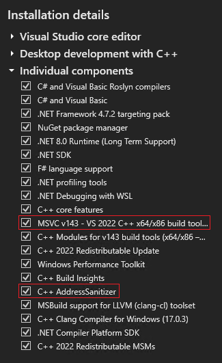

# Fuzzing the Azure Integrated HSM (AZIHMS) KSP

The KSP builds as a Windows **Dynamic Link Library** (**DLL**). It also is meant
to be copied into `C:\Windows\System32` and registered with the OS (see [the
integration guide](./integration_guide.md) for more details). These requirements
make the way we use [cargo-fuzz](https://github.com/rust-fuzz/cargo-fuzz) to
fuzz the KSP different than how we fuzz other parts of this repository (such as
the fuzzing tests in `api/fuzz/`).

## How to Fuzz

(**NOTE:** Run all the below commands in a Windows environment, on PowerShell.
Make sure you run the PowerShell instances as an Administrator; you will need
permission to copy files into `C:\Windows\System32`.)

### 1. Set up your Environment

First, follow [the integration guide](./integration_guide.md) and complete all
prerequisites.

#### Install Visual Studio

Next, make sure you have Visual Studio installed; there are a number of features
that need to be installed alongside it in order for the fuzzing code to build.
Follow [this
guide](https://learn.microsoft.com/en-us/visualstudio/install/install-visual-studio)
to install the "Visual Studio Installer". Use it to make sure you have the
following individual components installed:

* MSVC v143 - VS 2022 C++ x64/x86 build tools
    * (This was the latest as of 2024-10-15 - you may install a newer version if
      you're reading this at a later point in time!)
* C++ AddressSanitizer

For reference, here is a screenshot of the install details including these
dependencies:



#### Set up PowerShell

Certain directories must be on the PowerShell system `$env:PATH` in order for
the below commands to work. The `Developer PowerShell for VS 2022` and/or `x64
Native Tools Command Prompt for VS 2022` may have these directories already on
the path. If they don't, or you are using a different PowerShell, run [the setup
script](../setup-env.ps1) included in the `plugins/ksp/` directory.

```PowerShell
# set up for fuzzing
./setup-env.ps1 fuzz

# set up for debug
./setup-env.ps1 debug

# or, set up for everything
./setup-env.ps1 all
```

You'll also need to set the `RUSTC_BOOTSTRAP` environment variable to `1` in
your PowerShell. See the [`msrustup-setup.md`](../../../docs/msrustup-setup.md)
document for more information.

### 2. Build the DLL

Before you can build and run the KSP fuzzing tests (which are found in
[`plugins/ksp/fuzz/fuzz_targets/fuzz_*.rs`](../fuzz/fuzz_targets)), you first
need to build an instrumented version of the DLL. To do this, run:

```PowerShell
# Build and install the DLL:
cargo fuzz run --features=build_azihsmksp_dll --no-include-main-msvc --strip-dead-code build_azihsmksp_dll
```

>**Note:** If you see `error: unexpected argument '--no-include-main-msvc' found`, you need to update cargo fuzz to latest version direct from git repo using `cargo install --git "https://github.com/rust-fuzz/cargo-fuzz"`

This should build `azihsmksp.dll` and attempt to install it into
`C:\Windows\System32`. If copying the DLL fails, the script will report it, and
you'll need to manually find `azihsmksp.dll` within `fuzz/target/` and copy it
over.

At this point, you'll need to run a one-time command set-up command to register
the DLL with Windows:

```PowerShell
# You only need to do this once!
regsvr32 C:\Windows\System32\azihsmksp.dll
```

### 3. Run the Fuzzing Targets

At this point, the DLL should be installed and registered with the system. Now,
you need to build and run the fuzzing targets. Run this command to get a listing
of all the fuzzing targets you can choose from.

```PowerShell
cargo fuzz list
```

Select a target you'd like to run. (**NOTE**: You'll see `build_azihsmksp_dll` in
the list; this is not a true fuzzing target. It was used above to build the DLL.
So, don't pick this one!) Then, run this command to build and run it:

```PowerShell
cargo fuzz run NAME_OF_FUZZING_TARGET
```

This will build the fuzzing target, then promptly execute it. You should see
[LibFuzzer-like output](https://llvm.org/docs/LibFuzzer.html#output) if all is
working as expected.

#### Optional: Build Targets as Direct-To-DLL

The KSP fuzzing tests can be built such that the DLL is loaded and invoked
directly by the fuzzing target, rather than through the NCrypt API. This may be
helpful if you would like to fuzz the KSP, but don't have the ability (or the
permissions) to register the DLL with the Windows OS in your environment (i.e.
you cannot run `regsvr32 ...`).

To do this, build your fuzzing tests with the `direct-invoke-dll` feature:

```PowerShell
cargo fuzz run NAME_OF_FUZZING_TARGET --features direct-invoke-dll
```

If the tests are built this way, they will search for the KSP DLL in multiple
locations, following this order of priority:

1. If a file path was specified in the `AZIHSMKSP_DLL_PATH` environment variable,
   this will be used first.
2. Otherwise, the path stored in the `CARGO_TARGET_DIR` environment variable
   will be searched recursively for the DLL.
2. Then, the current shell directory will be searched recursively for the DLL.
3. Finally, the Windows System32 directory (`C:\Windows\System32`) will be
   searched for the DLL.

If all searches fail and the DLL cannot be found, the test will return early
with an error, and fuzzing will not occur.

## Debugging Fuzzing Tests

<details>
<summary>
(Click Here)
</summary>

You can debug the Windows-based fuzzing tests with
[WinDbg](https://learn.microsoft.com/en-us/windows-hardware/drivers/debugger/debugger-reference).
Make sure you install this on your Windows system. To fire it up, run `windbg`,
followed by your fuzzing target's executable + arguments. The command-line
arguments are dumped to the terminal when a fuzzing test fails. For example,
here are the arguments for the `fuzz_ksp_open_close_key` test:

```powershell
windbg fuzz\target\x86_64-pc-windows-msvc\release\fuzz_ksp_open_close_key.exe -artifact_prefix=C:\Users\connorshugg\dev\azihsm\Martichoras\plugins\ksp\fuzz\artifacts\fuzz_ksp_open_close_key\ C:\Users\connorshugg\dev\azihsm\Martichoras\plugins\ksp\fuzz\corpus\fuzz_ksp_open_close_key
```

A good first step is to set a breakpoint on the LibFuzzer main function (which
will call the `fuzz_target!()` macro-function defined in each fuzz target's
source file. Use
[`bm`](https://learn.microsoft.com/en-us/windows-hardware/drivers/debuggercmds/bp--bu--bm--set-breakpoint-)
to have the debugger find the symbol and attach a breakpoint to it. In the
below example, the fuzzing target is `fuzz_ksp_open_close_key`:

```windbg
bm fuzz_ksp_open_close_key!fuzz_ksp_open_close_key::_::__libfuzzer_sys_run
```

Once you're here, you can use [debugger
commands](https://learn.microsoft.com/en-us/windows-hardware/drivers/debuggercmds/commands)
to step through the code, set breakpoints, and display data types.

### Ignoring Bothersome Exceptions

The AddressSanitizer works by tracking memory operations and performing scans
of memory touched by the fuzzing target. Something I've noticed when debugging
fuzzing targets is that some of these scans and accesses are picked up in
WinDbg as access violations, appearing like this:

```
(386c.4e7c): Access violation - code c0000005 (first chance)
First chance exceptions are reported before any exception handling.
This exception may be expected and handled.
clang_rt_asan_dynamic_x86_64!MemcmpInterceptorCommon+0x35e:
00007ff9`00342b5e 0fb60410        movzx   eax,byte ptr [rax+rdx] ds:000002c8`1d3a06ae=??
```

This can be troublesome, as this exception is encountered *every time* ASAN
performs a check (which is a *lot*). This means the `g` ("go") debugger command
won't get very far; it'll run until the next ASAN exception is triggered, and
likely won't actually jump you to the next line of code in the function you're
examining. This can be avoided by telling the debugger to ignore these
exceptions:

```windbg
sxi 0xc0000005
```

</details>

## Technical Details

<details>
<summary>
(Click Here)
</summary>

Code that is fuzzed through cargo-fuzz must be compiled with extra
instrumentation inserted. The binary that is produced behaves normally, but
executes additional code that cargo-fuzz (which uses
[LibFuzzer](https://llvm.org/docs/LibFuzzer.html) under the hood) can use to
recieve feedback about how the target program behaved when given inputs from the
fuzzer. In this way, a fuzzing "feedback loop" is established, and the fuzzer
can slowly generate more "interesting" inputs that create new behavior in the
target program.

In our case, the target program is the AZIHSM KSP DLL. Because it's a DLL
(shared library) it must be built and instrumented as a completely separate
binary (a `.dll` file). The executable binaries generated from the programs
within `plugins/ksp/fuzz/fuzz_targets/*.rs` are designed to load this DLL in at
run-time in order to call its functions.

So, there are two steps that need to be done when building (hence the two
separate `cargo fuzz run ...` commands listed above):

1. Build the DLL and install it.
2. Build the fuzzing targets.

### MSVC and LibFuzzer's `main` Function

On Windows, Rust uses the [MSVC compiler and
linker](https://learn.microsoft.com/en-us/cpp/build/reference/compiling-a-c-cpp-program)
to build. The cargo-fuzz fuzzing targets do not implement a `main` function;
instead, they use LibFuzzer's built-in `main` function. (This function is what
actually starts up the fuzzer. The fuzzer then invokes the `fuzz_target!()`
macro function defined in each fuzzing target.) For reasons I (Connor) do not
know, the MSVC linker does not recognize the LibFuzzer `main` function, and thus
cannot build the fuzzing targets without a little help.

The cargo-fuzz developers found this, too. To fix the problem, their code adds
the `/include:main` linker argument to the build arguments passed to `cargo
build`. This arguments forces the inclusion of an external `main` symbol in the
executables produced by MSVC. (See more on the `/include` argument
[here](https://learn.microsoft.com/en-us/cpp/build/reference/include-force-symbol-references).)
This allows the fuzzing targets to build.

### Adding `/include:main` breaks DLL Linking

But hang on a second! DLLs by nature are shared libraries, and thus should not
have any references to a `main` function. It's the job of the executable that
loads a DLL into worry about `main`. So, if we attempt to build a DLL using
`cargo fuzz build`, it'll add the `/include:main`, and we'll get a linker error:

```
LINK : error LNK2001: unresolved external symbol main
C:\....\azihsmksp.dll : fatal error LNK1120: 1 unresolved externals
```

To avoid this, I (Connor) added a new argument to cargo-fuzz:
`--no-include-main-msvc`, which allows us to control whether or not
`/include:main` is added to the MSVC linker arguments. (See [this cargo-fuzz
issue](https://github.com/rust-fuzz/cargo-fuzz/issues/386) and [this cargo-fuzz
PR](https://github.com/rust-fuzz/cargo-fuzz/pull/387).)

### But removing `/include:main` breaks Fuzzing Target Linking

However... we need `/include:main` to build the fuzzing targets. This puts us at a
bit of an impasse:

* If we add `/include:main`, the fuzzing targets will build, but the DLL will
  not.
* If we remove `/include:main`, the DLL will build, but the fuzzing targets will
  not.

### Solution: Two Separate Builds

To solve this, we need to invoke `cargo fuzz ...` twice: once to build the DLL
(*without* `/include:main`), and another time to build the fuzzing targets
(*with* `/include:main`). In order to build the DLL using cargo-fuzz (which we
want to do, because it builds using all the relevant LLVM coverage and
AddressSanitizer compiler options), there is a "dummy" fuzzing target that
provides its own `main` function.

This "dummy" target is implemented in
[`fuzz/fuzz_targets/build_azihsmksp_dll.rs`](../fuzz/fuzz_targets/build_azihsmksp_dll.rs).
It does not define a `fuzz_target!()` function, so no fuzzing is actually done,
but it does implement a little code which finds and installs the instrumented
`azihsmksp.dll` to `C:\Windows\System32`, for convenience.

### Why Use `--strip-dead-code`?

By default, cargo-fuzz invokes rustc (the Rust compiler) with the
`-Clink-dead-code` argument. This, as described
[here](https://doc.rust-lang.org/rustc/codegen-options/index.html#link-dead-code),
controls whether or not the linker is instructed to keep dead code. "Dead code"
refers to functions/symbols that are provided by some dependency (such as a
DLL) but aren't ever referenced/used by the program that's importing code from
the dependency. This can be useful in some cases, but harmful in others.

In the case of the AZIHSM KSP, it's harmful. By building with
`-Clink-dead-code`, references to unused functions within various Windows DLLs
are included in the resulting `azihsmksp.dll` when we build it with cargo-fuzz.
One such DLL that is included because of this is `infocardapi.dll`, which does
not appear to come installed in `C:\Windows\System32`, nor appears to be an
available DLL that can be installed with the Visual Studio Installer. By
forcing dead function references to be included from the non-existent
`infocardapi.dll` in `azihsmksp.dll`, the loader will be unable to find them at
runtime, and the fuzzing target will exit with a `STATUS_DLL_NOT_FOUND` error.

See [this post in the Rustaceans Teams
Channel](https://teams.microsoft.com/l/message/19:246fa716fbd841c299519ffe539c3bee@thread.skype/1729805167747?tenantId=72f988bf-86f1-41af-91ab-2d7cd011db47&groupId=8103d456-bb0d-4dd0-a104-dd25ca29044f&parentMessageId=1729805167747&teamName=Rustaceans&channelName=General&createdTime=1729805167747)
for some of the conversations I (Connor) had around this issue.

</details>

